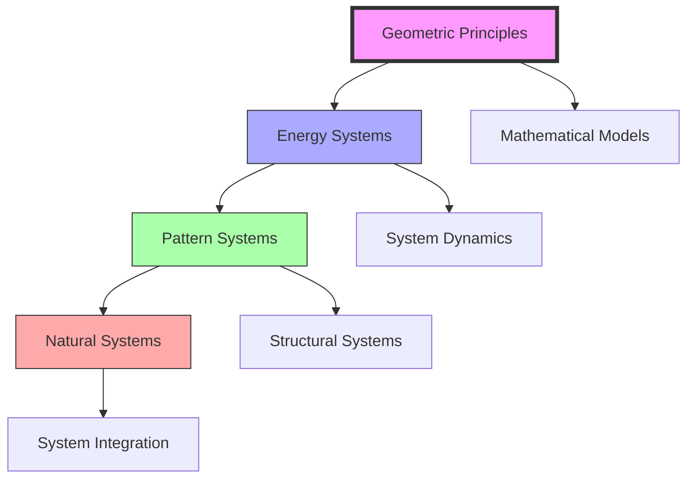
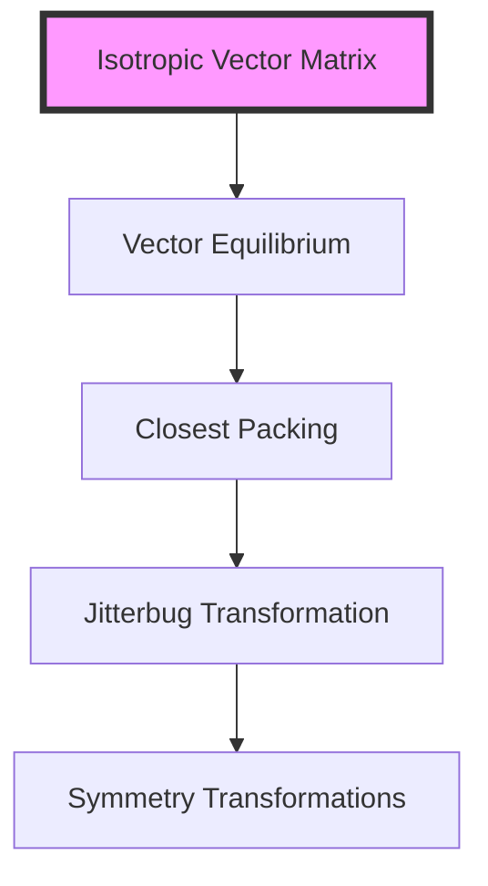
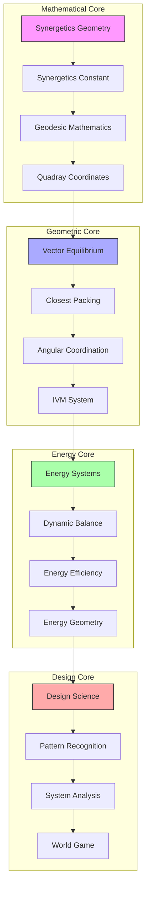
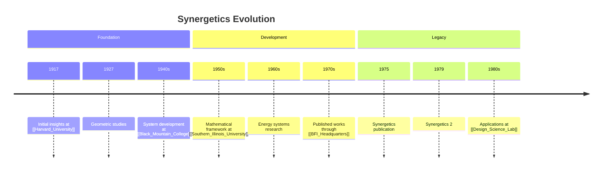
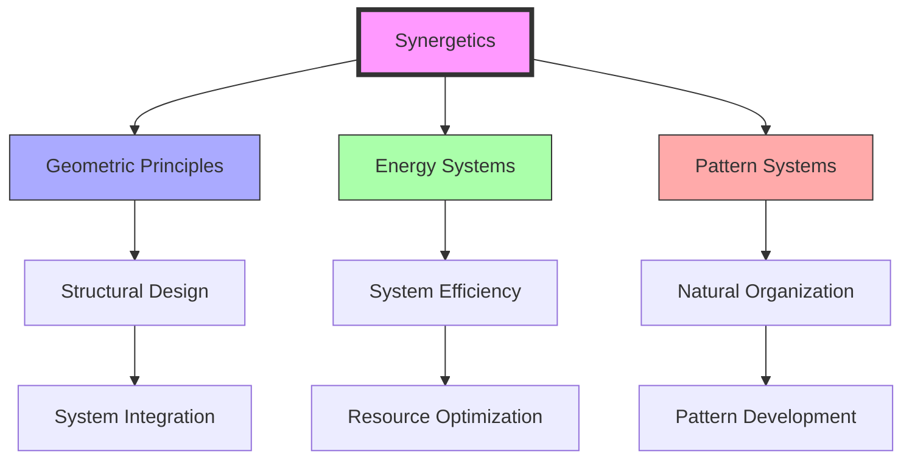

# Synergetics

> Fuller's systematic study of nature's coordinate system and fundamental patterns of energy organization, forming the mathematical and philosophical foundation for his [[Design_Science]] approach through the understanding of [[Natural_Patterns]] and [[60_Degree_Coordination]].

## Core Principles

### Fundamental Concepts
```mermaid
mindmap
    root((Synergetics))
        Geometry
            [[Vector_Equilibrium]]
            [[Closest_Packing_of_Spheres]]
            [[Great_Circles]]
            [[Tensegrity]]
        Energy Systems
            [[Dynamic_Balance]]
            [[Energy_Efficiency]]
            [[Energy_Transformation]]
            [[Energy_Conservation]]
        Pattern Mathematics
            [[60_Degree_Coordination]]
            [[Triangulation]]
            [[Symmetry_Systems]]
            [[System_Hierarchy]]
        Natural Systems
            [[Growth_Patterns]]
            [[System_Evolution]]
            [[Natural_Organization]]
            [[Pattern_Transformation]]
```

### System Relationships


## Technical Foundations

### Vector Mathematics
- [[Vector_Analysis]]: Spatial force relationships
- [[Tensional_Integrity]]: Structural stability principles
- [[Force_Distribution]]: Load path analysis
- [[Geometric_Topology]]: Surface relationships
- [[Polyhedral_Mathematics]]: Regular and irregular forms

### Coordinate Systems


### Geometric Transformations
- [[Jitterbug_Transform]]: Dynamic geometry changes
- [[Fuller_Projections]]: Cartographic transformations
- [[Symmetry_Operations]]: Group theory applications
- [[Geometric_Phase_States]]: System configurations
- [[Structural_Hierarchy]]: Nested relationships

### Quantum Applications
- [[Quantum_Geometry]]: Microscale relationships
- [[Wave_Functions]]: Energy patterns
- [[Probability_Densities]]: Distribution models
- [[Field_Theory]]: Force relationships
- [[Quantum_Topology]]: State spaces

### Mathematical Models
```yaml
geometric_systems:
  vector_matrix:
    principle: "Isotropic vector relationships"
    connection: "[[IVM_System]]"
    applications:
      - "Structural analysis"
      - "Force distribution"
      - "System coordination"
  
  transformations:
    principle: "Geometric phase changes"
    connection: "[[Jitterbug_Transform]]"
    applications:
      - "Dynamic systems"
      - "State transitions"
      - "Energy pathways"
  
  topology:
    principle: "Surface relationships"
    connection: "[[Geometric_Topology]]"
    applications:
      - "Form analysis"
      - "Boundary conditions"
      - "Connectivity patterns"
```

### Computational Methods
- [[Numerical_Analysis]]: System modeling
- [[Optimization_Algorithms]]: Efficiency calculations
- [[Structural_Analysis]]: Force computations
- [[Energy_Calculations]]: System dynamics
- [[Pattern_Recognition_Algorithms]]: Form identification

### Technical Standards
- [[Geometric_Standards]]: Form specifications
- [[Material_Properties]]: Physical parameters
- [[Load_Calculations]]: Structural requirements
- [[Energy_Metrics]]: System efficiency
- [[Pattern_Classifications]]: System taxonomy

## Advanced Topics

### Research Frontiers
```mermaid
mindmap
    root((Advanced Research))
        Quantum Systems
            [[Quantum_Geometry]]
            [[Wave_Pattern_Analysis]]
            [[Field_Theory_Applications]]
        Complex Systems
            [[Emergence_Patterns]]
            [[Self_Organization]]
            [[System_Evolution]]
        Computational Methods
            [[AI_Applications]]
            [[Pattern_Recognition]]
            [[Optimization_Algorithms]]
```

### Theoretical Developments
- [[Advanced_Topology]]: Higher-dimensional relationships
- [[Complex_Systems]]: Emergent behaviors
- [[Quantum_Applications]]: Microscale patterns
- [[Field_Theory_Extensions]]: Force relationships
- [[Pattern_Theory]]: System organization

## Epic Connections

### Conceptual Networks
```mermaid
mindmap
    root((Synergetics))
        Mathematical Foundations
            [[Synergetics_Geometry|Nature's Mathematics]]
            [[Synergetics_Constant|Universal Ratios]]
            [[Geodesic_Mathematics|Structural Math]]
            [[Quadray_Coordinates|4D Coordinates]]
        Geometric Systems
            [[Vector_Equilibrium|Force Balance]]
            [[Closest_Packing_of_Spheres|Spatial Efficiency]]
            [[60_Degree_Coordination|Angular Relations]]
            [[IVM_XYZ|Coordinate Systems]]
        Energy Patterns
            [[Energy_Systems|Flow Systems]]
            [[Dynamic_Balance|System Equilibrium]]
            [[Energy_Efficiency|Resource Optimization]]
            [[Energetic_Synergetic_Geometry|Energy Geometry]]
        Design Integration
            [[Design_Science|Method Integration]]
            [[Pattern_Recognition|System Understanding]]
            [[System_Analysis|Analysis Methods]]
            [[World_Game|Global Applications]]
```

### System Weaving


### Integration Framework
```yaml
synergetic_networks:
  mathematical_foundations:
    synergetics_geometry:
      principle: "Nature's mathematics"
      connection: "[[Synergetics_Geometry]]"
    synergetics_constant:
      principle: "Universal ratios"
      connection: "[[Synergetics_Constant]]"
    geodesic_mathematics:
      principle: "Structural math"
      connection: "[[Geodesic_Mathematics]]"
    quadray_coordinates:
      principle: "4D coordinates"
      connection: "[[Quadray_Coordinates]]"

  geometric_systems:
    vector_equilibrium:
      foundation: "Force balance"
      connection: "[[Vector_Equilibrium]]"
    closest_packing:
      foundation: "Spatial efficiency"
      connection: "[[Closest_Packing_of_Spheres]]"
    angular_coordination:
      foundation: "Angular relations"
      connection: "[[60_Degree_Coordination]]"
    ivm_system:
      foundation: "Coordinate systems"
      connection: "[[IVM_XYZ]]"

  energy_patterns:
    energy_systems:
      pattern: "Flow systems"
      connection: "[[Energy_Systems]]"
    dynamic_balance:
      pattern: "System equilibrium"
      connection: "[[Dynamic_Balance]]"
    energy_efficiency:
      pattern: "Resource optimization"
      connection: "[[Energy_Efficiency]]"
    energy_geometry:
      pattern: "Energy geometry"
      connection: "[[Energetic_Synergetic_Geometry]]"

  design_integration:
    design_science:
      method: "Method integration"
      connection: "[[Design_Science]]"
    pattern_recognition:
      method: "System understanding"
      connection: "[[Pattern_Recognition]]"
    system_analysis:
      method: "Analysis methods"
      connection: "[[System_Analysis]]"
    world_game:
      method: "Global applications"
      connection: "[[World_Game]]"
```

### Application Domains
```mermaid
mindmap
    root((Applications))
        Structural Systems
            [[Geodesic_Dome|Spherical Structures]]
            [[Space_Frames|Framework Systems]]
            [[Tensegrity|Force Networks]]
            [[Octet_Truss|Load Distribution]]
        Energy Systems
            [[Energy_Efficiency|Resource Management]]
            [[Dynamic_Balance|System Balance]]
            [[Energy_Systems|Flow Networks]]
            [[System_Behavior|Dynamic Response]]
        Pattern Systems
            [[Pattern_Recognition|System Understanding]]
            [[Natural_Patterns|Nature's Language]]
            [[Living_Systems|Biological Patterns]]
            [[Growth_Patterns|Evolution Systems]]
        Educational Systems
            [[Design_Science_Education|Design Methods]]
            [[Systems_Education|Teaching Systems]]
            [[Pattern_Learning|Learning Networks]]
            [[Global_University|Knowledge Distribution]]
```

### Philosophical Integration
```mermaid
mindmap
    root((Philosophy))
        Epistemological Base
            [[Phenomenology|Direct Experience]]
            [[Operationalism|Verification Methods]]
            [[Pragmatism|Practical Solutions]]
            [[Systems_Philosophy|Systems Thinking]]
        Methodological Framework
            [[Design_Science|Design Methods]]
            [[Pattern_Recognition|Pattern Understanding]]
            [[System_Analysis|Analysis Methods]]
            [[Anticipatory_Design|Forward Planning]]
        Implementation Systems
            [[World_Game|Global Solutions]]
            [[Digital_Democracy|Network Systems]]
            [[Resource_Distribution|Resource Management]]
            [[USA_OS|Operating Systems]]
        Future Vision
            [[Spaceship_Earth|Global Integration]]
            [[Universal_Architecture|Built Environment]]
            [[System_Innovation|Continuous Development]]
            [[System_Wholeness|Holistic Unity]]
```

## Historical Development



## Mathematical Framework

### Geometric Principles
- [[Vector_Equilibrium]]: Nature's coordinate system
- [[Closest_Packing_of_Spheres]]: Spatial efficiency
- [[Great_Circles]]: Geodesic paths
- [[Tensegrity]]: Structural integrity

### Energy Mathematics
- [[Dynamic_Balance]]: System equilibrium
- [[Energy_Transformation]]: State changes
- [[Pattern_Relationships]]: System connections
- [[Energy_Conservation]]: System efficiency

## Applications

### Design Implementation
- [[Geodesic_Dome]] structures
- [[Dymaxion]] innovations
- [[Energy_Systems]] design
- [[Space_Frames]] development

### System Integration


## Research Impact

### Areas of Influence
- [[Design_Science]]: Comprehensive approach
- [[Pattern_Recognition]]: System understanding
- [[System_Analysis]]: Structural evaluation
- [[Energy_Systems]]: Efficiency optimization
- [[Natural_Patterns]]: Pattern study
- [[60_Degree_Coordination]]: Geometric foundation

### Innovation Areas
- [[Structural_Design]]: Building systems
- [[Energy_Efficiency]]: Resource use
- [[System_Optimization]]: Performance
- [[Pattern_Integration]]: Natural systems

## Educational Applications

### Teaching Methods
- [[Systems_Education]]: Comprehensive learning
- [[Pattern_Learning]]: Recognition skills
- [[Design_Science_Education]]: Integration methods
- [[Geometric_Modeling]]: Visualization tools

### Learning Tools
- [[Physical_Models]]: Hands-on learning
- [[System_Diagrams]]: Visual understanding
- [[Design_Exercises]]: Practical application
- [[Mathematical_Tools]]: Analysis methods

## System Principles

### Core Concepts


## References

### Primary Sources
- Fuller, R. B. (1975). *Synergetics*
- Fuller, R. B. (1979). *Synergetics 2*
- [[BFI_Archives]] Research Materials
- [[Operating_Manual_for_Spaceship_Earth]]

### Secondary Sources
- Edmondson, A. C. (2007). *A Fuller Explanation*
- [[Black_Mountain_College]] Documentation
- Research Program Records
- [[Design_Science_Lab]] Studies

## See Also

- [[Design_Science]]
- [[Pattern_Recognition]]
- [[System_Analysis]]
- [[Energy_Systems]]
- [[Natural_Patterns]]
- [[60_Degree_Coordination]]
- [[Tensegrity]]
- [[Geodesic_Mathematics]]

## Notes

Synergetics represents Fuller's comprehensive exploration of nature's coordinate system and fundamental patterns of energy organization, providing the mathematical and philosophical foundation for his work in [[Design_Science]] and systems thinking. It integrates [[Natural_Patterns]], [[60_Degree_Coordination]], and [[Energy_Systems]] into a unified understanding of universal principles. 