# Synergetics

> Fuller's systematic study of nature's coordinate system and fundamental patterns of energy organization, forming the mathematical and philosophical foundation for his [[Design_Science]] approach through the understanding of [[Natural_Patterns]] and [[60_Degree_Coordination]].

## Core Principles

### Fundamental Concepts

```mermaid
graph TD
    S((Synergetics)) --> G[Geometry]
    S --> ES[Energy Systems]
    S --> PM[Pattern Mathematics]
    S --> NS[Natural Systems]

    %% Geometry Branch
    G --> VE[Vector Equilibrium]
    G --> CP[Closest Packing]
    G --> GC[Great Circles]
    G --> T[Tensegrity]

    VE --> |Nature's Zero| VE1[60° Coordination]
    VE --> |Symmetry| VE2[12 Vectors]
    VE --> |Transformation| VE3[Jitterbug]
    
    CP --> |Spatial Efficiency| CP1[Face-Centered Cubic]
    CP --> |Natural Pattern| CP2[Atomic Structure]
    CP --> |System Order| CP3[Crystal Growth]
    
    GC --> |Geodesic Path| GC1[Minimal Distance]
    GC --> |Structural| GC2[Dome Design]
    GC --> |Navigation| GC3[Dymaxion Map]

    %% Energy Systems Branch
    ES --> DB[Dynamic Balance]
    ES --> EF[Energy Flow]
    ES --> ET[Energy Transform]
    ES --> EC[Energy Conservation]

    DB --> |System State| DB1[Equilibrium]
    DB --> |Forces| DB2[Vector Balance]
    DB --> |Stability| DB3[Dynamic Stability]

    %% Pattern Mathematics Branch
    PM --> DC[60° Coordination]
    PM --> TR[Triangulation]
    PM --> SS[Symmetry Systems]
    PM --> SH[System Hierarchy]

    DC --> |Angular| DC1[Vector Angles]
    DC --> |Structure| DC2[Natural Forms]
    DC --> |Grid| DC3[IVM System]

    %% Natural Systems Branch
    NS --> GP[Growth Patterns]
    NS --> SE[System Evolution]
    NS --> NO[Natural Organization]
    NS --> PT[Pattern Transform]

    GP --> |Biological| GP1[Cell Structure]
    GP --> |Crystal| GP2[Mineral Growth]
    GP --> |Social| GP3[Network Formation]

    %% Styling
    classDef core fill:#f9f,stroke:#333,stroke-width:4px
    classDef primary fill:#aaf,stroke:#333
    classDef secondary fill:#afa,stroke:#333
    classDef detail fill:#faa,stroke:#333

    class S core
    class G,ES,PM,NS primary
    class VE,CP,GC,T,DB,EF,ET,EC,DC,TR,SS,SH,GP,SE,NO,PT secondary
    class VE1,VE2,VE3,CP1,CP2,CP3,GC1,GC2,GC3,DB1,DB2,DB3,DC1,DC2,DC3,GP1,GP2,GP3 detail
```


### System Relationships


## Technical Foundations

### Vector Mathematics
- [[Vector_Analysis]]: Spatial force relationships
- [[Tensional_Integrity]]: Structural stability principles
- [[Force_Distribution]]: Load path analysis
- [[Geometric_Topology]]: Surface relationships
- [[Polyhedral_Mathematics]]: Regular and irregular forms

### Coordinate Systems


### Geometric Transformations
- [[Jitterbug_Transform]]: Dynamic geometry changes
- [[Fuller_Projections]]: Cartographic transformations
- [[Symmetry_Operations]]: Group theory applications
- [[Geometric_Phase_States]]: System configurations
- [[Structural_Hierarchy]]: Nested relationships

### Quantum Applications
- [[Quantum_Geometry]]: Microscale relationships
- [[Wave_Functions]]: Energy patterns
- [[Probability_Densities]]: Distribution models
- [[Field_Theory]]: Force relationships
- [[Quantum_Topology]]: State spaces

### Mathematical Models
```yaml
geometric_systems:
  vector_matrix:
    principle: "Isotropic vector relationships"
    connection: "[[IVM_System]]"
    applications:
      - "Structural analysis"
      - "Force distribution"
      - "System coordination"
  
  transformations:
    principle: "Geometric phase changes"
    connection: "[[Jitterbug_Transform]]"
    applications:
      - "Dynamic systems"
      - "State transitions"
      - "Energy pathways"
  
  topology:
    principle: "Surface relationships"
    connection: "[[Geometric_Topology]]"
    applications:
      - "Form analysis"
      - "Boundary conditions"
      - "Connectivity patterns"
```

### Computational Methods
- [[Numerical_Analysis]]: System modeling
- [[Optimization_Algorithms]]: Efficiency calculations
- [[Structural_Analysis]]: Force computations
- [[Energy_Calculations]]: System dynamics
- [[Pattern_Recognition_Algorithms]]: Form identification

### Technical Standards
- [[Geometric_Standards]]: Form specifications
- [[Material_Properties]]: Physical parameters
- [[Load_Calculations]]: Structural requirements
- [[Energy_Metrics]]: System efficiency
- [[Pattern_Classifications]]: System taxonomy

## Advanced Topics

### Research Frontiers


### Conceptual Networks


### Application Domains


### Philosophical Integration


## Historical Development


## Mathematical Framework

### Geometric Principles
- [[Vector_Equilibrium]]: Nature's coordinate system
- [[Closest_Packing_of_Spheres]]: Spatial efficiency
- [[Great_Circles]]: Geodesic paths
- [[Tensegrity]]: Structural integrity

### Energy Mathematics
- [[Dynamic_Balance]]: System equilibrium
- [[Energy_Transformation]]: State changes
- [[Pattern_Relationships]]: System connections
- [[Energy_Conservation]]: System efficiency

## Applications

### Design Implementation
- [[Geodesic_Dome]] structures
- [[Dymaxion]] innovations
- [[Energy_Systems]] design
- [[Space_Frames]] development

### System Integration


## Research Impact

### Areas of Influence
- [[Design_Science]]: Comprehensive approach
- [[Pattern_Recognition]]: System understanding
- [[System_Analysis]]: Structural evaluation
- [[Energy_Systems]]: Efficiency optimization
- [[Natural_Patterns]]: Pattern study
- [[60_Degree_Coordination]]: Geometric foundation

### Innovation Areas
- [[Structural_Design]]: Building systems
- [[Energy_Efficiency]]: Resource use
- [[System_Optimization]]: Performance
- [[Pattern_Integration]]: Natural systems

## Educational Applications

### Teaching Methods
- [[Systems_Education]]: Comprehensive learning
- [[Pattern_Learning]]: Recognition skills
- [[Design_Science_Education]]: Integration methods
- [[Geometric_Modeling]]: Visualization tools

### Learning Tools
- [[Physical_Models]]: Hands-on learning
- [[System_Diagrams]]: Visual understanding
- [[Design_Exercises]]: Practical application
- [[Mathematical_Tools]]: Analysis methods

## System Principles

### Core Concepts


## References

### Primary Sources
- Fuller, R. B. (1975). *Synergetics*
- Fuller, R. B. (1979). *Synergetics 2*
- [[BFI_Archives]] Research Materials
- [[Operating_Manual_for_Spaceship_Earth]]

### Secondary Sources
- Edmondson, A. C. (2007). *A Fuller Explanation*
- [[Black_Mountain_College]] Documentation
- Research Program Records
- [[Design_Science_Lab]] Studies

## See Also

- [[Design_Science]]
- [[Pattern_Recognition]]
- [[System_Analysis]]
- [[Energy_Systems]]
- [[Natural_Patterns]]
- [[60_Degree_Coordination]]
- [[Tensegrity]]
- [[Geodesic_Mathematics]]

## Notes

Synergetics represents Fuller's comprehensive exploration of nature's coordinate system and fundamental patterns of energy organization, providing the mathematical and philosophical foundation for his work in [[Design_Science]] and systems thinking. It integrates [[Natural_Patterns]], [[60_Degree_Coordination]], and [[Energy_Systems]] into a unified understanding of universal principles. 