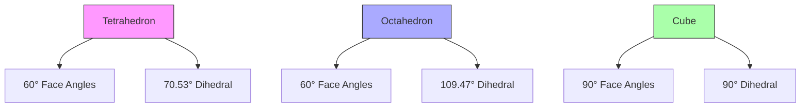
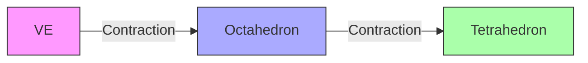

# Synergetics Geometry

Synergetics Geometry represents R. Buckminster Fuller's systematic study of geometric structures based on nature's coordinate system, centered on the tetrahedron as the most fundamental structural system in Universe.

## Fundamental Ratios

### Volume Relationships
1. Regular Polyhedra (Normalized to Unit Edge Length)
```yaml
volumes:
  tetrahedron: 0.11785113019775792
  cube: 1.0
  octahedron: 0.4714045207910317
  icosahedron: 2.1816950226468217
  dodecahedron: 7.663118960624632
  vector_equilibrium: 1.0
```

2. Volume Ratios (Relative to Tetrahedron)
```yaml
volume_ratios:
  tetrahedron: 1.0
  cube: 8.485281374238571
  octahedron: 4.0
  icosahedron: 18.51233619066628
  dodecahedron: 65.02469510717241
  vector_equilibrium: 8.485281374238571
```

### Geometric Constants
```yaml
constants:
  phi: 1.618033988749895  # Golden ratio
  root2: 1.4142135623730951
  root3: 1.7320508075688772
  tetra_freq_ratio: 0.6298484146560053  # Tetrahedral frequency ratio
  icosa_edge_ratio: 1.0514622242382672  # Icosahedral edge to radius ratio
```

## Topological Relationships

### Euler Characteristics
1. Regular Polyhedra
```yaml
euler_characteristics:
  tetrahedron:
    vertices: 4
    edges: 6
    faces: 4
    V - E + F: 2
  cube:
    vertices: 8
    edges: 12
    faces: 6
    V - E + F: 2
  octahedron:
    vertices: 6
    edges: 12
    faces: 8
    V - E + F: 2
  icosahedron:
    vertices: 12
    edges: 30
    faces: 20
    V - E + F: 2
  dodecahedron:
    vertices: 20
    edges: 30
    faces: 12
    V - E + F: 2
  vector_equilibrium:
    vertices: 12
    edges: 24
    faces: 14
    V - E + F: 2
```

### Angular Relationships


## IVM Coordinates

### Vector Equilibrium
1. Vertex Coordinates (IVM)
```yaml
ve_vertices:
  - [±1, ±1, 0]
  - [±1, 0, ±1]
  - [0, ±1, ±1]
```

2. Edge Relationships
```yaml
ve_edges:
  length: 2
  count: 24
  types:
    square_diagonals: 12
    triangular_edges: 12
```

### Geometric Transformations
1. IVM to XYZ Conversion
\[
\begin{bmatrix} 
x \\ y \\ z 
\end{bmatrix} = 
\begin{bmatrix} 
1 & -1/2 & -1/2 \\
0 & \sqrt{3}/2 & -\sqrt{3}/6 \\
0 & 0 & \sqrt{6}/3
\end{bmatrix}
\begin{bmatrix} 
a \\ b \\ c
\end{bmatrix}
\]

2. Frequency Relationships
\[
f = \frac{2}{\sqrt{3}} \cdot \frac{L}{R}
\]
where:
- f = frequency
- L = edge length
- R = radius

## Structural Systems

### Close-Packing Analysis
1. Sphere Packing Ratios
```yaml
packing_ratios:
  cubic: 0.5235987755982989
  tetrahedral: 0.7404804896930611
  octahedral: 0.7404804896930611
```

2. Coordination Numbers
```yaml
coordination:
  tetrahedral: 4
  octahedral: 6
  cubic: 6
  icosahedral: 12
  ve: 12
```

### Jitterbug Transformation


## Mathematical Relationships

### Surface Areas
1. Regular Polyhedra (Unit Edge)
```yaml
surface_areas:
  tetrahedron: 1.7320508075688772
  cube: 6.0
  octahedron: 3.464101615137754
  icosahedron: 8.660254037844386
  dodecahedron: 20.64573502691896
```

2. Area Ratios (Relative to Face)
```yaml
face_ratios:
  tetrahedron: 1.0
  cube: 2.0
  octahedron: 0.8660254037844386
  icosahedron: 0.7557613140761707
  dodecahedron: 2.618033988749895
```

### Dihedral Angles
```yaml
dihedral_angles:
  tetrahedron: 70.52877936550930
  cube: 90.0
  octahedron: 109.47122063449070
  icosahedron: 138.18969055927836
  dodecahedron: 116.56505117707799
```

## Applications

### Geodesic Structures
1. Frequency Relationships
\[
R = \frac{L}{2\sin(\pi/n)}
\]
where:
- R = radius
- L = edge length
- n = frequency

2. Chord Factors
```yaml
chord_factors:
  2v: 0.618033988749895
  3v: 0.427050983124842
  4v: 0.324919696232906
```

## References

### Primary Sources
1. Synergetics (Fuller, 1975)
2. Synergetics 2 (Fuller, 1979)
3. Geometric Analysis (Clinton, 1971)
4. Vector Geometry (Edmondson, 1987)

### Related Concepts
- [[concepts/Vector_Equilibrium|Vector Equilibrium]]
- [[concepts/Isotropic_Vector_Matrix|Isotropic Vector Matrix]]
- [[concepts/Closest_Packing_of_Spheres|Closest Packing of Spheres]]
- [[concepts/Geodesic_Mathematics|Geodesic Mathematics]]

## Notes
- Based on nature's coordinate system
- Tetrahedron as fundamental unit
- Comprehensive geometric relationships
- Practical structural applications

## Tags
#geometry #synergetics #mathematics #topology #polyhedra 