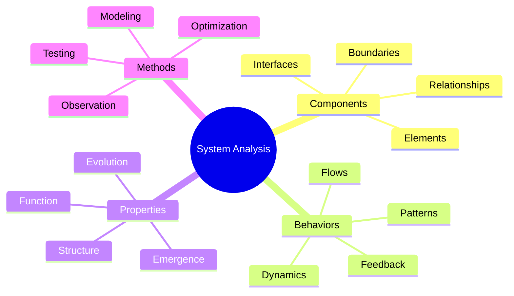
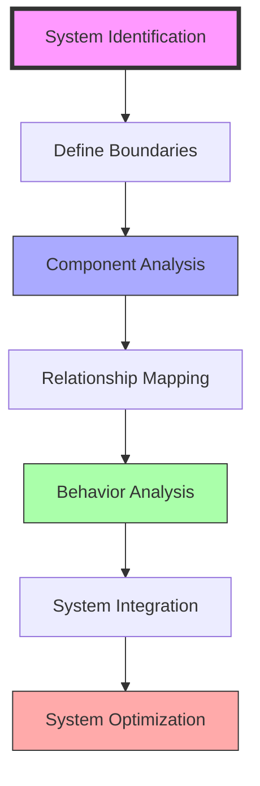
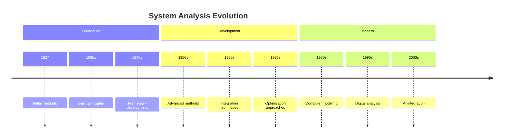

# System Analysis

> Fuller's comprehensive methodology for understanding, analyzing, and optimizing complex systems through their interconnections, behaviors, and patterns, central to his [[Design_Science]] approach.

## Core Methodology

### Analysis Framework

### Process Flow

## Applications

### Design Implementation
- [[Energy_Systems]] analysis
- [[Resource_Distribution]] optimization
- [[Geodesic_Dome]] design
- [[Tensegrity]] structures

### Analysis Areas
- Natural systems
- Built environment
- Social structures
- Resource networks

## Research Methods

### Analytical Tools
- System mapping
- Flow analysis
- Pattern recognition
- Behavior modeling

### Implementation

## System Types

### Natural Systems
- Ecological systems
- Biological systems
- Climate systems
- Energy flows

### Human Systems
- Built environment
- Social structures
- Economic systems
- Technology networks

## Historical Development

## Methodology

### Analysis Methods
- Component analysis
- Relationship mapping
- Behavior modeling
- System integration

### Tools and Techniques
- Mapping tools
- Analysis frameworks
- Modeling software
- Testing protocols

## Implementation

### Practical Applications
- System design
- Optimization
- Integration
- Monitoring

### Development Process
- Analysis phase
- Design phase
- Testing phase
- Implementation phase

## Educational Framework

### Learning Methods
- [[Systems_Education]]
- [[Pattern_Learning]]
- Practical analysis
- Case studies

### Teaching Tools
- System models
- Analysis frameworks
- Case examples
- Practical exercises

## Research Impact

### Areas of Influence
- [[Design_Science]]
- [[Pattern_Recognition]]
- [[Energy_Systems]]
- [[Resource_Distribution]]

### Current Research
- Complex systems
- Network analysis
- System optimization
- Integration methods

## Modern Applications

### Contemporary Use
- Sustainable design
- Urban planning
- Resource management
- Technology systems

### Future Directions
- AI integration
- Digital twins
- Predictive modeling
- System automation

## References

### Primary Sources
- Fuller, R. B. (1969). *Operating Manual for Spaceship Earth*.
- Fuller, R. B. (1981). *Critical Path*.

### Secondary Sources
- Edmondson, A. C. (2007). *A Fuller Explanation*.
- Applewhite, E. J. (1975). *Cosmic Fishing*.

## See Also

- [[Design_Science]]
- [[Pattern_Recognition]]
- [[Energy_Systems]]
- [[Resource_Distribution]]

## Notes

System Analysis represents a cornerstone of Fuller's methodological approach to understanding and optimizing complex systems, providing a framework for comprehensive analysis and design solutions. 