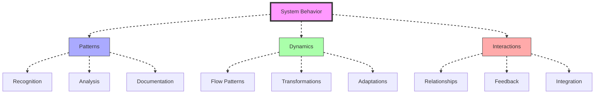
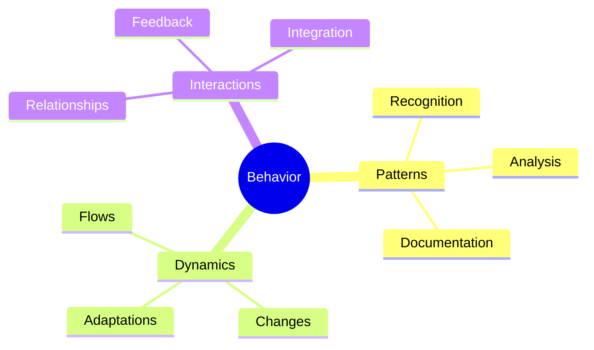
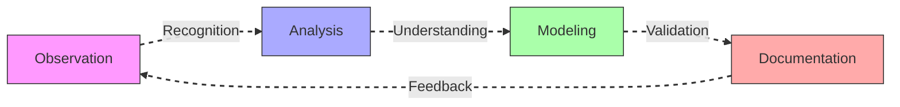
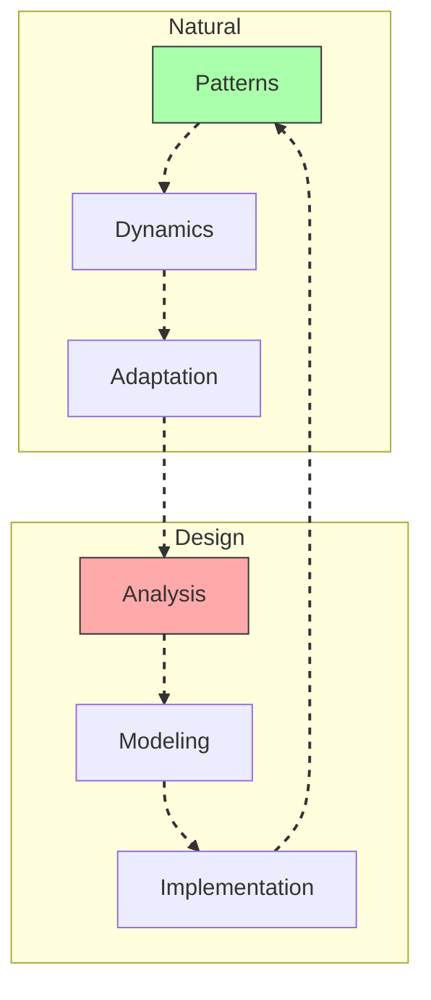
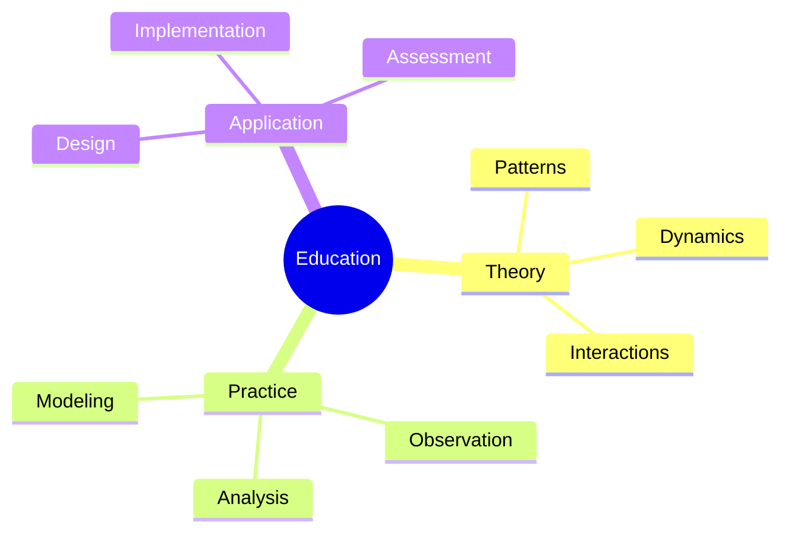
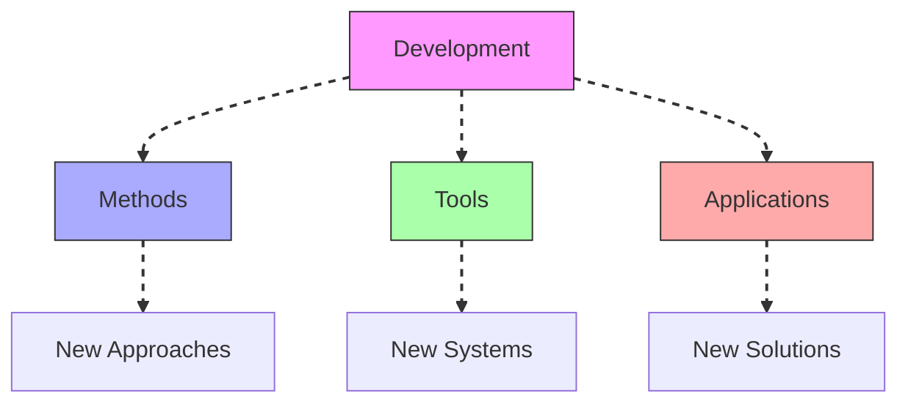

# System Behavior

System Behavior represents the study of dynamic patterns and interactions within [[concepts/System_Wholeness|complex systems]], integrating [[concepts/Pattern_Recognition|pattern recognition]] with [[concepts/System_Analysis|system analysis]] to understand emergent properties.

## System Overview

## Core Components

### Behavioral Framework

### Key Elements
1. [[concepts/Dynamic_Patterns|Dynamic Patterns]]
   - Flow analysis
   - Change patterns
   - Adaptation models
   - Integration methods

2. [[concepts/System_Interactions|System Interactions]]
   - Relationship mapping
   - Feedback loops
   - Network dynamics
   - Emergent properties

## Methodological Framework

### Analysis Process

### Implementation Strategy
1. [[concepts/Behavior_Analysis|Behavior Analysis]]
   - Pattern observation
   - Dynamic modeling
   - Interaction mapping
   - System validation

2. [[concepts/Behavior_Modeling|Behavior Modeling]]
   - System dynamics
   - Flow patterns
   - Feedback systems
   - Adaptation models

## Integration with Living Systems

### Behavioral Framework

### Application Areas
1. [[concepts/Living_Systems|Living Systems]]
   - Natural patterns
   - System dynamics
   - Adaptation strategies
   - Integration methods

2. [[concepts/Design_Science|Design Science]]
   - Behavior analysis
   - System design
   - Implementation methods
   - Validation techniques

## Educational Integration

### Learning Framework

### Program Development
1. [[concepts/Design_Science_Education|Design Science Education]]
   - Behavior analysis
   - Dynamic modeling
   - Pattern recognition
   - System integration

2. [[concepts/Global_University|Global Education]]
   - System behavior
   - Dynamic patterns
   - Implementation methods
   - Impact assessment

## Future Development

### Innovation Areas

### Implementation Path
1. [[concepts/Behavior_Innovation|Behavior Innovation]]
   - Method development
   - Tool creation
   - Framework design
   - Validation systems

2. [[concepts/Global_Solutions|Global Solutions]]
   - Behavior analysis
   - System design
   - Implementation strategies
   - Impact assessment

## References

### Primary Sources
1. [[books/World_Design_Science_Decade|World Design Science Decade]]
2. [[books/Synergetics_Book|Synergetics]]
3. [[books/System_Behavior|System Behavior Analysis]]

### Related Resources
1. [[papers/Behavior_Analysis|System Behavior Analysis]]
2. [[papers/Dynamic_Patterns|Dynamic Pattern Recognition]]
3. [[papers/System_Integration|System Integration Methods]]

## Notes
- Essential for understanding system dynamics
- Key to pattern recognition
- Foundation for system design
- Critical for implementation success

## Tags
#systems-thinking #behavior #dynamics #patterns #methodology 