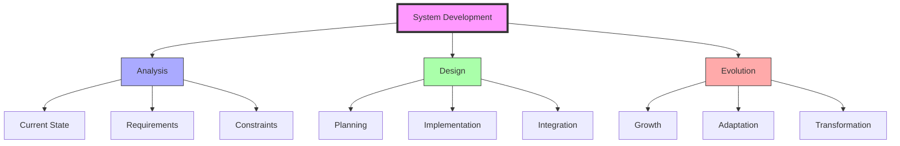
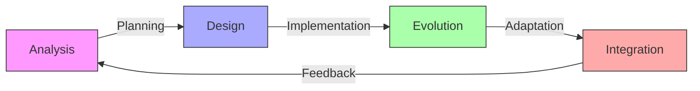
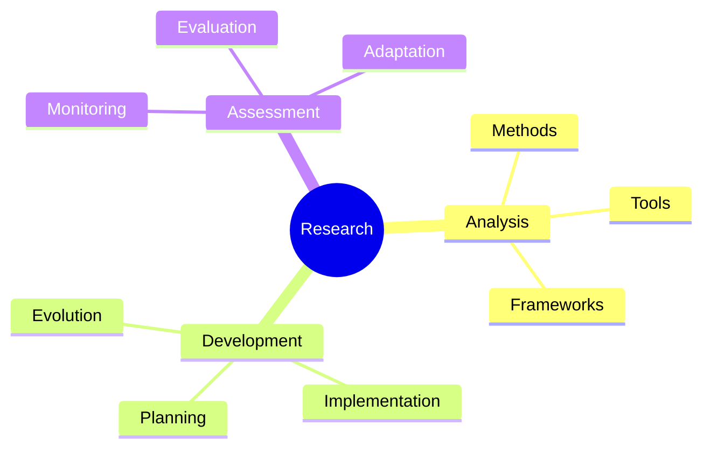
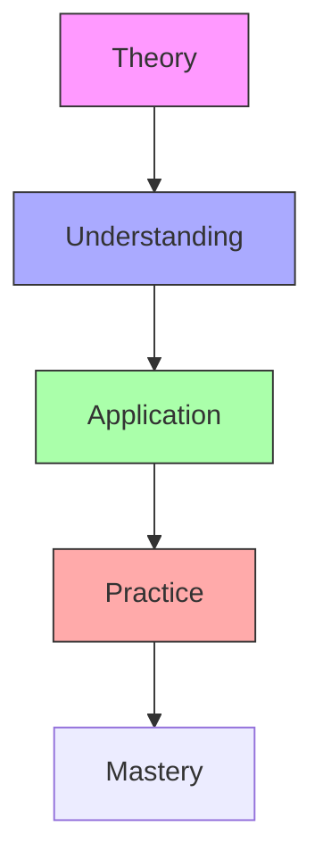

# System Development

System Development represents the integrated approach to understanding and guiding the evolution of complex systems, combining principles from [[concepts/Design_Science|Design Science]], [[concepts/Growth_Patterns|Growth Patterns]], and [[concepts/Pattern_Formation|Pattern Formation]].

## System Overview

## Core Components

### Development Framework
1. [[concepts/Development_Process|Process Elements]]
   - [[concepts/System_Analysis|Current state analysis]]
   - [[concepts/Requirements_Analysis|Requirements definition]]
   - [[concepts/Development_Planning|Development planning]]
   - [[concepts/Implementation_Strategy|Implementation methods]]

2. [[concepts/Evolution_Framework|Evolution Elements]]
   - [[concepts/Growth_Patterns|Growth dynamics]]
   - [[concepts/Adaptation_Patterns|Adaptation processes]]
   - [[concepts/Transformation_Patterns|Transformation paths]]
   - [[concepts/Integration_Methods|Integration strategies]]

### System Types
1. [[concepts/Natural_Systems|Natural Systems]]
   - [[concepts/Biological_Development|Biological evolution]]
   - [[concepts/Ecological_Development|Ecosystem development]]
   - [[concepts/Population_Development|Population dynamics]]
   - [[concepts/Resource_Systems|Resource networks]]

2. [[concepts/Designed_Systems|Designed Systems]]
   - [[concepts/Technical_Development|Technical evolution]]
   - [[concepts/Social_Development|Social systems]]
   - [[concepts/Knowledge_Systems|Knowledge networks]]
   - [[concepts/Innovation_Systems|Innovation platforms]]

## Integration Methods

### Development Process

### Implementation Strategy
1. [[concepts/Development_Methods|Development Methods]]
   - Process planning
   - Resource allocation
   - Implementation techniques
   - Integration strategies

2. [[concepts/Evolution_Tools|Evolution Tools]]
   - Growth monitoring
   - Adaptation tracking
   - Performance analysis
   - Impact assessment

## Applications

### Natural Systems
1. [[concepts/Living_Systems|Living Systems]]
   - Biological development
   - Ecosystem evolution
   - Population dynamics
   - Resource networks

2. [[concepts/Physical_Systems|Physical Systems]]
   - Material development
   - Energy systems
   - Structural evolution
   - Network growth

### Design Applications
1. [[concepts/Design_Science|Design Integration]]
   - Development planning
   - System evolution
   - Resource optimization
   - Integration methods

2. [[concepts/System_Innovation|Innovation Development]]
   - Process innovation
   - System transformation
   - Growth strategies
   - Adaptation methods

## Research Methods

### Analysis Framework

### Study Methods
1. [[concepts/Development_Analysis|Development Analysis]]
   - Process tracking
   - Evolution monitoring
   - Impact assessment
   - Performance evaluation

2. [[concepts/Development_Tools|Research Tools]]
   - Analysis systems
   - Monitoring platforms
   - Evaluation methods
   - Documentation tools

## Educational Integration

### Learning Framework
1. [[concepts/Development_Education|Educational Programs]]
   - Development principles
   - Evolution methods
   - Implementation skills
   - Assessment techniques

2. [[concepts/Development_Practice|Practical Training]]
   - Process analysis
   - System planning
   - Implementation methods
   - Evolution strategies

### Teaching Methods

## References

### Primary Sources
1. [[books/System_Development|System Development Principles]]
2. [[books/Evolution_Methods|Evolution and Development]]
3. [[books/Development_Practice|Development in Practice]]

### Related Resources
1. [[papers/Development_Analysis|Development Analysis Methods]]
2. [[papers/Evolution_Studies|System Evolution Studies]]
3. [[papers/Integration_Research|System Integration Research]]

## Notes
- Essential for understanding system evolution
- Key to sustainable development
- Critical for system optimization
- Foundation for growth strategies

## Tags
#development #systems-thinking #evolution #design-science #methodology 