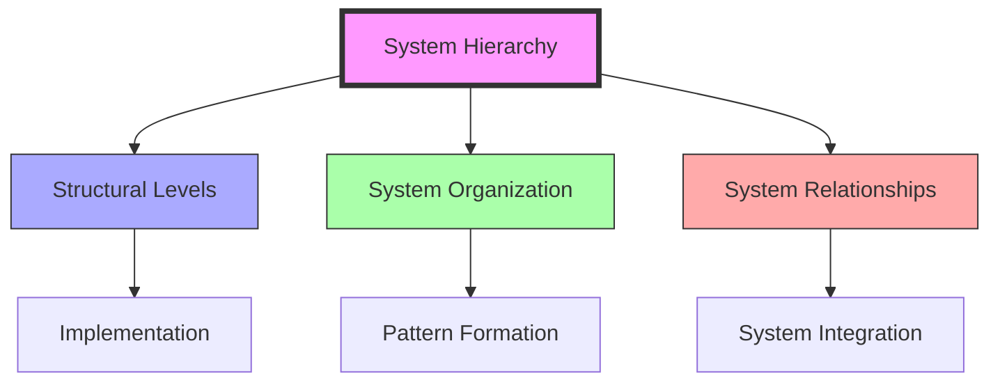

# System Hierarchy

> Fuller's systematic approach to understanding the nested organization of complex systems, from fundamental geometric patterns to global structures, through [[System_Analysis]] and [[Pattern_Recognition]].

## Core Principles

### Fundamental Concepts
```mermaid
mindmap
    root((System Hierarchy))
        Structural Levels
            [[Geometric_Principles]]
            [[Scale_Relationships]]
            [[Nested_Systems]]
            [[Level_Integration]]
        Organization
            [[System_Organization]]
            [[Pattern_Recognition]]
            [[Structure_Formation]]
            [[Hierarchical_Order]]
        Relationships
            [[System_Connections]]
            [[Flow_Patterns]]
            [[Energy_Transfer]]
            [[Information_Flow]]
        Implementation
            [[System_Design]]
            [[Analysis_Methods]]
            [[Integration_Tools]]
            [[Optimization_Strategies]]
```

### System Relationships


## Mathematical Framework

### Hierarchical Properties
\[
\begin{align*}
L_n &= f(L_{n-1}) \text{ (Level Relationship)} \\
S_t &= \sum_{i=1}^{n} L_i \text{ (System Total)} \\
C_r &= \frac{C_n}{C_{n-1}} \text{ (Complexity Ratio)}
\end{align*}
\]

### System Properties
- Level organization
- Nested relationships
- Scale invariance
- Emergent properties

## Applications

### Design Implementation
- [[Geodesic_Structures]]
- [[System_Design]]
- [[Organization_Methods]]
- [[Integration_Patterns]]

### System Integration


## Research Impact

### Areas of Influence
- [[System_Analysis]]: Structural understanding
- [[Pattern_Recognition]]: Hierarchical patterns
- [[Design_Science]]: System organization
- [[Energy_Systems]]: Flow hierarchies
- [[Synergetics]]: Geometric relationships

### Innovation Areas
- [[System_Organization]]: Structural design
- [[Pattern_Formation]]: Emergent properties
- [[Scale_Integration]]: Level relationships
- [[Flow_Hierarchies]]: Energy distribution

## Educational Applications

### Teaching Methods
- [[Systems_Education]]: Hierarchical principles
- [[Pattern_Learning]]: Structure recognition
- [[Design_Science_Education]]: Implementation
- [[Analysis_Methods]]: System evaluation

### Learning Tools
- [[System_Models]]: Hierarchy demonstration
- [[Structure_Diagrams]]: Organization visualization
- [[Analysis_Tools]]: Evaluation methods
- [[Integration_Methods]]: Enhancement techniques

## Natural Examples

### Physical Systems
- Atomic structures
- Molecular organization
- Crystalline patterns
- Biological hierarchies

### System Examples
- Ecosystem organization
- Social structures
- Urban systems
- Information networks

## References

### Primary Sources
- Fuller, R. B. (1975). *Synergetics*
- Fuller, R. B. (1979). *Synergetics 2*
- [[BFI_Archives]] System Studies
- [[Design_Science]] Documentation

### Secondary Sources
- Edmondson, A. C. (2007). *A Fuller Explanation*
- [[System_Analysis]] Research
- Hierarchy Studies
- Organization Analysis

## See Also

- [[System_Analysis]]
- [[Pattern_Recognition]]
- [[Design_Science]]
- [[Energy_Systems]]
- [[Synergetics]]
- [[Flow_Patterns]]

## Notes

System Hierarchy represents a fundamental concept in Fuller's work, demonstrating how complex systems are organized through nested levels of relationship and structure. This understanding is essential for comprehensive design science and system analysis. 