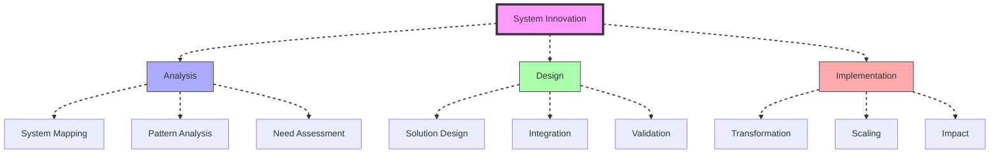
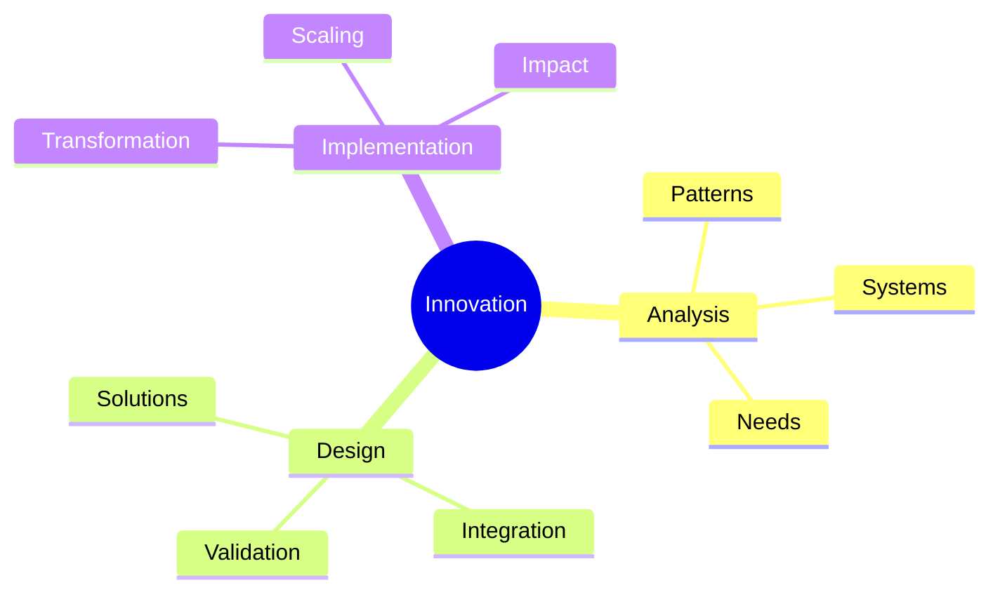
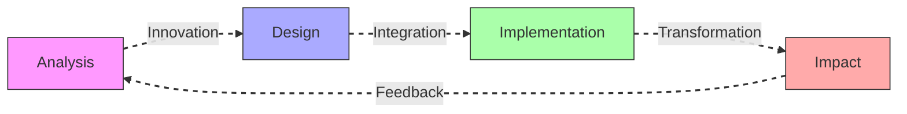
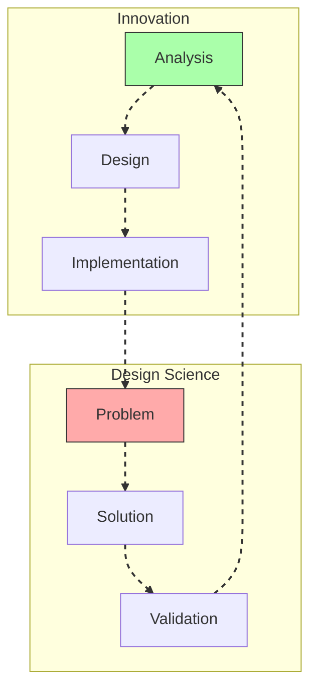
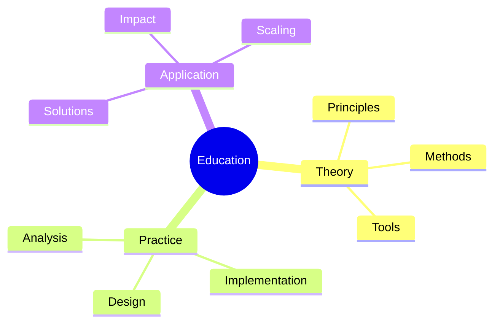
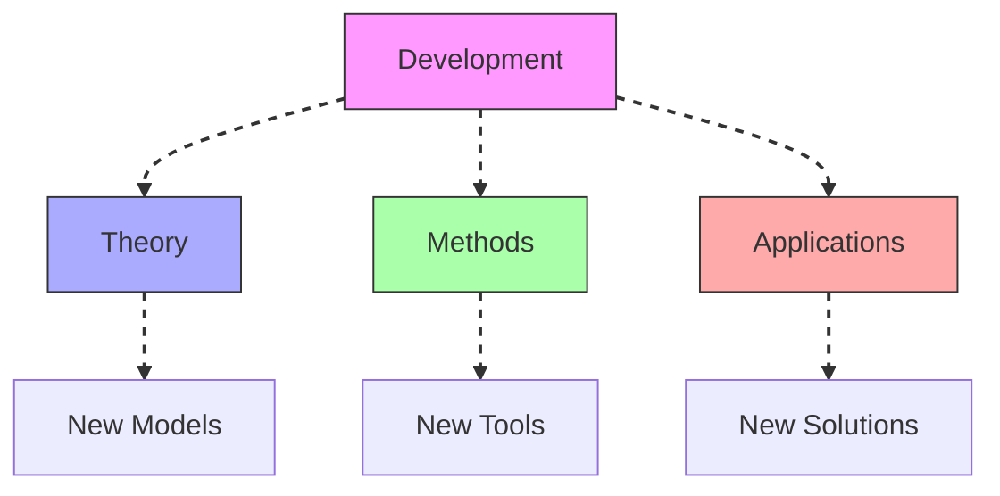

# System Innovation

System Innovation represents a comprehensive approach to creating transformative solutions through the integration of [[concepts/Design_Science|Design Science]] principles and [[concepts/System_Wholeness|System Wholeness]] understanding.

## System Overview

## Core Components

### Innovation Framework

### Key Elements
1. [[concepts/System_Analysis|System Analysis]]
   - Pattern recognition
   - Need identification
   - Resource mapping
   - Impact assessment

2. [[concepts/Solution_Design|Solution Development]]
   - Design principles
   - Integration methods
   - Validation frameworks
   - Implementation strategies

## Methodological Framework

### Process Flow

### Implementation Strategy
1. [[concepts/Transformation_Process|Transformation Process]]
   - System mapping
   - Change design
   - Implementation planning
   - Impact measurement

2. [[concepts/Scaling_Methods|Scaling Methods]]
   - Growth strategies
   - Resource allocation
   - Network development
   - Impact expansion

## Integration with Design Science

### Design Framework

### Application Areas
1. [[concepts/World_Game|World Game]]
   - Global solutions
   - Resource innovation
   - System transformation
   - Impact scaling

2. [[concepts/Living_Systems|Living Systems]]
   - Natural patterns
   - Adaptation strategies
   - System resilience
   - Sustainable design

## Educational Integration

### Learning Framework

### Program Development
1. [[concepts/Design_Science_Education|Design Science Education]]
   - Innovation principles
   - System thinking
   - Design methods
   - Implementation skills

2. [[concepts/Global_University|Global Education]]
   - System understanding
   - Innovation methods
   - Solution development
   - Impact assessment

## Future Development

### Innovation Areas

### Implementation Path
1. [[concepts/Innovation_Methods|Innovation Methods]]
   - Theory development
   - Tool creation
   - Application design
   - Validation systems

2. [[concepts/Global_Solutions|Global Solutions]]
   - System transformation
   - Resource innovation
   - Implementation strategies
   - Impact assessment

## References

### Primary Sources
1. [[books/World_Design_Science_Decade|World Design Science Decade]]
2. [[books/Operating_Manual_for_Spaceship_Earth|Operating Manual for Spaceship Earth]]
3. [[books/Innovation_Systems|Innovation Systems Theory]]

### Related Resources
1. [[papers/System_Innovation|System Innovation Methods]]
2. [[papers/Transformation_Strategies|Transformation Strategies]]
3. [[papers/Innovation_Impact|Innovation Impact Assessment]]

## Notes
- Essential for system transformation
- Integration with design science principles
- Key to sustainable development
- Foundation for global solutions

## Tags
#innovation #systems-thinking #transformation #design-science #methodology 