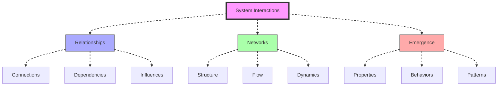
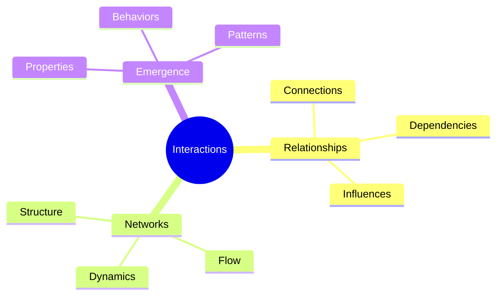
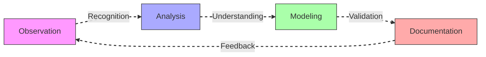
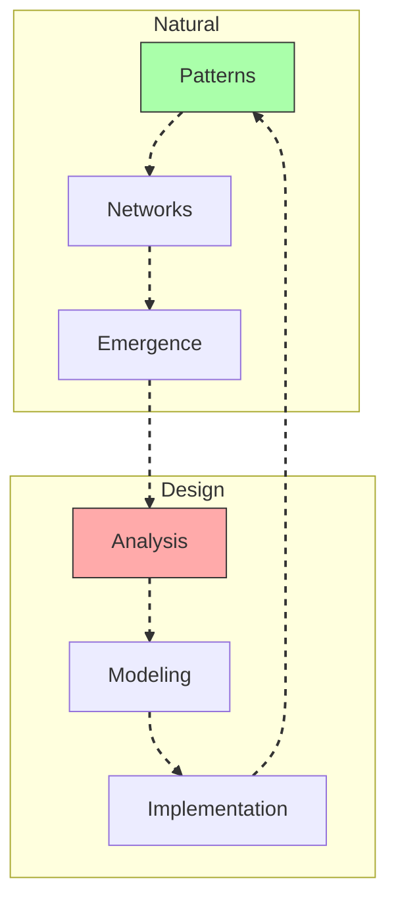
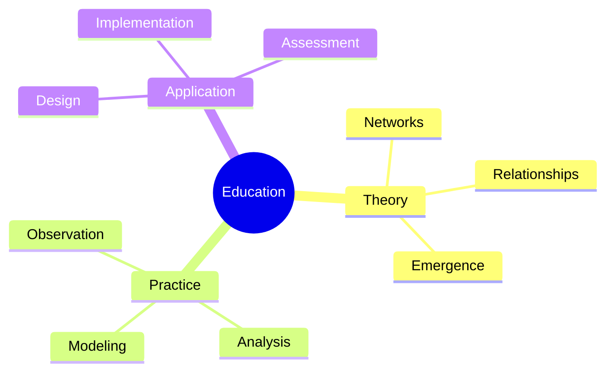
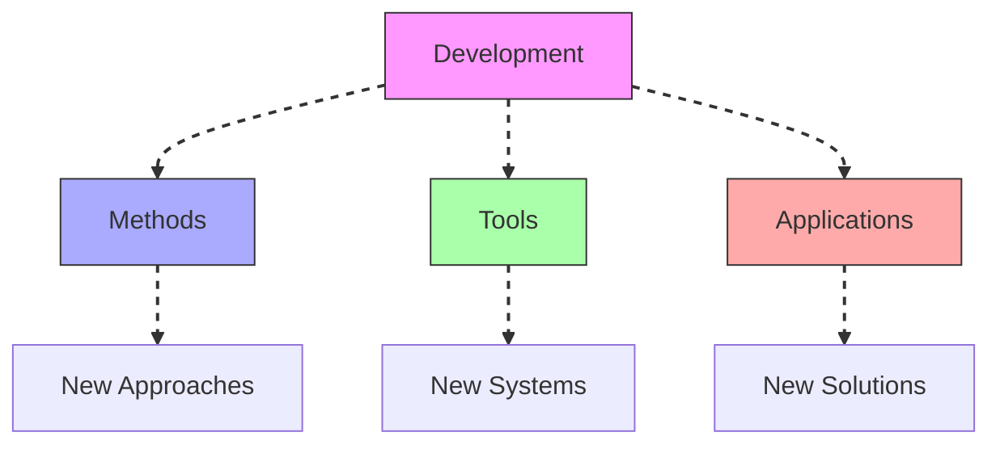

# System Interactions

System Interactions represent the study of relationships and connections within [[concepts/System_Behavior|complex systems]], integrating [[concepts/Pattern_Recognition|pattern recognition]] with [[concepts/System_Analysis|system analysis]] to understand emergent behaviors.

## System Overview

## Core Components

### Interaction Framework

### Key Elements
1. [[concepts/Network_Dynamics|Network Dynamics]]
   - Structure analysis
   - Flow patterns
   - Dynamic behavior
   - Emergence study

2. [[concepts/Relationship_Patterns|Relationship Patterns]]
   - Connection mapping
   - Dependency analysis
   - Influence tracking
   - Pattern recognition

## Methodological Framework

### Analysis Process

### Implementation Strategy
1. [[concepts/Interaction_Analysis|Interaction Analysis]]
   - Relationship mapping
   - Network analysis
   - Emergence study
   - Pattern validation

2. [[concepts/Network_Modeling|Network Modeling]]
   - Structure design
   - Flow analysis
   - Dynamic modeling
   - Behavior prediction

## Integration with Living Systems

### Network Framework

### Application Areas
1. [[concepts/Living_Systems|Living Systems]]
   - Natural networks
   - System relationships
   - Emergent properties
   - Adaptation patterns

2. [[concepts/Design_Science|Design Science]]
   - Network design
   - Interaction modeling
   - System integration
   - Pattern application

## Educational Integration

### Learning Framework

### Program Development
1. [[concepts/Design_Science_Education|Design Science Education]]
   - Network analysis
   - Relationship mapping
   - Pattern recognition
   - System integration

2. [[concepts/Global_University|Global Education]]
   - System interactions
   - Network dynamics
   - Implementation methods
   - Impact assessment

## Future Development

### Innovation Areas

### Implementation Path
1. [[concepts/Network_Innovation|Network Innovation]]
   - Method development
   - Tool creation
   - Framework design
   - Validation systems

2. [[concepts/Global_Solutions|Global Solutions]]
   - Network design
   - Interaction modeling
   - System integration
   - Impact assessment

## References

### Primary Sources
1. [[books/World_Design_Science_Decade|World Design Science Decade]]
2. [[books/Synergetics_Book|Synergetics]]
3. [[books/Network_Systems|Network Systems Analysis]]

### Related Resources
1. [[papers/Network_Analysis|Network Analysis Methods]]
2. [[papers/System_Interactions|System Interaction Patterns]]
3. [[papers/Emergence_Studies|Emergent Properties Analysis]]

## Notes
- Essential for understanding system relationships
- Key to network dynamics
- Foundation for emergent properties
- Critical for system integration

## Tags
#systems-thinking #interactions #relationships #networks #methodology 