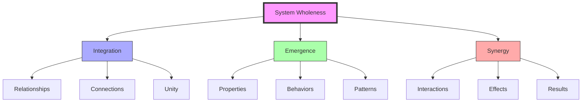
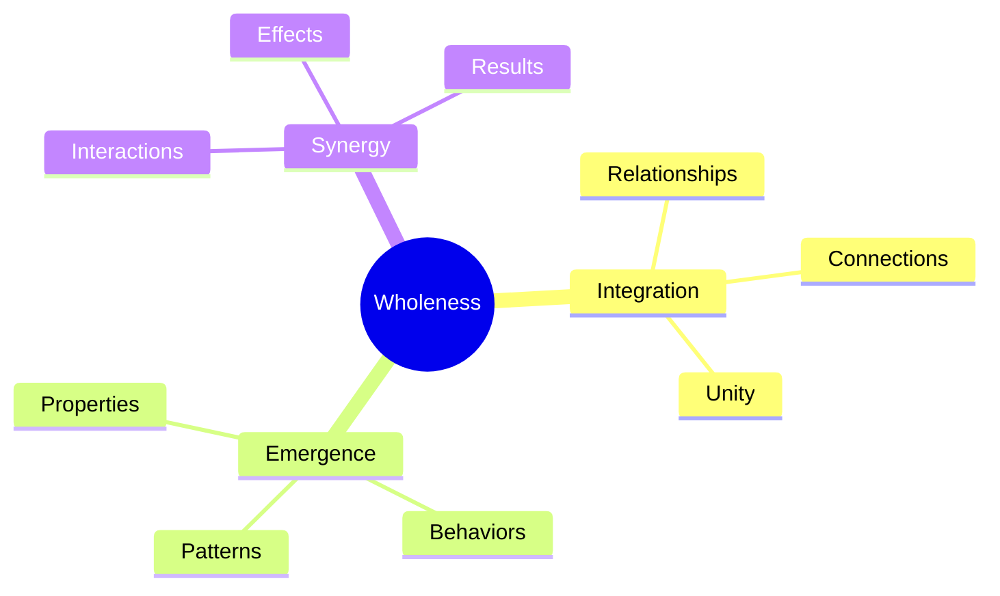
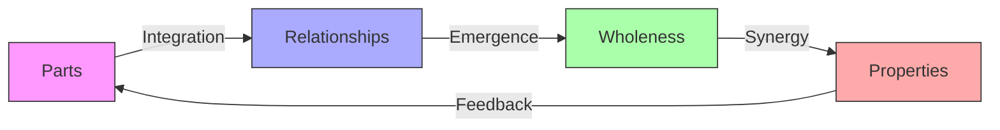
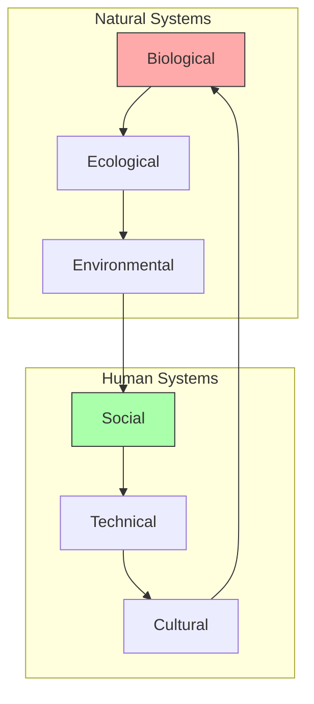
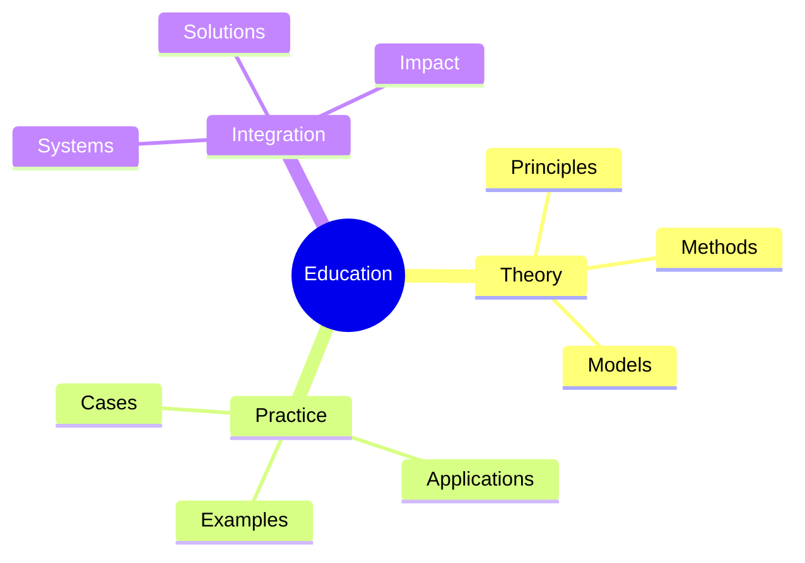
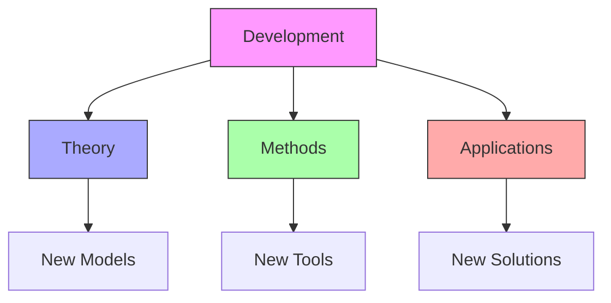

# System Wholeness

System Wholeness represents a fundamental principle in [[concepts/General_Systems_Theory|General Systems Theory]], [[concepts/Synergetics|Synergetics]], and [[concepts/Living_Systems|Living Systems]], emphasizing the understanding of systems as integrated wholes whose behavior emerges from the dynamic interactions of their components rather than the mere sum of their parts.

## System Overview

## Core Principles

### Fundamental Elements

### Key Components
1. [[concepts/System_Integration|System Integration]]
   - Relationship patterns
   - Connection networks
   - Unity principles
   - Wholeness dynamics
   - [[concepts/Pattern_Recognition|Pattern Recognition]]
   - [[concepts/Dynamic_Patterns|Dynamic Patterns]]

2. [[concepts/Emergent_Properties|Emergence]]
   - System properties
   - Behavioral patterns
   - Collective effects
   - Dynamic interactions
   - [[concepts/System_Behavior|System Behavior]]
   - [[concepts/System_Dynamics|System Dynamics]]

## Integration with Design Science

### Design Framework
1. [[concepts/Design_Science|Design Science Applications]]
   - [[concepts/Comprehensive_Anticipatory_Design_Science|CADS Integration]]
   - [[concepts/World_Game|World Game Implementation]]
   - [[concepts/Global_University|Educational Systems]]
   - [[concepts/System_Innovation|Innovation Methods]]

2. [[concepts/Pattern_Analysis|Pattern Analysis]]
   - [[concepts/Natural_Systems|Natural Systems Study]]
   - [[concepts/System_Behavior|Behavioral Analysis]]
   - [[concepts/Dynamic_Patterns|Pattern Recognition]]
   - [[concepts/System_Dynamics|Dynamic Systems]]

## Theoretical Framework

### Wholeness Model

### System Properties
1. [[concepts/System_Organization|Organization]]
   - Structure patterns
   - Relationship networks
   - Integration levels
   - Unity principles

2. [[concepts/System_Behavior|Behavior]]
   - Dynamic patterns
   - Emergent properties
   - Collective actions
   - System responses

## Applications

### Implementation Areas

### Practical Applications
1. [[concepts/Design_Science|Design Science]]
   - System design
   - Integration methods
   - Wholeness principles
   - Implementation strategies

2. [[concepts/World_Game|World Game]]
   - Global systems
   - Resource integration
   - Problem-solving
   - System simulation

## Modern Applications

### Contemporary Systems
1. [[concepts/Living_Systems|Living Systems]]
   - [[concepts/Natural_Systems|Natural Patterns]]
   - [[concepts/Ecological_Systems|Ecological Networks]]
   - [[concepts/Biological_Systems|Biological Organization]]
   - [[concepts/Social_Systems|Social Structures]]

2. [[concepts/Technological_Systems|Technological Systems]]
   - [[concepts/Digital_Networks|Network Design]]
   - [[concepts/Smart_Systems|Intelligent Systems]]
   - [[concepts/Adaptive_Systems|Adaptive Architecture]]
   - [[concepts/Sustainable_Systems|Sustainable Design]]

## Educational Integration

### Learning Framework

### Educational Programs
1. [[concepts/Systems_Education|Systems Education]]
   - Wholeness principles
   - Integration methods
   - Application practices
   - Case studies

2. [[concepts/Design_Science_Education|Design Science Education]]
   - System design
   - Integration techniques
   - Implementation methods
   - Practical applications

## Future Development

### Innovation Areas

### Implementation Path
1. [[concepts/System_Innovation|System Innovation]]
   - Theory development
   - Method enhancement
   - Tool creation
   - Application expansion

2. [[concepts/Global_Solutions|Global Solutions]]
   - Problem analysis
   - Solution design
   - Implementation
   - Impact assessment

## System Relationships

### Core System Concepts
- [[General_Systems_Theory]] - Theoretical foundation
- [[System_Analysis]] - Analysis methodology
- [[System_Behavior]] - Behavioral understanding
- [[System_Development]] - Evolution principles
- [[System_Innovation]] - Change implementation
- [[System_Interactions]] - Relationship dynamics

### Pattern Integration
- [[Pattern_Recognition]] - Analysis methods
- [[Pattern_Formation]] - Development process
- [[Dynamic_Patterns]] - System dynamics
- [[Living_Systems]] - Natural applications
- [[Growth_Patterns]] - Evolution patterns

## References

### Primary Sources
1. [[books/General_System_Theory|General System Theory]]
2. [[books/Synergetics_Book|Synergetics]]
3. [[books/World_Design_Science_Decade|World Design Science Decade]]

### Related Resources
1. [[papers/System_Wholeness|System Wholeness Theory]]
2. [[papers/Integration_Methods|Integration Methods]]
3. [[papers/Wholeness_Applications|Wholeness Applications]]

## Notes
- Fundamental principle of systems thinking
- Key to understanding complex systems
- Essential for design science applications
- Foundation for educational transformation

## Tags
#systems-thinking #wholeness #integration #unity #synergy 