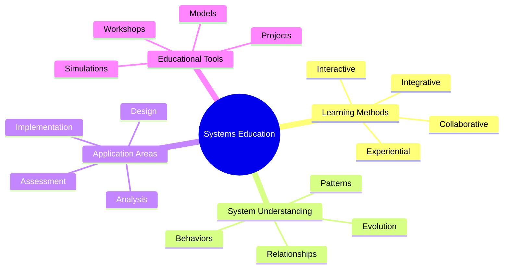
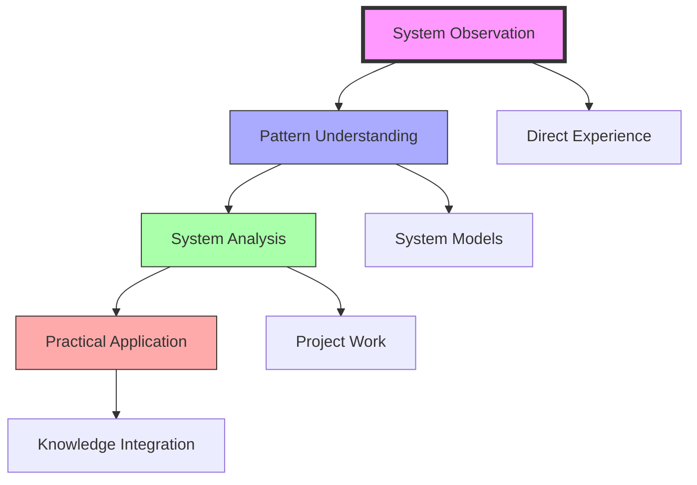
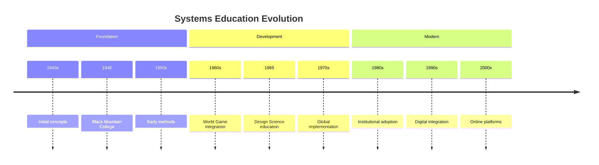
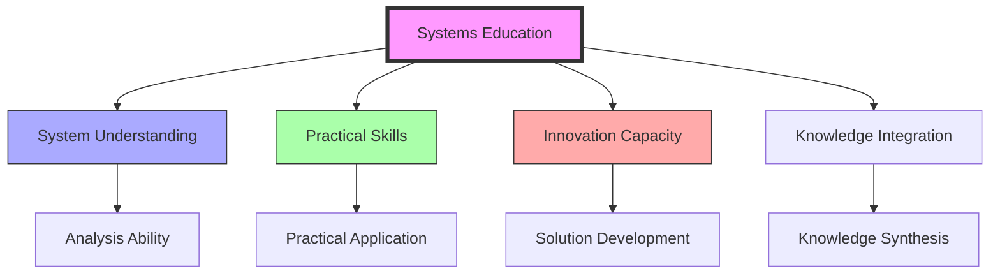

# Systems Education

> Fuller's innovative educational methodology integrating [[System_Analysis]], [[Pattern_Recognition]], and [[Design_Science]] to develop comprehensive understanding of interconnected systems.

## Core Philosophy

### Educational Framework

### Learning Process

## Historical Development

## Educational Methods

### Teaching Approaches
- [[Pattern_Learning]]
- [[Design_Science_Education]]
- Experiential learning
- Project-based work

### Learning Tools
- [[World_Game]] simulations
- System models
- Design projects
- Collaborative workshops

## Implementation

### Educational Settings
- [[Black_Mountain_College]]
- [[Southern_Illinois_University]]
- [[Harvard_University]]
- [[Design_Science_Lab]]

### Teaching Methods

## Core Components

### Learning Elements
- System understanding
- Pattern recognition
- Design thinking
- Practical application

### Educational Tools
- Interactive models
- System simulations
- Design projects
- Collaborative work

## Research Impact

### Areas of Influence
- [[Design_Science]]
- [[Pattern_Recognition]]
- [[System_Analysis]]
- [[Resource_Distribution]]

### Educational Innovation
- Teaching methods
- Learning tools
- Assessment approaches
- Integration strategies

## Modern Applications

### Contemporary Use
- Design education
- Systems thinking
- Sustainability studies
- Innovation training

### Digital Integration
- Online platforms
- Virtual simulations
- Interactive tools
- Collaborative spaces

## Institutional Implementation

### Educational Programs
- University courses
- Professional training
- Workshop series
- Research programs

### Learning Environments
- Physical classrooms
- Design studios
- Research labs
- Online platforms

## Future Development

### Innovation Areas
- Digital platforms
- Virtual reality
- AI integration
- Global networks

### Application Domains
- Sustainable design
- Global systems
- Resource management
- Innovation development

## Educational Impact

### Learning Outcomes

### Global Influence
- Educational methods
- Teaching approaches
- Learning tools
- Assessment systems

## References

### Primary Sources
- Fuller, R. B. (1969). *Education Automation*.
- Fuller, R. B. (1981). *Critical Path*.
- [[BFI_Archives]] Educational Materials

### Secondary Sources
- Edmondson, A. C. (2007). *A Fuller Explanation*.
- [[Black_Mountain_College]] Documentation
- Educational Program Records

## See Also

- [[Design_Science_Education]]
- [[Pattern_Learning]]
- [[World_Game]]
- [[System_Analysis]]

## Notes

Systems Education represents Fuller's comprehensive approach to developing integrated understanding through experiential learning and practical application, forming the foundation for his educational philosophy and methodologies. 