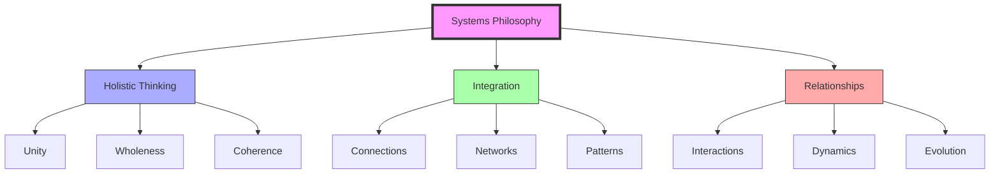
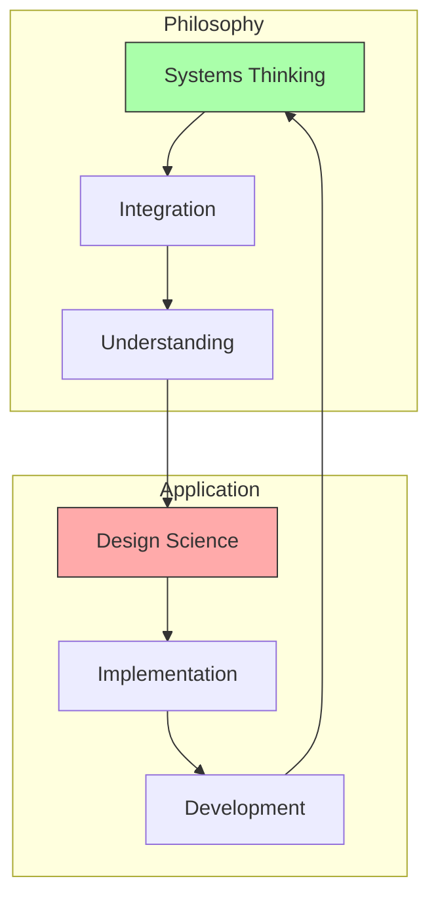
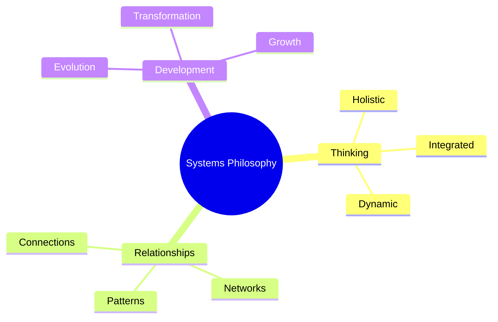
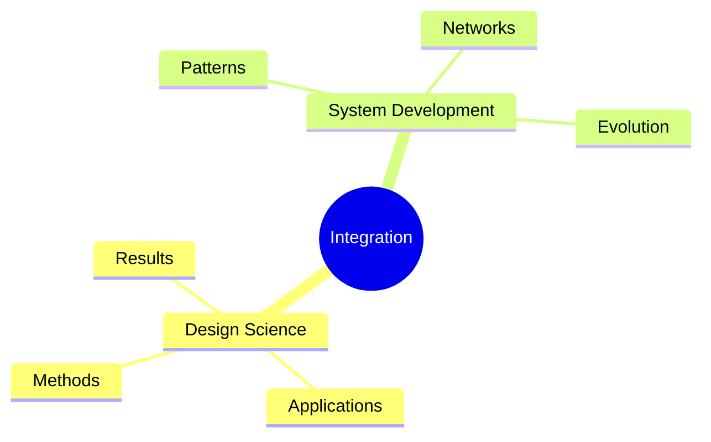

# Systems Philosophy

Systems Philosophy represents the foundational philosophical framework underlying Fuller's approach to understanding reality as an integrated network of systems and relationships.

## Core Principles

### Philosophical Framework

### Key Elements
1. Holistic Understanding
   - System unity
   - Pattern recognition
   - Relationship dynamics
   - Integration methods

2. System Dynamics
   - Network interactions
   - Pattern evolution
   - Dynamic relationships
   - System development

## Integration with Fuller's Work

### System Connection

### Application Areas
1. [[concepts/Design_Science|Design Science]]
   - System integration
   - Pattern application
   - Relationship development
   - Implementation methods

2. [[concepts/Synergetics|Synergetics]]
   - Geometric systems
   - Pattern relationships
   - Dynamic interactions
   - System evolution

## Methodological Framework

### Core Concepts

### Implementation Strategy
1. [[concepts/System_Analysis|System Analysis]]
   - Pattern recognition
   - Relationship mapping
   - Network understanding
   - Integration methods

2. [[concepts/System_Development|System Development]]
   - Evolution patterns
   - Growth dynamics
   - Transformation processes
   - Integration strategies

## Educational Applications

### Learning Framework
1. [[concepts/Systems_Education|Educational Integration]]
   - Systems thinking
   - Pattern recognition
   - Relationship understanding
   - Integration methods

2. [[concepts/Global_University|Global Implementation]]
   - System networks
   - Pattern development
   - Relationship dynamics
   - Integration strategies

### Teaching Methods

## Influence on Fuller's Work

### Key Impacts
1. Design Approach
   - System integration
   - Pattern recognition
   - Relationship dynamics
   - Implementation methods

2. Development Strategy
   - Network thinking
   - Pattern evolution
   - Dynamic relationships
   - System growth

### Integration Framework

## References

### Primary Sources
1. [[books/General_Systems_Theory|General Systems Theory]]
2. [[books/Synergetics_Book|Synergetics]]
3. [[books/Operating_Manual_for_Spaceship_Earth|Operating Manual for Spaceship Earth]]

### Related Resources
1. [[papers/Systems_Philosophy|Systems Philosophy Papers]]
2. [[papers/Integration_Methods|Integration Methodology]]
3. [[papers/System_Development|System Development Studies]]

## Notes
- Foundational to Fuller's approach
- Integration of systems thinking
- Pattern recognition focus
- Relationship dynamics
- Continuous development

## Tags
#philosophy #systems-thinking #holistic-approach #methodology #integration 