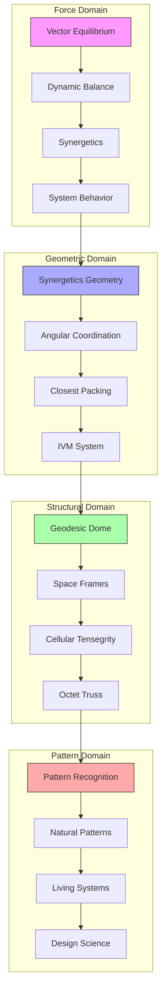
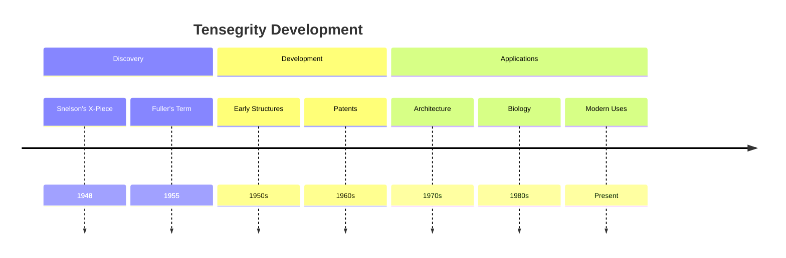
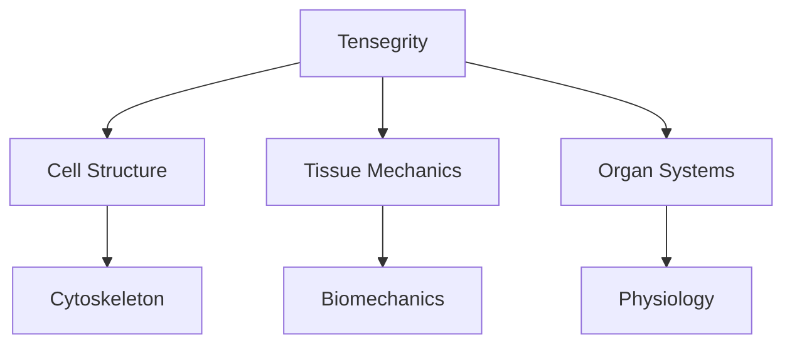
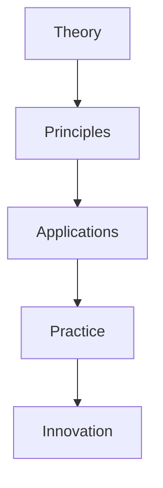

# Tensegrity

Tensegrity, a term coined by R. Buckminster Fuller from "tensional integrity," represents a structural principle where isolated components under compression exist within a network of continuous tension, creating stable and efficient structures that embody Fuller's principle of "doing more with less."

## Overview

### Definition
```yaml
tensegrity:
  etymology: Tension + Integrity (Fuller, 1955)
  discovered_by: Kenneth Snelson (Student of Fuller)
  developed_by: R. Buckminster Fuller
  principle: "Islands of compression in an ocean of tension"
  key_characteristics:
    - Discontinuous compression
    - Continuous tension
    - Structural efficiency
    - Self-stabilization
  applications:
    - Architecture
    - Engineering
    - Biology
    - Space Structures
    - Sustainable Design
  key_interpreters:
    - [[Kenneth Snelson]]
    - [[Donald E Ingber]]
    - [[David Georges Emmerich]]
    - [[R Buckminster Fuller]]
```

### Core Principles
1. Structural Properties
   - Continuous tension
   - Discontinuous compression
   - Self-stabilization
   - Structural efficiency

2. System Characteristics
   - Force distribution
   - Material optimization
   - Dynamic stability
   - Scalable design

## Epic Connections

### Structural Networks
```mermaid
mindmap
    root((Tensegrity))
        Force Systems
            [[Vector_Equilibrium|Force Balance]]
            [[Dynamic_Balance|System Equilibrium]]
            [[Synergetics|Energy Systems]]
            [[System_Behavior|Dynamic Response]]
        Geometric Principles
            [[Synergetics_Geometry|Nature's Mathematics]]
            [[60_Degree_Coordination|Angular Relations]]
            [[Closest_Packing_of_Spheres|Spatial Efficiency]]
            [[IVM_XYZ|Coordinate Systems]]
        Structural Applications
            [[Geodesic_Dome|Spherical Structures]]
            [[Space_Frames|Framework Systems]]
            [[Cellular_Tensegrity|Biological Systems]]
            [[Octet_Truss|Load Distribution]]
        Pattern Integration
            [[Pattern_Recognition|System Understanding]]
            [[Natural_Patterns|Nature's Language]]
            [[Living_Systems|Biological Patterns]]
            [[Design_Science|Method Integration]]
```

### System Weaving


### Integration Framework
```yaml
tensegrity_networks:
  force_systems:
    vector_equilibrium:
      principle: "Force balance"
      connection: "[[Vector_Equilibrium]]"
    dynamic_balance:
      principle: "System equilibrium"
      connection: "[[Dynamic_Balance]]"
    synergetics:
      principle: "Energy systems"
      connection: "[[Synergetics]]"
    system_behavior:
      principle: "Dynamic response"
      connection: "[[System_Behavior]]"

  geometric_principles:
    synergetics_geometry:
      foundation: "Nature's mathematics"
      connection: "[[Synergetics_Geometry]]"
    angular_coordination:
      foundation: "Angular relations"
      connection: "[[60_Degree_Coordination]]"
    closest_packing:
      foundation: "Spatial efficiency"
      connection: "[[Closest_Packing_of_Spheres]]"
    ivm_system:
      foundation: "Coordinate systems"
      connection: "[[IVM_XYZ]]"

  structural_applications:
    geodesic_dome:
      application: "Spherical structures"
      connection: "[[Geodesic_Dome]]"
    space_frames:
      application: "Framework systems"
      connection: "[[Space_Frames]]"
    cellular_tensegrity:
      application: "Biological systems"
      connection: "[[Cellular_Tensegrity]]"
    octet_truss:
      application: "Load distribution"
      connection: "[[Octet_Truss]]"

  pattern_integration:
    pattern_recognition:
      method: "System understanding"
      connection: "[[Pattern_Recognition]]"
    natural_patterns:
      method: "Nature's language"
      connection: "[[Natural_Patterns]]"
    living_systems:
      method: "Biological patterns"
      connection: "[[Living_Systems]]"
    design_science:
      method: "Method integration"
      connection: "[[Design_Science]]"
```

### Application Domains
```mermaid
mindmap
    root((Applications))
        Structural Design
            [[Geodesic_Dome|Spherical Systems]]
            [[Space_Frames|Framework Design]]
            [[Octet_Truss|Load Systems]]
            [[Universal_Architecture|Building Systems]]
        Biological Systems
            [[Cellular_Tensegrity|Cell Structure]]
            [[Living_Systems|Organic Design]]
            [[Natural_Patterns|Growth Systems]]
            [[System_Behavior|Dynamic Response]]
        Design Integration
            [[Design_Science|Method Integration]]
            [[Synergetics|System Integration]]
            [[Pattern_Recognition|Pattern Systems]]
            [[System_Analysis|Analysis Methods]]
        Educational Methods
            [[Pattern_Learning|Learning Systems]]
            [[Systems_Education|Teaching Methods]]
            [[Design_Science_Education|Design Education]]
            [[Global_University|Knowledge Networks]]
```

## Historical Development

### Origins and Evolution


### Key Contributors
1. Primary Development
   - [[Kenneth Snelson]]
   - [[R. Buckminster Fuller]]
   - [[David Georges Emmerich]]

2. Modern Applications
   - [[Donald E Ingber]]
   - [[Tom Flemons]]
   - [[Contemporary Researchers]]

## Technical Principles

### Structural Analysis
```mermaid
mindmap
    root((Tensegrity))
        Forces
            [[Tension Network]]
            [[Compression Members]]
            [[Force Balance]]
        Components
            [[Struts]]
            [[Cables]]
            [[Nodes]]
        Behavior
            [[Stability]]
            [[Flexibility]]
            [[Resilience]]
```

### Mathematical Foundation
1. Force Distribution
   - Vector analysis
   - Load paths
   - Stress patterns
   - Equilibrium states

2. Geometric Properties
   - Spatial relationships
   - Symmetry patterns
   - Structural efficiency
   - Scaling principles

## Applications

### Architecture and Engineering
1. Building Structures
   - [[Tensegrity Domes]]
   - [[Space Frames]]
   - [[Bridge Design]]
   - [[Deployable Structures]]

2. Engineering Systems
   - [[Aerospace Applications]]
   - [[Robotics]]
   - [[Smart Materials]]
   - [[Sustainable Design]]

### Biological Systems


## Research Areas

### Current Studies
1. Structural Research
   - Form-finding
   - Optimization
   - Dynamic behavior
   - Material systems

2. Biological Research
   - [[Cellular Tensegrity]]
   - [[Tissue Engineering]]
   - [[Biomechanical Systems]]
   - [[Medical Applications]]

### Research Framework
```mermaid
mindmap
    root((Research))
        Structure
            [[Form Analysis]]
            [[Load Testing]]
            [[Dynamic Response]]
        Biology
            [[Cell Mechanics]]
            [[Tissue Systems]]
            [[Medical Applications]]
        Innovation
            [[New Materials]]
            [[Smart Structures]]
            [[Adaptive Systems]]
```

## Design and Construction

### Design Principles
1. System Design
   - Component relationships
   - Force distribution
   - Material selection
   - Assembly methods

2. Construction Methods
   - Component fabrication
   - Assembly sequence
   - Quality control
   - Testing procedures

### Design Process


## Educational Value

### Learning Applications
1. Engineering Education
   - Structural principles
   - Force analysis
   - Design methods
   - Construction techniques

2. Interdisciplinary Learning
   - Biology connections
   - Design principles
   - Systems thinking
   - Innovation methods

### Educational Framework


## Modern Applications

### Sustainable Design
1. Environmental Integration
   - Resource efficiency
   - Material optimization
   - [[Ephemeralization|Doing more with less]]
   - [[Comprehensive_Anticipatory_Design_Science|Design science principles]]

2. Future Applications
   - Space structures
   - Adaptive architecture
   - Biomimetic design
   - [[World_Game|Global solutions]]

### Innovation Areas
```mermaid
mindmap
    root((Innovation))
        Technology
            [[Smart Structures]]
            [[Adaptive Systems]]
            [[New Materials]]
        Biology
            [[Medical Research]]
            [[Tissue Engineering]]
            [[Drug Development]]
```

## Cultural Impact

### Influence Areas
1. Design Field
   - Architectural innovation
   - Engineering methods
   - Material systems
   - Sustainable design

2. Scientific Understanding
   - Biological systems
   - Material science
   - Systems thinking
   - Innovation methods

### Legacy Effects
```mermaid
mindmap
    root((Impact))
        Design
            [[Architecture]]
            [[Engineering]]
            [[Art]]
        Science
            [[Biology]]
            [[Materials]]
            [[Systems]]
```

## Resources

### Fuller-Specific Resources
1. Primary Sources
   - [[Synergetics|Synergetics Books]]
   - [[Operating_Manual_for_Spaceship_Earth]]
   - Fuller's Patents
   - Original Drawings

2. Contemporary Studies
   - [[BFI|Buckminster Fuller Institute]]
   - Academic Research
   - Technical Papers
   - Application Studies

## References
1. Fuller, R. B. (1975). Synergetics: Explorations in the Geometry of Thinking
2. Fuller, R. B. (1979). Synergetics 2
3. Snelson, K. (2012). The Art of Tensegrity
4. Ingber, D. E. (1998). The Architecture of Life
5. Edmondson, A. (1987). A Fuller Explanation

## Related Concepts
- [[Synergetics]]
- [[Vector_Equilibrium]]
- [[Geodesic_Mathematics]]
- [[Dymaxion_Principles]]
- [[World_Game]]
- [[Comprehensive_Anticipatory_Design_Science]]

## Tags
#fuller-principle #concept #structure #engineering #architecture #biomechanics 