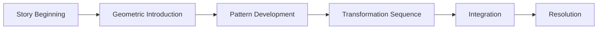
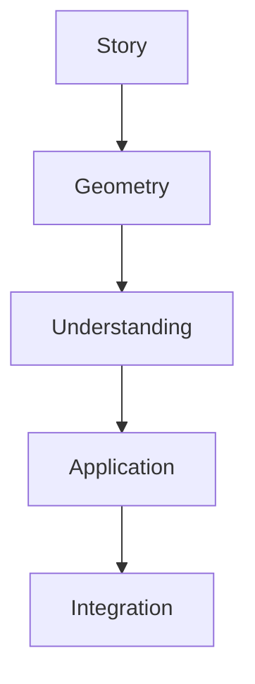
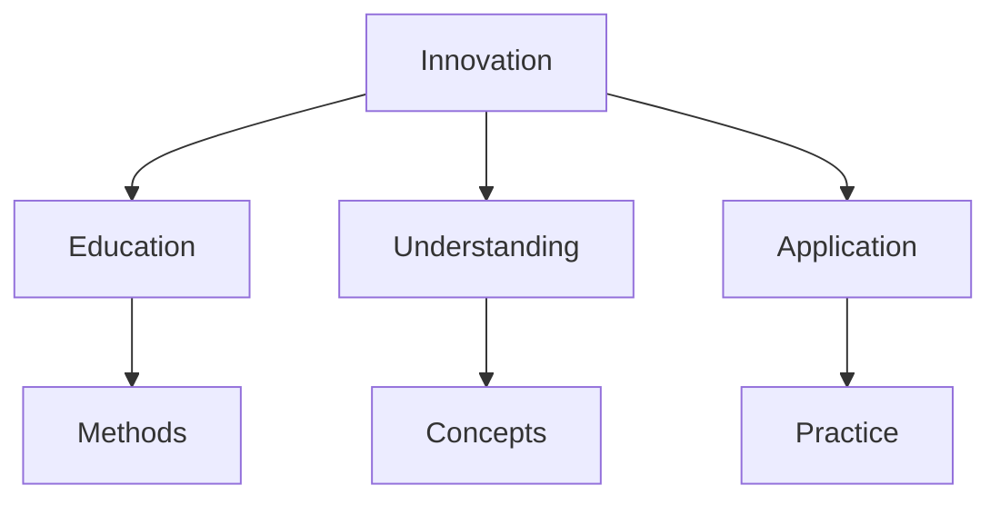
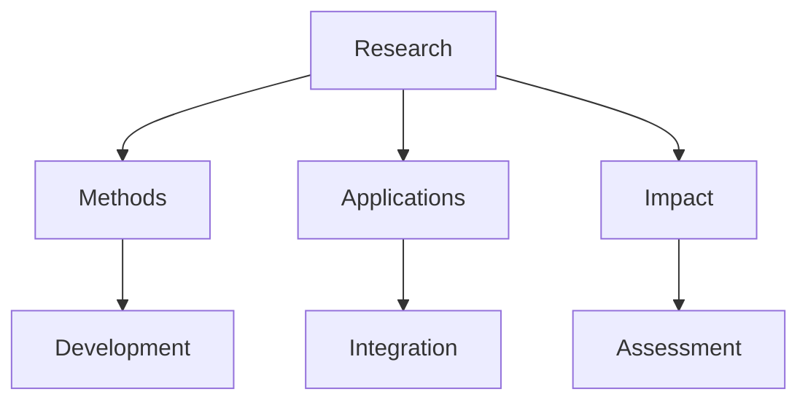

# Tetrascroll

Tetrascroll is R. Buckminster Fuller's geometric reimagining of "Goldilocks and the Three Bears," using the story as a vehicle to explore fundamental principles of synergetics and geometric thought.

## Overview

### Definition
```yaml
tetrascroll:
  creator: R. Buckminster Fuller
  published: 1975
  format: Accordion-fold book
  subtitle: Goldilocks and the Three Bears
  purpose: Geometric education through storytelling
  principles:
    - Tetrahedral geometry
    - Synergetic principles
    - Transformation patterns
    - Educational innovation
```

### Core Elements
1. Story Components
   - Traditional fairy tale
   - Geometric principles
   - Transformational patterns
   - Educational narrative

2. Geometric Concepts
   - Tetrahedral systems
   - Symmetry operations
   - Spatial relationships
   - Dynamic transformations

## Educational Design

### Teaching Approach
```mermaid
mindmap
    root((Tetrascroll))
        Story
            [[Narrative Structure]]
            [[Character Development]]
            [[Plot Integration]]
        Geometry
            [[Tetrahedral Systems]]
            [[Transformation Patterns]]
            [[Spatial Relations]]
        Learning
            [[Conceptual Understanding]]
            [[Visual Learning]]
            [[Pattern Recognition]]
```

### Learning Objectives
1. Geometric Understanding
   - Spatial relationships
   - Transformation principles
   - Symmetry operations
   - System dynamics

2. Conceptual Integration
   - Story-based learning
   - Visual thinking
   - Pattern recognition
   - System understanding

## Narrative Structure

### Story Elements
1. Traditional Components
   - [[Goldilocks Character]]
   - [[Three Bears]]
   - [[Forest Setting]]
   - [[House Discovery]]

2. Geometric Integration
   - [[Tetrahedral Forms]]
   - [[Transformation Sequences]]
   - [[Spatial Patterns]]
   - [[System Relationships]]

### Narrative Flow


## Geometric Principles

### Core Concepts
1. Tetrahedral Systems
   - Basic forms
   - Relationships
   - Transformations
   - Patterns

2. Spatial Dynamics
   - Movement patterns
   - Form changes
   - System evolution
   - Integration methods

### Geometric Framework
```mermaid
mindmap
    root((Geometry))
        Forms
            [[Tetrahedra]]
            [[Symmetries]]
            [[Patterns]]
        Transformations
            [[Movement]]
            [[Evolution]]
            [[Integration]]
        Systems
            [[Relationships]]
            [[Dynamics]]
            [[Structures]]
```

## Educational Applications

### Teaching Methods
1. Story-Based Learning
   - Narrative engagement
   - Visual understanding
   - Pattern recognition
   - Concept integration

2. Geometric Education
   - Form understanding
   - Spatial relationships
   - Transformation principles
   - System dynamics

### Learning Framework


## Design Elements

### Physical Structure
1. Book Design
   - Accordion format
   - Visual sequences
   - Geometric patterns
   - Transformation series

2. Visual Components
   - Illustrations
   - Diagrams
   - Pattern sequences
   - Transformation maps

### Design Framework
```mermaid
mindmap
    root((Design))
        Structure
            [[Format]]
            [[Layout]]
            [[Sequence]]
        Visuals
            [[Illustrations]]
            [[Patterns]]
            [[Diagrams]]
```

## Cultural Impact

### Influence Areas
1. Educational Innovation
   - Teaching methods
   - Learning tools
   - Concept integration
   - Pattern understanding

2. Geometric Education
   - Spatial thinking
   - Form understanding
   - System relationships
   - Transformation principles

### Impact Framework


## Modern Applications

### Contemporary Use
1. Educational Settings
   - Geometry teaching
   - Pattern recognition
   - System understanding
   - Concept integration

2. Design Applications
   - Visual thinking
   - Pattern development
   - System design
   - Transformation understanding

### Application Areas
```mermaid
mindmap
    root((Applications))
        Education
            [[Teaching]]
            [[Learning]]
            [[Understanding]]
        Design
            [[Thinking]]
            [[Patterns]]
            [[Systems]]
```

## Research Value

### Study Areas
1. Educational Research
   - Learning methods
   - Visual thinking
   - Pattern recognition
   - System understanding

2. Design Research
   - Form development
   - Transformation patterns
   - System relationships
   - Integration methods

### Research Framework


## Resources

### Documentation
- [[Original Publication]]
- [[Teaching Guides]]
- [[Application Notes]]
- [[Research Studies]]

### Learning Materials
1. Educational Resources
   - [[Teaching Materials]]
   - [[Learning Guides]]
   - [[Pattern Studies]]

2. Research Materials
   - [[Method Studies]]
   - [[Impact Analysis]]
   - [[Application Cases]]

## References
1. Fuller's original work
2. Educational studies
3. Application research
4. Impact assessments
5. Teaching guides

## Notes
- Innovative educational tool
- Integrates story and geometry
- Continues to influence teaching
- Relevant to modern education

## Tags
#concept #education #geometry #storytelling #synergetics 