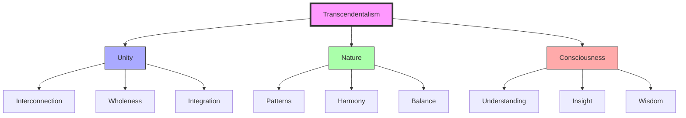
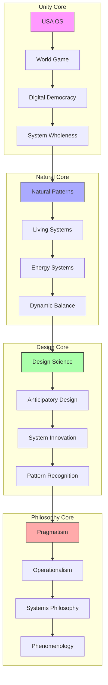
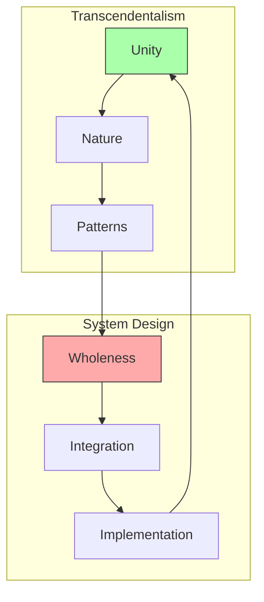
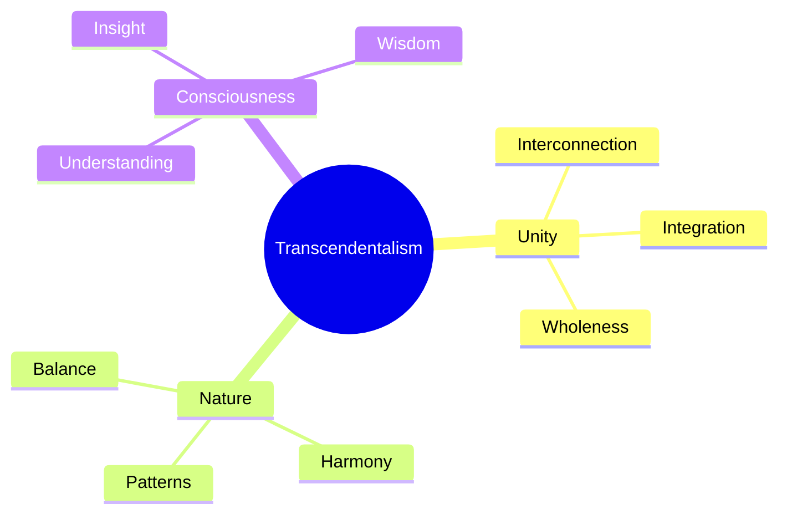

# Transcendentalism

Transcendentalism represents a philosophical perspective that influenced Fuller's understanding of [[concepts/System_Wholeness|system wholeness]] and the interconnected nature of reality, emphasizing unity, nature, and holistic thinking.

## Core Principles

### Philosophical Framework


### Key Elements
1. Holistic Vision ([[1]] and related topics). 
   - Unity of existence
   - Natural harmony
   - Pattern recognition
   - System integration

2. Natural Principles
   - Interconnection
   - Balance
   - Harmony
   - Evolution

## Epic Connections

### Unity Networks
```mermaid
mindmap
    root((Transcendentalism))
        System Unity
            [[USA_OS|Operating System Unity]]
            [[World_Game|Resource Unity]]
            [[Digital_Democracy|Network Unity]]
            [[System_Wholeness|System Integration]]
        Natural Harmony
            [[Natural_Patterns|Pattern Unity]]
            [[Living_Systems|Biological Unity]]
            [[Energy_Systems|Flow Unity]]
            [[Dynamic_Balance|System Balance]]
        Design Integration
            [[Design_Science|Method Unity]]
            [[Anticipatory_Design|Planning Unity]]
            [[System_Innovation|Evolution Unity]]
            [[Pattern_Recognition|Pattern Integration]]
        Philosophical Foundations
            [[Pragmatism|Practical Unity]]
            [[Operationalism|Verification Unity]]
            [[Systems_Philosophy|Systems Unity]]
            [[Phenomenology|Experience Unity]]
```

### System Weaving


### Integration Framework
```yaml
transcendental_networks:
  system_unity:
    usa_os:
      principle: "Operating system unity"
      connection: "[[USA_OS]]"
    world_game:
      principle: "Resource unity"
      connection: "[[World_Game]]"
    digital_democracy:
      principle: "Network unity"
      connection: "[[Digital_Democracy]]"
    system_wholeness:
      principle: "System integration"
      connection: "[[System_Wholeness]]"

  natural_harmony:
    natural_patterns:
      harmony: "Pattern unity"
      connection: "[[Natural_Patterns]]"
    living_systems:
      harmony: "Biological unity"
      connection: "[[Living_Systems]]"
    energy_systems:
      harmony: "Flow unity"
      connection: "[[Energy_Systems]]"
    dynamic_balance:
      harmony: "System balance"
      connection: "[[Dynamic_Balance]]"

  design_integration:
    design_science:
      method: "Method unity"
      connection: "[[Design_Science]]"
    anticipatory_design:
      method: "Planning unity"
      connection: "[[Anticipatory_Design]]"
    system_innovation:
      method: "Evolution unity"
      connection: "[[System_Innovation]]"
    pattern_recognition:
      method: "Pattern integration"
      connection: "[[Pattern_Recognition]]"

  philosophical_foundations:
    pragmatism:
      foundation: "Practical unity"
      connection: "[[Pragmatism]]"
    operationalism:
      foundation: "Verification unity"
      connection: "[[Operationalism]]"
    systems_philosophy:
      foundation: "Systems unity"
      connection: "[[Systems_Philosophy]]"
    phenomenology:
      foundation: "Experience unity"
      connection: "[[Phenomenology]]"
```

### USA OS Integration
```mermaid
mindmap
    root((USA OS Unity))
        System Integration
            [[System_Wholeness|System Unity]]
            [[Pattern_Recognition|Pattern Unity]]
            [[System_Behavior|Behavior Unity]]
            [[Energy_Systems|Flow Unity]]
        Resource Unity
            [[Resource_Distribution|Distribution Unity]]
            [[World_Game|Simulation Unity]]
            [[Digital_Democracy|Network Unity]]
            [[Global_University|Education Unity]]
        Design Unity
            [[Design_Science|Method Unity]]
            [[Anticipatory_Design|Planning Unity]]
            [[System_Innovation|Evolution Unity]]
            [[Pattern_Formation|Development Unity]]
        Philosophical Unity
            [[Pragmatism|Practical Unity]]
            [[Operationalism|Verification Unity]]
            [[Systems_Philosophy|Systems Unity]]
            [[Phenomenology|Experience Unity]]
```

## Integration with Fuller's Work

### System Connection


### Application Areas
1. [[concepts/System_Wholeness|System Wholeness]]
   - Unity principles
   - Natural patterns
   - Holistic design
   - Integration methods

2. [[concepts/Living_Systems|Living Systems]]
   - Natural harmony
   - System balance
   - Pattern recognition
   - Evolutionary design

## Philosophical Framework

### Core Concepts


### Implementation Strategy
1. [[concepts/Pattern_Recognition|Pattern Recognition]]
   - Natural patterns
   - System relationships
   - Unity principles
   - Integration methods

2. [[concepts/Spaceship_Earth|Global Vision]]
   - Planetary consciousness
   - System unity
   - Natural harmony
   - Global integration

## Educational Applications

### Learning Framework
1. [[concepts/Design_Science_Education|Educational Integration]]
   - Holistic understanding
   - Pattern recognition
   - System thinking
   - Natural principles

2. [[concepts/Global_University|Global Perspective]]
   - Unity consciousness
   - System integration
   - Natural harmony
   - Global awareness

### Teaching Methods


## Influence on Fuller's Work

### Key Impacts
1. System Understanding
   - Holistic vision
   - Natural patterns
   - Unity principles
   - Integration methods

2. Design Philosophy
   - Natural harmony
   - System balance
   - Pattern recognition
   - Evolutionary design

## References

### Primary Sources
1. [[books/Nature|Nature - Emerson]]
2. [[books/Synergetics_Book|Synergetics]]
3. [[books/Operating_Manual_for_Spaceship_Earth|Operating Manual for Spaceship Earth]]

### Related Resources
1. [[papers/Transcendental_Philosophy|Transcendental Philosophy]]
2. [[papers/System_Unity|System Unity Principles]]
3. [[papers/Natural_Harmony|Natural Harmony in Design]]

## Notes
- Significant influence on Fuller's holistic thinking
- Integration with system wholeness principles
- Focus on natural patterns and harmony
- Unity-based approach

## Tags
#philosophy #holistic-thinking #nature #unity #systems-thinking 