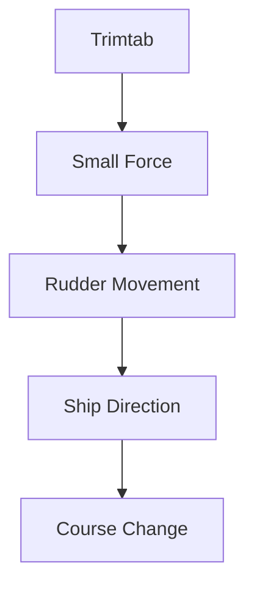
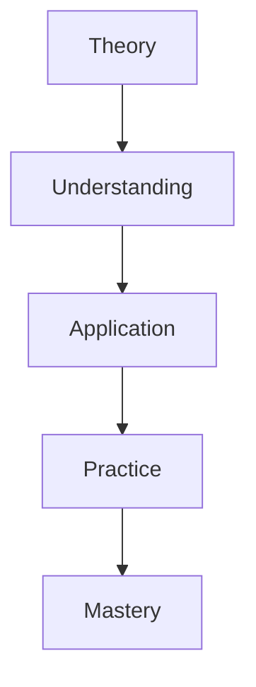
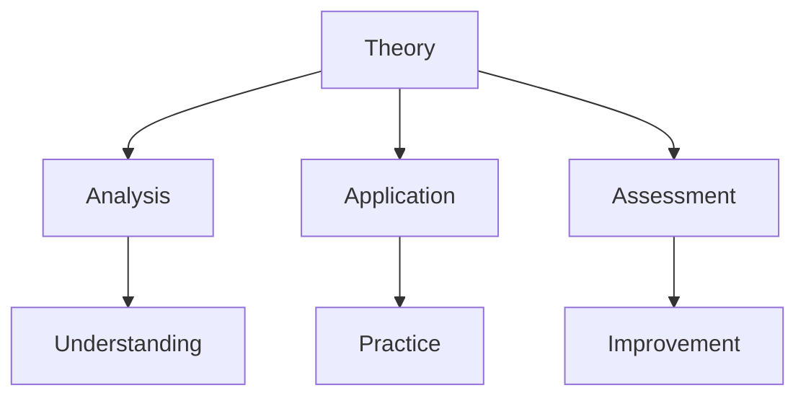

# Trimtab

The Trimtab principle, derived from ship steering mechanisms, represents R. Buckminster Fuller's concept of achieving maximum change through minimum, well-placed effort.

## Overview

### Definition
```yaml
trimtab:
  origin: Naval architecture
  metaphor: Ship steering mechanism
  principle: Minimal input, maximum effect
  application: Social and technological change
  fuller_quote: "Call me trimtab"
  epitaph: "Call me trimtab" - Fuller's gravestone
```

### Core Concept
1. Physical Principle
   - Small rudder on main rudder
   - Minimal energy input
   - Maximum steering effect
   - Efficient control

2. Metaphorical Application
   - Strategic intervention
   - Leverage points
   - System change
   - Efficient transformation

## Technical Foundation

### Mechanical Principle


### System Dynamics
1. Physical Systems
   - Force multiplication
   - Energy efficiency
   - Control systems
   - Feedback loops

2. Social Systems
   - Change catalysts
   - Influence networks
   - System leverage
   - Transformation patterns

## Applications

### Implementation Areas
1. Design Science
   - [[System Design]]
   - [[Efficient Solutions]]
   - [[Change Management]]
   - [[Innovation Strategy]]

2. Social Change
   - [[Community Action]]
   - [[Policy Reform]]
   - [[Education Systems]]
   - [[Cultural Transformation]]

### Strategic Framework
```mermaid
mindmap
    root((Trimtab Effect))
        Design
            [[System Analysis]]
            [[Intervention Points]]
            [[Solution Design]]
        Implementation
            [[Strategic Action]]
            [[Resource Efficiency]]
            [[Impact Measurement]]
        Scale
            [[Local Action]]
            [[Global Impact]]
            [[System Change]]
```

## Philosophical Implications

### Change Theory
1. System Understanding
   - Complex dynamics
   - Interconnections
   - Feedback loops
   - Change patterns

2. Strategic Thinking
   - Leverage identification
   - Resource optimization
   - Impact maximization
   - System transformation

### Conceptual Framework


## Practical Implementation

### Application Methods
1. Analysis Phase
   - System mapping
   - Leverage identification
   - Resource assessment
   - Strategy development

2. Action Phase
   - Targeted intervention
   - Resource deployment
   - Impact monitoring
   - Adjustment process

### Implementation Process
```mermaid
mindmap
    root((Implementation))
        Analysis
            [[System Mapping]]
            [[Leverage Points]]
            [[Resource Assessment]]
        Action
            [[Strategic Intervention]]
            [[Impact Monitoring]]
            [[Adjustment Process]]
```

## Educational Value

### Learning Applications
1. System Understanding
   - Complex systems
   - Change dynamics
   - Leverage points
   - Strategic thinking

2. Practical Skills
   - Analysis methods
   - Strategy development
   - Implementation
   - Impact assessment

### Educational Framework


## Modern Applications

### Contemporary Use
1. Social Innovation
   - Community development
   - Policy change
   - Educational reform
   - Cultural transformation

2. Technical Systems
   - Design optimization
   - Resource efficiency
   - System improvement
   - Innovation strategy

### Current Projects
```mermaid
mindmap
    root((Modern Use))
        Social
            [[Community Projects]]
            [[Policy Initiatives]]
            [[Education Programs]]
        Technical
            [[Design Innovation]]
            [[System Optimization]]
            [[Resource Efficiency]]
```

## Research Value

### Study Areas
1. Systems Theory
   - Change dynamics
   - Leverage effects
   - System behavior
   - Transformation patterns

2. Application Research
   - Implementation methods
   - Impact assessment
   - Success factors
   - Case studies

### Research Framework


## Cultural Impact

### Influence Areas
1. Design Thinking
   - Strategic design
   - Efficient solutions
   - System innovation
   - Change management

2. Social Change
   - Movement building
   - Policy development
   - Educational reform
   - Cultural transformation

### Legacy Effects
```mermaid
mindmap
    root((Impact))
        Design
            [[Innovation]]
            [[Efficiency]]
            [[Strategy]]
        Society
            [[Movements]]
            [[Policy]]
            [[Culture]]
```

## Resources

### Documentation
- [[Design Principles]]
- [[Case Studies]]
- [[Implementation Guides]]
- [[Research Papers]]

### Learning Materials
1. Educational Resources
   - [[Teaching Guides]]
   - [[Practice Examples]]
   - [[Application Methods]]

2. Research Materials
   - [[Theory Development]]
   - [[Impact Studies]]
   - [[Case Analyses]]

## References
1. Fuller's writings
2. System studies
3. Application cases
4. Impact research
5. Educational materials

## Notes
- Powerful change principle
- Wide applicability
- Efficient approach
- Continuing relevance

## Tags
#concept #design-principle #leverage #change-theory #systems-thinking 