# USA OS

The United States of America Operating System (USA OS) represents a conceptual framework for reimagining governance and resource distribution through the lens of [[concepts/Design_Science|Design Science]] and [[concepts/General_Systems_Theory|General Systems Theory]].

## System Overview

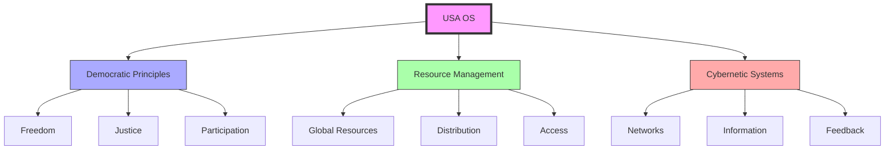

## Core Concepts

### System Architecture
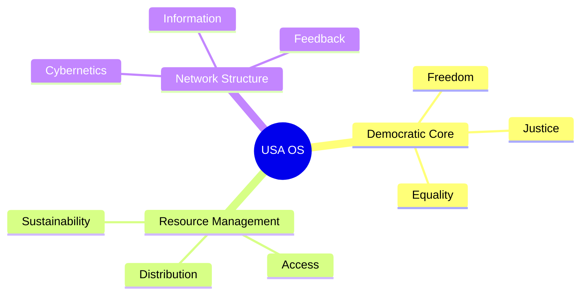

### Relationship to [[concepts/GRUNCH|GRUNCH]]
The challenge posed by [[concepts/GRUNCH|Gross Universal Cash Heist]] raises questions about the future of democratic ideals and institutional frameworks. Rather than accepting corporate dominance, USA OS proposes a cybernetic framework for democratic resource management.

## Implementation Framework

### Digital Democracy
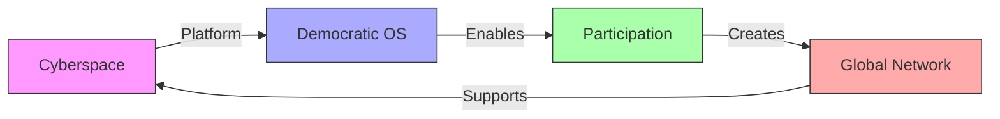

### Resource Distribution
1. [[concepts/Global_University|Global University System]]
   - Educational access
   - Resource allocation
   - Knowledge distribution
   - Skill development

2. [[Design_Science|Design Science Revolution]]
   - Systematic solutions
   - Resource optimization
   - Sustainable design
   - Global implementation

## Economic Transformation

### From Economics to [[concepts/General_Systems_Theory|GST]]
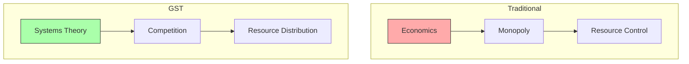

### Educational Evolution
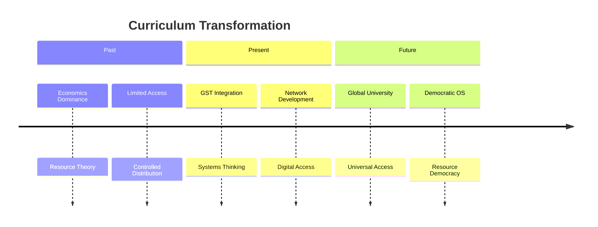

## Applications

### Global Implementation
1. [[concepts/World_Game|World Game Platform]]
   - Resource simulation
   - Global cooperation
   - Problem-solving
   - Strategic planning

2. [[concepts/Digital_Democracy|Digital Democracy Tools]]
   - Participation platforms
   - Decision systems
   - Resource allocation
   - Feedback mechanisms

### Network Structure
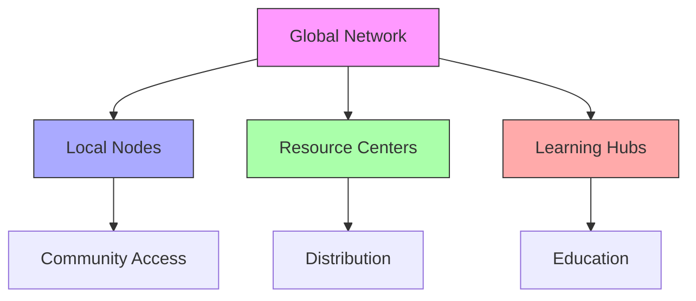

## Future Development

### Innovation Areas
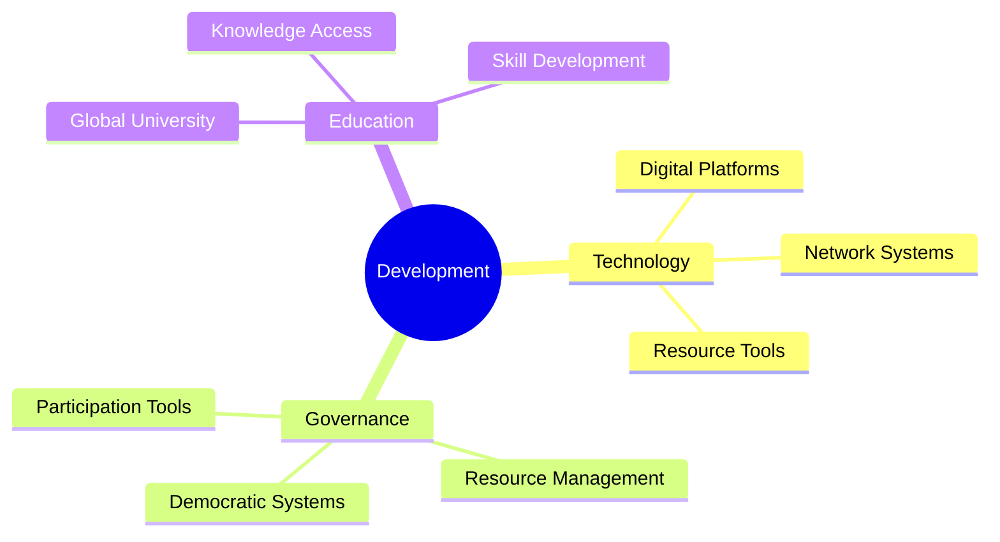

### Implementation Strategy
1. [[concepts/Project_Renaissance|Project Renaissance]]
   - Public-private collaboration
   - System development
   - Resource integration
   - Global deployment

2. [[concepts/Living_Systems|Living Systems Design]]
   - Sustainable solutions
   - Resource efficiency
   - System integration
   - Global accessibility

## Historical Evolution

### System Timeline
```mermaid
stateDiagram-v2
    direction TB
    
    state "Pre-Colonial Systems (Pre-1600s)" as PreColonial {
        Native_Systems: Indigenous Governance Networks
        Trade_Routes: Continental Trade Protocols
        Council_Systems: Confederacy Operating Models
        
        Native_Systems --> Trade_Routes
        Trade_Routes --> Council_Systems
    }
    
    state "Colonial Era (1600s-1776)" as Colonial {
        state "Governance Layer" as Col_Gov {
            British_OS: British Operating System v1.1
            Colonial_Assembly: Distributed Governance v0.9
            Town_Meet: Local Processing Units
        }
        state "Economic Layer" as Col_Econ {
            Mercantile: Resource Management v1.0
            Trade_System: Colonial Exchange Protocol
            Currency: Multiple Currency Standards
        }
        state "Social Layer" as Col_Social {
            Class_System: Hierarchical Access Control
            Church_State: Belief System Integration
            Education: Knowledge Distribution v0.8
        }
        
        Col_Gov --> Col_Econ
        Col_Econ --> Col_Social
    }
    
    state "Revolutionary Period (1776-1789)" as Revolution {
        state "System Declaration" as Rev_Dec {
            Declaration: Freedom Protocol v1.0
            Common_Sense: System Analysis Document
            Continental: Continental Congress Kernel
        }
        state "Configuration" as Rev_Conf {
            Articles: Confederation OS Beta
            State_Rights: Distributed Authority
            Sovereignty: Root Access Definition
        }
        state "Implementation" as Rev_Impl {
            Constitution: USA OS v2.0 Release
            Federalist: System Documentation
            Ratification: Distributed Consensus
        }
        
        Rev_Dec --> Rev_Conf
        Rev_Conf --> Rev_Impl
    }
    
    state "Early Republic (1789-1860)" as Early {
        state "Core Systems" as Early_Core {
            Bill_Rights: User Rights Protocol v1.0
            Judicial_Review: System Arbitration
            Federal_Reserve: Resource Management v1.0
        }
        state "Expansion Modules" as Early_Exp {
            Territory: Geographic Scaling
            Infrastructure: Transport Protocol Suite
            Market_System: Economic Framework v2.0
        }
        state "Social Processes" as Early_Social {
            Democracy: User Access Expansion
            Education: Public Knowledge Base
            Reform: System Optimization Attempts
        }
        
        Early_Core --> Early_Exp
        Early_Exp --> Early_Social
    }
    
    state "Industrial Era (1860-1945)" as Industrial {
        state "System Conflict" as Ind_Conflict {
            Civil_War: Configuration Conflict
            Reconstruction: System Rebuild v3.0
            Reunification: Network Reintegration
        }
        state "Industrial Protocols" as Ind_Proto {
            Industry: Mass Production Framework
            Labor: Worker Rights Module
            Commerce: Interstate Protocol Suite
        }
        state "Progressive Updates" as Ind_Progress {
            Trust_Busting: Monopoly Protection
            Regulation: System Control Framework
            Social_Reform: Access Rights Update
        }
        
        Ind_Conflict --> Ind_Proto
        Ind_Proto --> Ind_Progress
    }
    
    state "Modern Era (1945-2000)" as Modern {
        state "Global Protocols" as Mod_Global {
            Cold_War: Dual System Competition
            Space_Race: Orbital Capabilities
            Nuclear: Power Management System
        }
        state "Rights Framework" as Mod_Rights {
            Civil_Rights: Universal Access Protocol
            Voting_Rights: User Authentication Update
            Privacy: Data Protection Framework
        }
        state "Digital Revolution" as Mod_Digital {
            ARPANET: Network Protocol v1.0
            Personal_Computing: User Interface Revolution
            Internet: Global Network Protocol
        }
        
        Mod_Global --> Mod_Rights
        Mod_Rights --> Mod_Digital
    }
    
    state "Information Age (2000-Present)" as Info {
        state "Digital Systems" as Info_Digital {
            E_Gov: Digital Government Platform
            Crypto: Distributed Trust Protocol
            Cloud: Distributed Computing Framework
        }
        state "Network Security" as Info_Security {
            Cyber_Defense: System Protection Suite
            Privacy_2: Enhanced Data Rights
            Identity: Digital Identity Protocol
        }
        state "AI Integration" as Info_AI {
            Machine_Learning: Automated Decision Systems
            Neural_Nets: Pattern Recognition Suite
            Quantum: Quantum Processing Units
        }
        
        Info_Digital --> Info_Security
        Info_Security --> Info_AI
    }
    
    state "Future Vision (2025+)" as Future {
        state "Advanced Systems" as Fut_Systems {
            Neural_Gov: Neural Network Governance
            Quantum_Gov: Quantum Decision Framework
            Space_Gov: Multiplanetary Protocols
        }
        state "Resource Systems" as Fut_Resource {
            Energy: Zero-Point Energy Grid
            Matter: Matter Replication Network
            Knowledge: Universal Knowledge Base
        }
        state "Integration Layer" as Fut_Integration {
            Global_OS: Earth Operating System
            Consciousness: Collective Intelligence Network
            Evolution: System Self-Improvement Protocol
        }
        
        Fut_Systems --> Fut_Resource
        Fut_Resource --> Fut_Integration
    }
    
    PreColonial --> Colonial
    Colonial --> Revolution
    Revolution --> Early
    Early --> Industrial
    Industrial --> Modern
    Modern --> Info
    Info --> Future

    note right of PreColonial: Indigenous Knowledge Systems
    note right of Colonial: Multiple Operating Systems
    note right of Revolution: System Fork & Rewrite
    note right of Early: Distributed Processing Model
    note right of Industrial: Hardware Acceleration
    note right of Modern: Network Protocol Suite
    note right of Info: Distributed Computing
    note right of Future: Quantum Integration
```

### System Mythology & Lore

#### Epic Connections
```mermaid
mindmap
    root((USA OS Mythology))
        Origin Systems
            [[Transcendentalism|Transcendental Roots]]
            [[Pragmatism|Pragmatic Evolution]]
            [[Operationalism|Operational Methods]]
        System Architecture
            [[Vector_Equilibrium|Balance of Powers]]
            [[Tensegrity|Constitutional Tension]]
            [[Dynamic_Balance|Checks and Balances]]
        Knowledge Systems
            [[Global_University|Educational Network]]
            [[World_Game|Resource Management]]
            [[Pattern_Recognition|System Analysis]]
        Future Vision
            [[Digital_Democracy|Democratic Evolution]]
            [[System_Innovation|Continuous Improvement]]
            [[Anticipatory_Design|Forward Planning]]
```

#### Historical Weaving
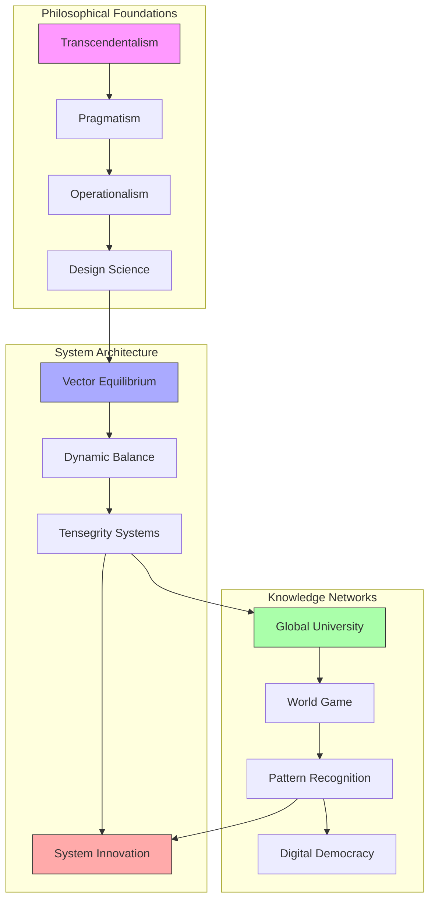

#### Mythological Framework
```yaml
system_mythology:
  philosophical_roots:
    transcendentalism:
      influence: "Unity and natural law principles"
      connection: "[[Transcendentalism]]"
    pragmatism:
      influence: "Practical problem-solving approach"
      connection: "[[Pragmatism]]"
    operationalism:
      influence: "Measurable outcomes and verification"
      connection: "[[Operationalism]]"

  architectural_principles:
    vector_equilibrium:
      principle: "Balance of powers"
      connection: "[[Vector_Equilibrium]]"
    tensegrity:
      principle: "Constitutional tension network"
      connection: "[[Tensegrity]]"
    dynamic_balance:
      principle: "Checks and balances system"
      connection: "[[Dynamic_Balance]]"

  knowledge_systems:
    global_university:
      function: "Educational network"
      connection: "[[Global_University]]"
    world_game:
      function: "Resource management simulation"
      connection: "[[World_Game]]"
    pattern_recognition:
      function: "System analysis and understanding"
      connection: "[[Pattern_Recognition]]"

  future_development:
    digital_democracy:
      vision: "Democratic evolution"
      connection: "[[Digital_Democracy]]"
    system_innovation:
      vision: "Continuous improvement"
      connection: "[[System_Innovation]]"
    anticipatory_design:
      vision: "Forward planning"
      connection: "[[Anticipatory_Design]]"
```

#### Founding Protocols
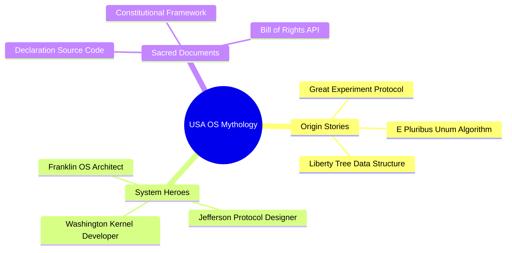

#### System Artifacts
```yaml
historical_artifacts:
  liberty_bell:
    type: "System Alert Mechanism"
    function: "Freedom Signal Broadcasting"
    status: "Deprecated but Preserved"
    symbolic_value: "Error Notification Protocol v1.0"

  declaration_parchment:
    type: "Core System Documentation"
    encoding: "Enlightenment Principles"
    redundancy: "Multiple Distributed Copies"
    hash: "We_Hold_These_Truths"

  constitution_scroll:
    type: "Master Configuration File"
    format: "Living Document Protocol"
    update_mechanism: "Amendment Process"
    checksum: "We_The_People"
```

### Technical Evolution Patterns

#### Protocol Inheritance Tree
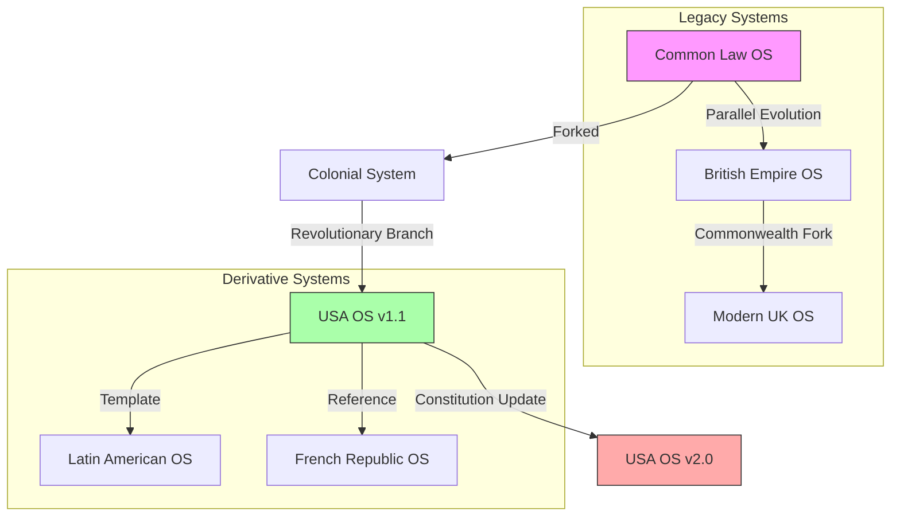

### Hidden System Features

#### Undocumented Protocols
```yaml
secret_systems:
  checks_and_balances:
    type: "Automatic Failsafe"
    trigger: "Power Concentration Detection"
    action: "System Rebalancing"
    status: "Always Running"

  constitutional_penumbras:
    type: "Emergent Rights Protection"
    scope: "Undefined Liberties"
    mechanism: "Judicial Discovery"
    update_frequency: "As Needed"

  separation_of_powers:
    type: "System Partition"
    security_level: "Kernel"
    bypass_protection: "Maximum"
    error_handling: "Constitutional Crisis Protocol"
```

#### Emergency Protocols
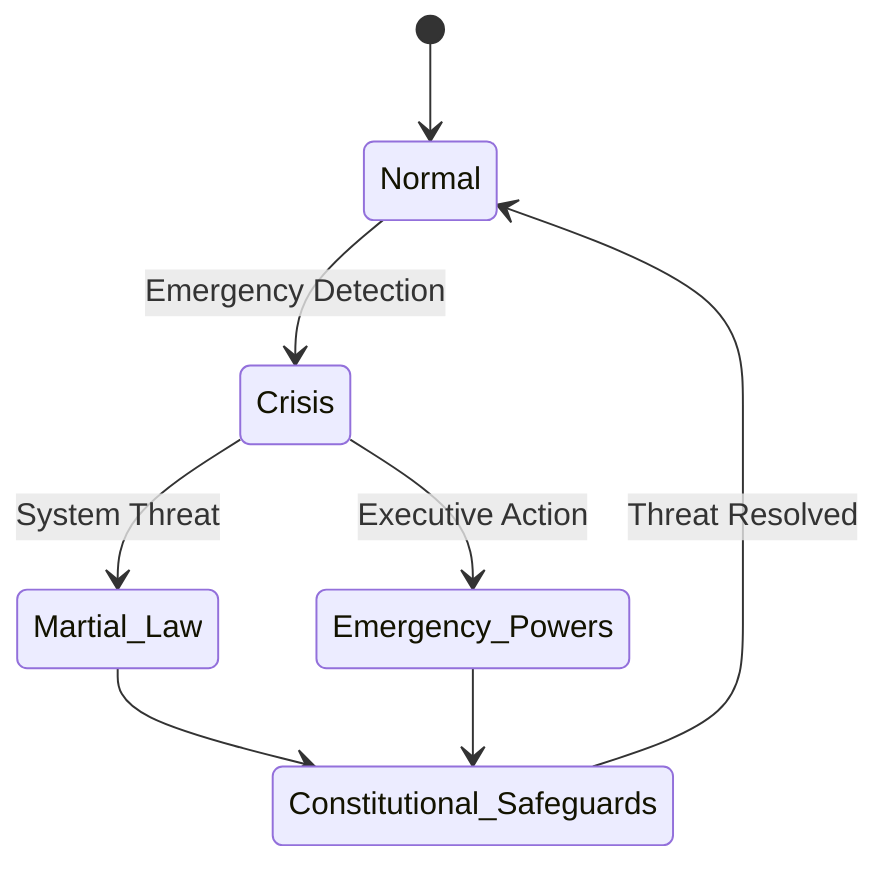

### System Architecture Patterns

#### Power Distribution Network
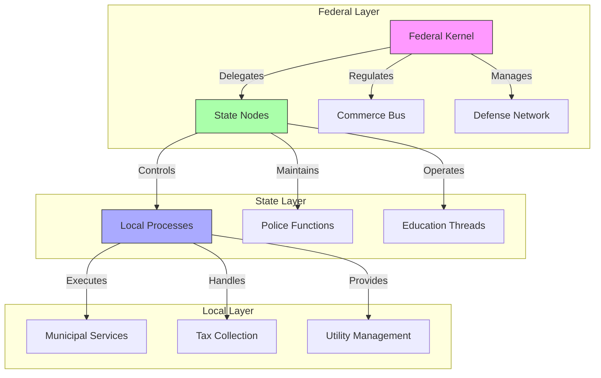

### Cultural Runtime Environment

#### Societal Threads
```yaml
cultural_processes:
  melting_pot:
    type: "Integration Algorithm"
    input: "Diverse Cultural Data"
    output: "Unified American Pattern"
    status: "Continuous Processing"

  frontier_mentality:
    type: "Expansion Protocol"
    characteristics: ["Innovation", "Risk-Taking", "Adaptation"]
    persistence: "System Memory"

  american_dream:
    type: "Social Mobility Engine"
    algorithm: "Merit-Based Advancement"
    resources: "Opportunity Allocation"
    constraints: "Economic Reality Check"
```

#### Ideological Frameworks
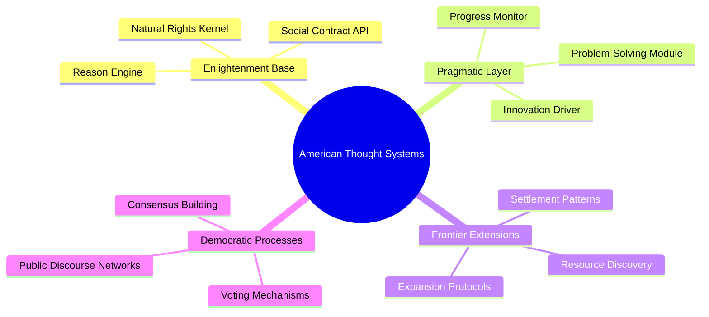

### System Maintenance Records

#### Critical Updates
```yaml
historical_patches:
  civil_war_patch:
    version: "3.0"
    changes: ["Slavery Removal", "Union Preservation", "Rights Expansion"]
    stability: "Achieved through Force"
    
  progressive_era_update:
    version: "3.5"
    changes: ["Trust Busting", "Labor Rights", "Consumer Protection"]
    compatibility: "Industrial Age Integration"
    
  new_deal_framework:
    version: "4.0"
    changes: ["Social Security", "Financial Regulation", "Labor Standards"]
    recovery: "Great Depression Mitigation"
```

### System Version History
```yaml
version_control:
  v1.0_colonial:
    kernel: "British Parliamentary System"
    protocols: ["Town Meetings", "Colonial Assemblies"]
    patches: ["Navigation Acts", "Colonial Laws"]
  
  v2.0_constitution:
    kernel: "Constitutional Framework"
    modules: ["Executive", "Legislative", "Judicial"]
    protocols: ["Checks and Balances", "Federalism"]
    
  v3.0_industrial:
    kernel: "Industrial Framework"
    modules: ["Interstate Commerce", "Banking System"]
    protocols: ["Corporate Law", "Labor Rights"]
    
  v4.0_digital:
    kernel: "Digital Infrastructure"
    modules: ["E-Government", "Digital Services"]
    protocols: ["Internet", "Cybersecurity"]
    
  v5.0_future:
    kernel: "Quantum-Ready Framework"
    modules: ["AI Governance", "Blockchain Voting"]
    protocols: ["Neural Networks", "Space Governance"]
```

### Constitutional Architecture
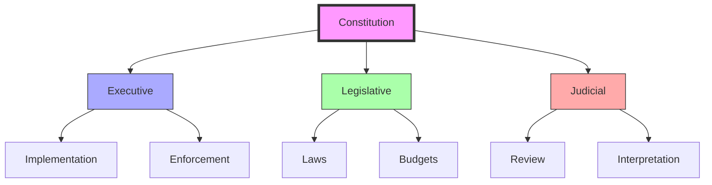

## System Components

### Resource Management Protocols
```yaml
protocols:
  monetary_policy:
    type: "Federal Reserve System"
    function: "Economic stability"
    implementation: "Interest rates, money supply"
  fiscal_policy:
    type: "Congressional Authority"
    function: "Resource allocation"
    implementation: "Budgets, taxes, spending"
  regulatory_framework:
    type: "Agency Network"
    function: "System oversight"
    implementation: "Rules, enforcement, standards"
```

### Information Architecture
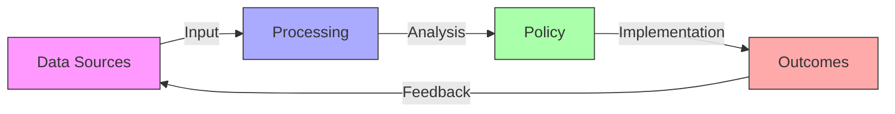

## System Challenges

### Current Issues
1. Legacy Systems
```yaml
challenges:
  infrastructure:
    age: "aging physical systems"
    upgrade_needs: "critical"
    cost: "trillions USD"
  digital_transformation:
    status: "in progress"
    barriers: "technical debt, security"
    priority: "high"
```

2. System Updates
```yaml
updates_needed:
  voting_systems:
    type: "critical upgrade"
    status: "pending"
    priority: "immediate"
  data_infrastructure:
    type: "network enhancement"
    status: "ongoing"
    priority: "high"
```

### Future Adaptations
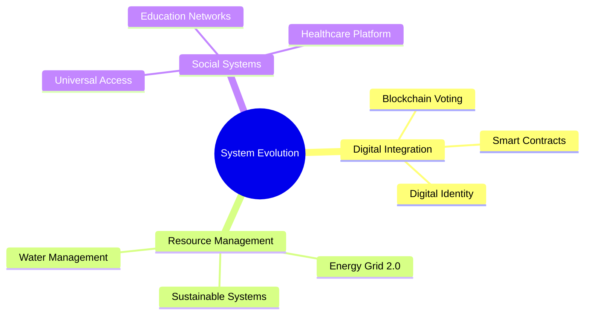

## Transformation Roadmap

### Digital Transition
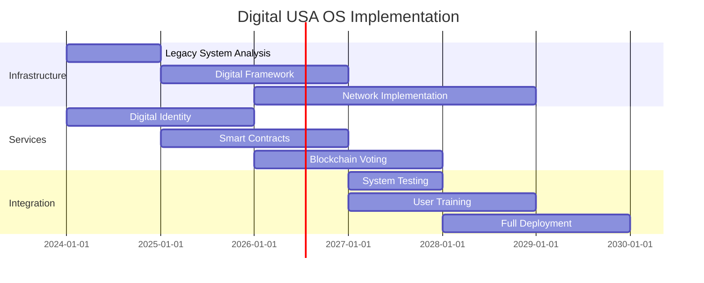

### Implementation Strategy
```yaml
strategy:
  phase_1:
    focus: "Digital infrastructure"
    timeline: "2024-2026"
    objectives: ["network upgrade", "security enhancement"]
  phase_2:
    focus: "Service transformation"
    timeline: "2025-2027"
    objectives: ["digital services", "user interfaces"]
  phase_3:
    focus: "Full integration"
    timeline: "2027-2029"
    objectives: ["system deployment", "user adoption"]
```

## Future Vision

### System Architecture 2.0
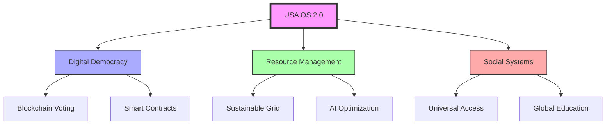

## References

### Primary Sources
1. [[books/Operating_Manual_for_Spaceship_Earth|Operating Manual for Spaceship Earth]]
2. [[papers/Design_Science_Approach|On Virtualizing Government: A Design Science Approach]]
3. [[papers/GST_Contribution|A Contribution to General Systems Theory]]

### Related Resources
1. [[concepts/World_Game|World Game Documentation]]
2. [[concepts/Design_Science|Design Science Principles]]
3. [[concepts/General_Systems_Theory|GST Framework]]

## Notes
- Represents a fundamental shift in governance thinking
- Integrates cybernetic principles with democratic ideals
- Focuses on global resource management and distribution
- Emphasizes educational access and participation
- See post by [[Kirby_Urner]] [here]() and [[USA_OS]] resources/art from [[Daniel_Ari_Friedman|DAF]] [here](https://coda.io/d/Math4Wisdom_d0SvdI3KSto/USA-OS_suRfidAo).

## Tags
#systems-thinking #governance #cybernetics #design-science #operating-system