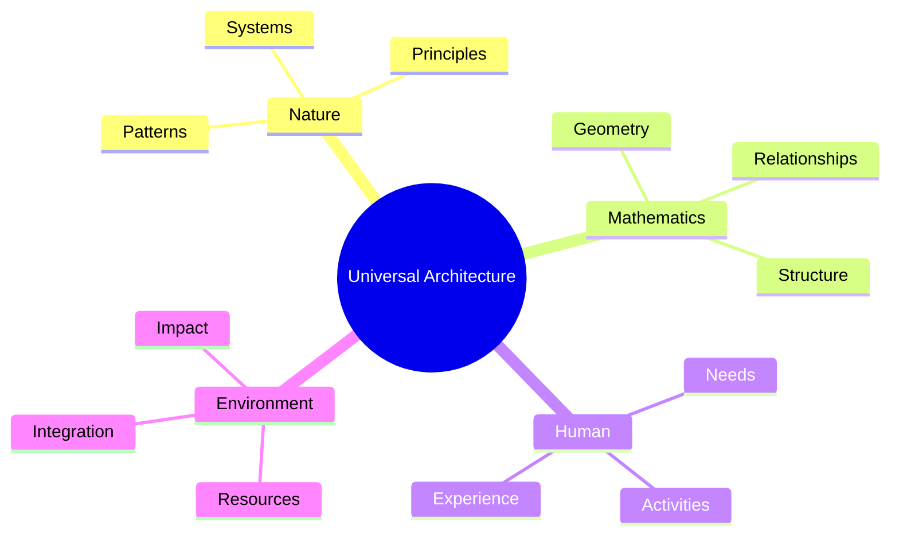
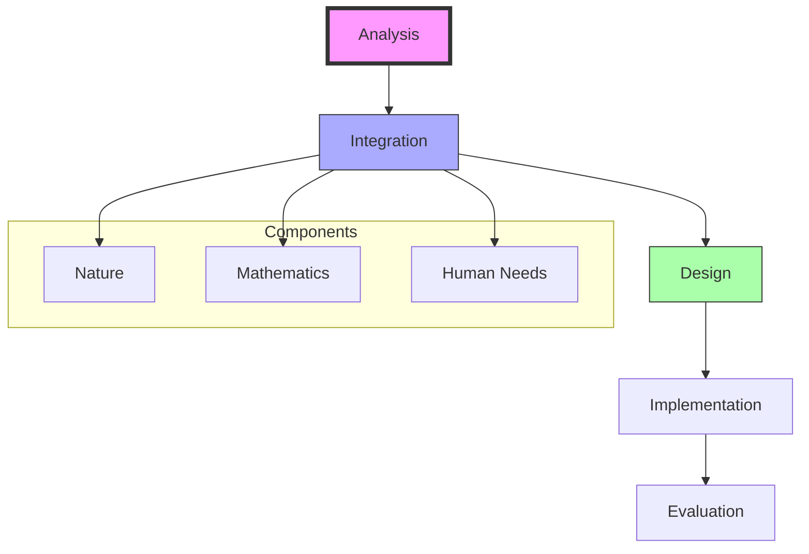
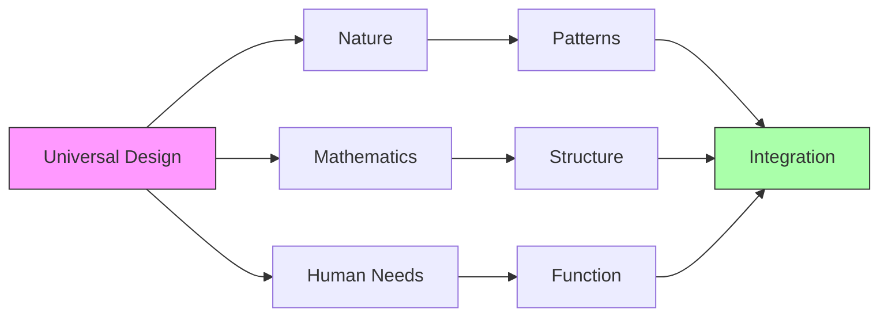
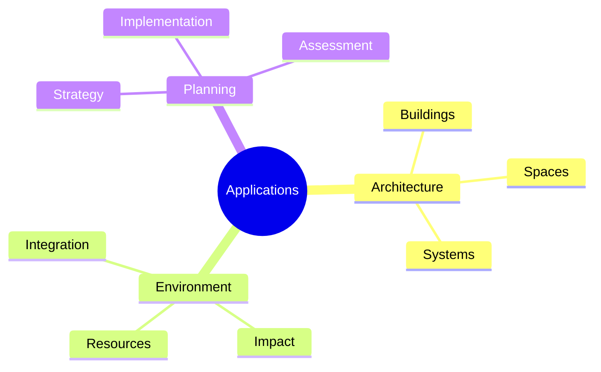
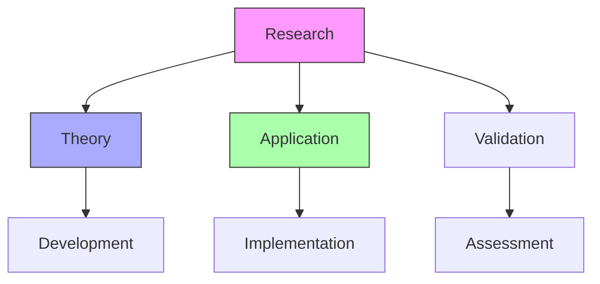
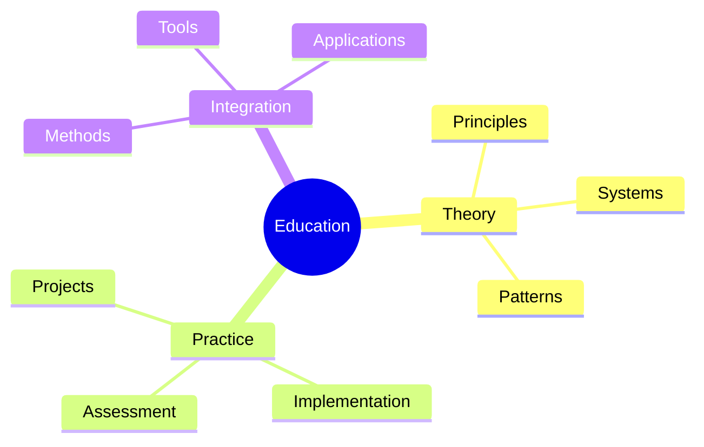
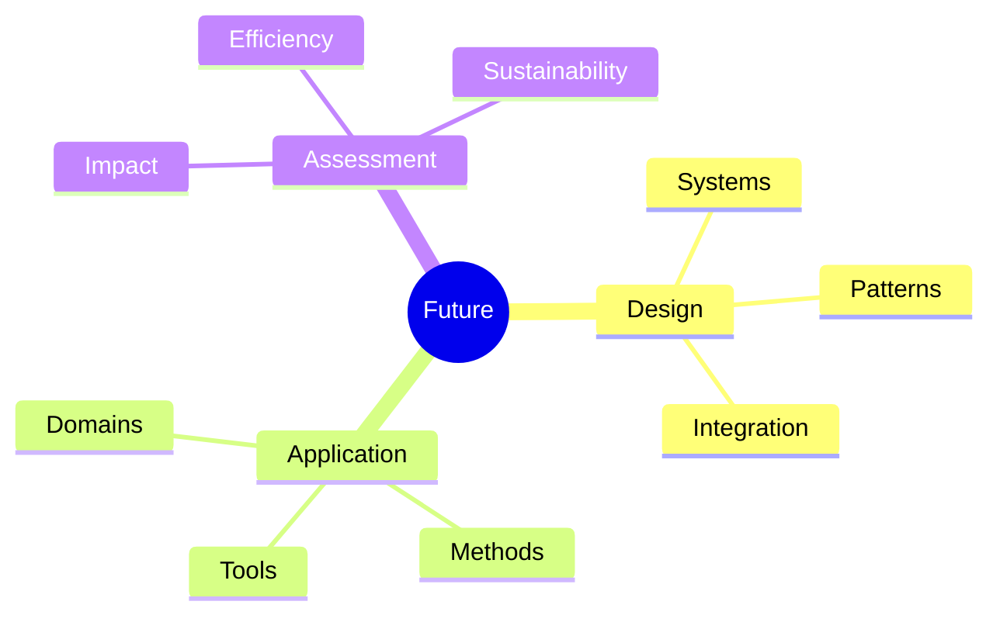

# Universal Architecture

Universal Architecture represents R. Buckminster Fuller's comprehensive approach to architectural and environmental design, integrating principles of nature, mathematics, and human needs into a unified design framework.

## Overview

### Definition
```yaml
universal_architecture:
  developer: R. Buckminster Fuller
  principle: Total integration of design principles
  foundation:
    - Natural systems
    - Mathematical principles
    - Human needs
    - Environmental harmony
  applications:
    - Building design
    - Environmental planning
    - System integration
    - Resource optimization
```

### Core Principles
1. Design Integration
   - Natural patterns
   - Mathematical relationships
   - Human requirements
   - Environmental factors

2. System Approach
   - Holistic design
   - Resource efficiency
   - Functional integration
   - Sustainable development

## Theoretical Framework

### Design Components


### Key Relationships
1. Natural Systems
   - Pattern recognition
   - System dynamics
   - Organic principles
   - Environmental harmony

2. Mathematical Principles
   - Geometric relationships
   - Structural efficiency
   - Pattern mathematics
   - System optimization

## Implementation Framework

### Design Process


### Application Areas
1. Building Systems
   - Structural design
   - Space utilization
   - Resource efficiency
   - Environmental integration

2. Environmental Design
   - Resource management
   - Impact minimization
   - System harmony
   - Sustainable development

## Design Principles

### Core Elements


### Design Integration
1. Natural Systems
   - Pattern analysis
   - System dynamics
   - Environmental factors
   - Resource flows

2. Mathematical Framework
   - Geometric principles
   - Structural relationships
   - Pattern mathematics
   - System optimization

## Practical Applications

### Implementation Areas
1. Architectural Design
   - Building systems
   - Space planning
   - Resource integration
   - Environmental harmony

2. Environmental Planning
   - Resource management
   - Impact assessment
   - System integration
   - Sustainable development

### Application Framework


## Research Development

### Study Areas
1. Theoretical Research
   - Design principles
   - System integration
   - Pattern analysis
   - Implementation methods

2. Applied Research
   - Case studies
   - Project development
   - Impact assessment
   - System validation

### Research Framework


## Educational Integration

### Learning Framework
1. Design Education
   - Principle understanding
   - System thinking
   - Pattern recognition
   - Implementation methods

2. Practical Training
   - Project development
   - System design
   - Resource management
   - Impact assessment

### Educational Structure


## Future Development

### Innovation Areas
1. Design Evolution
   - System integration
   - Pattern development
   - Resource optimization
   - Implementation methods

2. Application Expansion
   - New domains
   - System types
   - Resource management
   - Impact assessment

### Development Framework


## References

### Primary Sources
1. [[Ideas and Integrities]] (1963)
2. [[And It Came to Pass - Not to Stay]] (1976)
3. [[Grunch of Giants]] (1983)

### Secondary Literature
1. [[Design Science Papers]]
2. [[Architecture Studies]]
3. [[Environmental Planning]]

## Notes
- Comprehensive design approach
- Integration of natural principles
- Mathematical foundation
- Human-centered design
- Environmental harmony

## Tags
#concept #architecture #design #systems-thinking #universal-design 