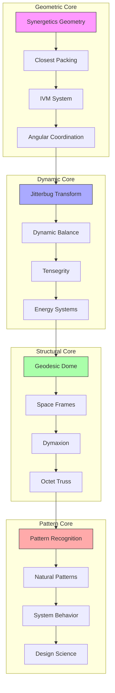
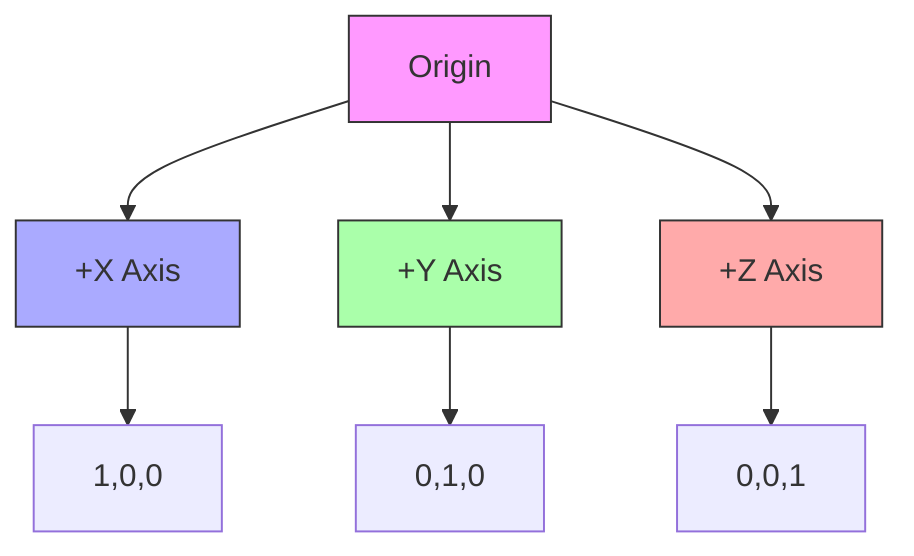

# Vector Equilibrium

The Vector Equilibrium (VE), also known as the cuboctahedron, represents the most symmetrical equilibrium relationship between forces in a spherical system. It is fundamental to [[concepts/Synergetics_Geometry|Synergetics Geometry]] and forms the basis of the [[concepts/Isotropic_Vector_Matrix|Isotropic Vector Matrix]] (IVM).

This is [[Closest_Packing_of_Spheres|Close Packing]] of [[12]] [[spheres]] around [[1]]. 

## Geometric Properties

### Basic Characteristics
```yaml
properties:
  vertices: 12
  edges: 24
  faces:
    triangular: 8
    square: 6
    total: 14
  symmetry_group: Oh
  dual_polyhedron: rhombic dodecahedron
```

### Dimensional Relationships
1. Unit Edge Length
```yaml
measurements:
  radius_to_vertex: 1.0
  edge_length: 1.0
  volume: 20/3 ≈ 6.666667
  surface_area: 22.784609690826528
  height: 2.0
```

2. Normalized Ratios
```yaml
ratios:
  edge_to_radius: 1.0
  volume_to_cube: 0.6666666666666666
  area_to_sphere: 0.8472135954999579
```

## Epic Connections

### Geometric Networks
```mermaid
mindmap
    root((Vector Equilibrium))
        Geometric Foundations
            [[Synergetics_Geometry|Nature's Mathematics]]
            [[Closest_Packing_of_Spheres|Spatial Efficiency]]
            [[IVM_XYZ|Coordinate Systems]]
            [[60_Degree_Coordination|Angular Relations]]
        Dynamic Systems
            [[Jitterbug_Transformation|Dynamic Evolution]]
            [[Dynamic_Balance|Force Equilibrium]]
            [[Tensegrity|Force Distribution]]
            [[Energy_Systems|Flow Patterns]]
        Structural Applications
            [[Geodesic_Dome|Structural Design]]
            [[Space_Frames|Framework Systems]]
            [[Dymaxion|Efficient Design]]
            [[Octet_Truss|Load Distribution]]
        Pattern Integration
            [[Pattern_Recognition|System Understanding]]
            [[Natural_Patterns|Nature's Language]]
            [[System_Behavior|Dynamic Analysis]]
            [[Design_Science|Method Integration]]
```

### System Weaving


### Integration Framework
```yaml
geometric_networks:
  geometric_foundations:
    synergetics_geometry:
      role: "Nature's mathematics"
      connection: "[[Synergetics_Geometry]]"
    closest_packing:
      role: "Spatial efficiency"
      connection: "[[Closest_Packing_of_Spheres]]"
    ivm_system:
      role: "Coordinate systems"
      connection: "[[IVM_XYZ]]"
    angular_coordination:
      role: "Angular relations"
      connection: "[[60_Degree_Coordination]]"

  dynamic_systems:
    jitterbug_transformation:
      principle: "Dynamic evolution"
      connection: "[[Jitterbug_Transformation]]"
    dynamic_balance:
      principle: "Force equilibrium"
      connection: "[[Dynamic_Balance]]"
    tensegrity:
      principle: "Force distribution"
      connection: "[[Tensegrity]]"
    energy_systems:
      principle: "Flow patterns"
      connection: "[[Energy_Systems]]"

  structural_applications:
    geodesic_dome:
      application: "Structural design"
      connection: "[[Geodesic_Dome]]"
    space_frames:
      application: "Framework systems"
      connection: "[[Space_Frames]]"
    dymaxion:
      application: "Efficient design"
      connection: "[[Dymaxion]]"
    octet_truss:
      application: "Load distribution"
      connection: "[[Octet_Truss]]"

  pattern_integration:
    pattern_recognition:
      method: "System understanding"
      connection: "[[Pattern_Recognition]]"
    natural_patterns:
      method: "Nature's language"
      connection: "[[Natural_Patterns]]"
    system_behavior:
      method: "Dynamic analysis"
      connection: "[[System_Behavior]]"
    design_science:
      method: "Method integration"
      connection: "[[Design_Science]]"
```

### Application Domains
```mermaid
mindmap
    root((Applications))
        Structural Design
            [[Geodesic_Dome|Spherical Structures]]
            [[Space_Frames|Framework Systems]]
            [[Tensegrity|Force Networks]]
            [[Octet_Truss|Load Systems]]
        System Analysis
            [[Pattern_Recognition|Pattern Systems]]
            [[System_Behavior|Dynamic Systems]]
            [[Energy_Systems|Flow Systems]]
            [[System_Analysis|Analysis Methods]]
        Design Integration
            [[Design_Science|Method Integration]]
            [[Synergetics|System Integration]]
            [[Dymaxion|Efficient Design]]
            [[Natural_Patterns|Nature's Patterns]]
        Educational Methods
            [[Pattern_Learning|Learning Systems]]
            [[Systems_Education|Teaching Methods]]
            [[Design_Science_Education|Design Education]]
            [[Global_University|Knowledge Networks]]
```

## Vector Relationships

### Force Equilibrium
1. Vector Properties
```yaml
vectors:
  count: 12
  length: uniform
  angles: 60°
  equilibrium: perfect
```

2. Radial Symmetry
\[
\sum_{i=1}^{12} \vec{v}_i = \vec{0}
\]

### Coordinate Systems
1. Cartesian Vertices (Unit Radius)
```yaml
vertices:
  - [±1, 0, 0]  # 2 vertices
  - [0, ±1, 0]  # 2 vertices
  - [0, 0, ±1]  # 2 vertices
  - [±1/√2, ±1/√2, 0]  # 4 vertices
  - [±1/√2, 0, ±1/√2]  # 4 vertices
  - [0, ±1/√2, ±1/√2]  # 4 vertices
```

2. IVM Coordinates


## Transformational Properties

### Jitterbug Transformation
1. Phase Sequence
```yaml
phases:
  - VE (expanded)
  - Icosahedron (intermediate)
  - Octahedron (intermediate)
  - Tetrahedron (contracted)
```

2. Volume Changes
```yaml
volume_ratios:
  ve_to_octahedron: 2.0
  octahedron_to_tetrahedron: 2.0
  total_contraction: 4.0
```

### Symmetry Operations
1. Rotational Symmetries
```yaml
rotations:
  24_fold: 3
  4_fold: 6
  3_fold: 8
  2_fold: 12
```

2. Reflection Planes
```yaml
reflections:
  total: 15
  types:
    - 9 through edges
    - 6 through faces
```

## Structural Applications

### Close-Packing Systems
1. Sphere Packing
```yaml
packing:
  coordination_number: 12
  kissing_number: 12
  packing_density: 0.74048048969
```

2. Space Filling
```yaml
space_filling:
  method: alternating_orientation
  efficiency: maximum
  gaps: none
```

### Construction Systems
1. Tensegrity Configurations
```yaml
tensegrity:
  struts: 6
  cables: 24
  stability: omnidirectional
```

2. Geodesic Applications
```yaml
geodesic:
  frequency_options: [2v, 3v, 4v]
  subdivision_method: great_circles
  strength_to_weight: optimal
```

## Mathematical Analysis

### Angular Relationships
1. Face Angles
```yaml
angles:
  triangular_faces: 60°
  square_faces: 90°
  dihedral: 125.2644°
```

2. Solid Angles
```yaml
solid_angles:
  at_vertex: 2.720699
  total: 32.648388
```

### Metric Relations
1. Distance Ratios
```yaml
distances:
  center_to_vertex: 1.0
  center_to_edge: 0.8660254038
  center_to_face:
    triangular: 0.8164965809
    square: 0.7071067812
```

2. Area Relationships
```yaml
areas:
  triangular_face: 0.4330127019
  square_face: 1.0
  total_surface: 22.784609691
```

## References

### Primary Sources
1. Synergetics (Fuller, 1975)
2. Synergetics 2 (Fuller, 1979)
3. Geometry of Behavior (Loeb, 1976)
4. Vector Equilibrium (Edmondson, 1987)

### Related Concepts
- [[concepts/Synergetics_Geometry|Synergetics Geometry]]
- [[concepts/Isotropic_Vector_Matrix|Isotropic Vector Matrix]]
- [[concepts/Jitterbug_Transformation|Jitterbug Transformation]]
- [[concepts/Closest_Packing_of_Spheres|Closest Packing of Spheres]]

## Notes
- Most symmetrical arrangement of vectors
- Fundamental to IVM coordinate system
- Key to understanding close-packing
- Essential for geodesic structures

## Tags
#geometry #synergetics #polyhedra #structures 