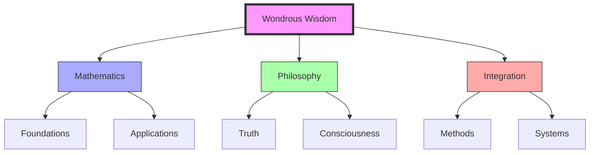

# Wondrous Wisdom

Wondrous Wisdom is a comprehensive framework developed by [[people/Andrius_Kulikauskas|Andrius Kulikauskas]] for investigating absolute truth through the integration of cognitive frameworks, mathematical foundations, and philosophical principles.

## Core Framework

### Foundational Elements
1. Cognitive Frameworks
   - Experiential perspectives
   - Consciousness studies
   - Mental models
   - Knowledge systems

2. Mathematical Foundations
   - Algebraic topology
   - Category theory
   - Complex geometry
   - Quantum physics

### Theoretical Structure
```mermaid
mindmap
    root((Wondrous Wisdom))
        Mathematics
            [[Algebraic Topology]]
            [[Category Theory]]
            [[Complex Geometry]]
        Philosophy
            [[Consciousness]]
            [[Truth]]
            [[Knowledge]]
        Integration
            [[Cognitive Frameworks]]
            [[Systems Thinking]]
            [[Applications]]
```

## Mathematical Expressions

### Advanced Mathematics
1. Topological Structures
   - Bott periodicity
   - Chain complexes
   - Category theory
   - Geometric topology

2. Physical Applications
   - Quantum mechanics
   - Complex systems
   - Pattern formation
   - Dynamic processes

### Integration Methods
1. Mathematical Tools
   - [[concepts/Active_Inference|Active Inference]]
   - [[concepts/Pattern_Recognition|Pattern Recognition]]
   - [[concepts/System_Analysis|System Analysis]]
   - [[concepts/Design_Science|Design Science]]

2. Cognitive Applications
   - Mental frameworks
   - Knowledge systems
   - Learning processes
   - Understanding structures

## Philosophical Foundations

### Truth Investigation
1. Absolute Truth
   - Foundational principles
   - Universal patterns
   - Knowledge structures
   - Understanding frameworks

2. Consciousness Studies
   - Mental models
   - Cognitive processes
   - Knowledge integration
   - Understanding development

### Integration Framework


## Practical Applications

### Educational Implementation
1. Study Programs
   - [[organizations/Math4Wisdom|Math4Wisdom]] curriculum
   - Research methods
   - Learning frameworks
   - Knowledge integration

2. Research Applications
   - Mathematical investigation
   - Philosophical inquiry
   - Systems integration
   - Practical implementation

### Development Areas
1. Current Research
   - Triangle centers
   - Bott periodicity
   - Category theory
   - Quantum applications

2. Future Directions
   - Framework expansion
   - Application development
   - Integration methods
   - Community engagement

## Community Integration

### Learning Communities
1. Study Groups
   - [[organizations/Math4Wisdom|Math4Wisdom]]
   - Research teams
   - Learning networks
   - Knowledge communities

2. Collaborative Networks
   - Research partnerships
   - Educational connections
   - Community engagement
   - Knowledge sharing

## References

### Primary Sources
1. Kulikauskas's writings
2. Math4Wisdom materials
3. Research documentation
4. Educational resources

### Related Concepts
- [[concepts/Active_Inference|Active Inference]]
- [[concepts/Pattern_Recognition|Pattern Recognition]]
- [[concepts/System_Analysis|System Analysis]]
- [[concepts/Design_Science|Design Science]]

## Notes
- Developed by Andrius Kulikauskas
- Integrates mathematics and philosophy
- Focus on absolute truth
- Practical applications

## Tags
#philosophy #mathematics #cognitive-frameworks #truth-investigation 