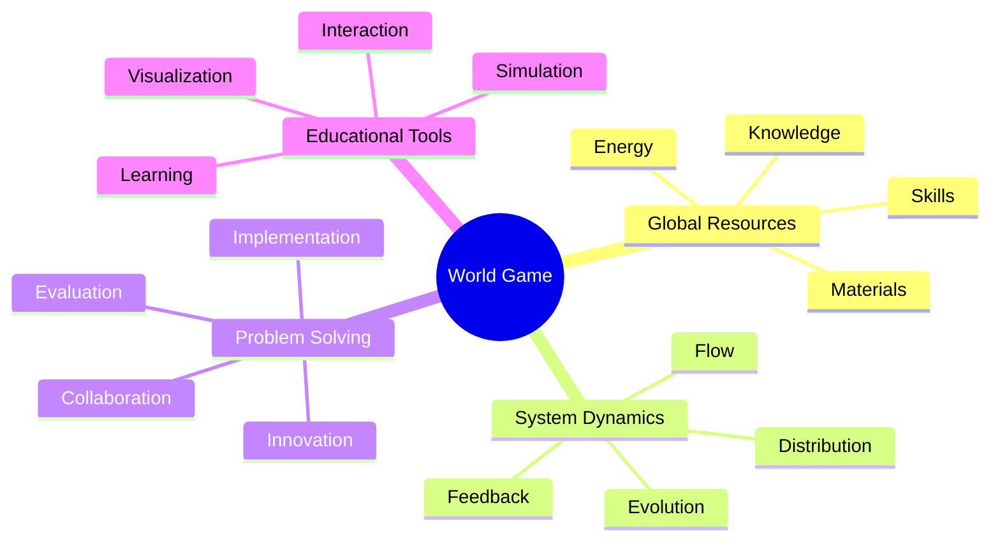
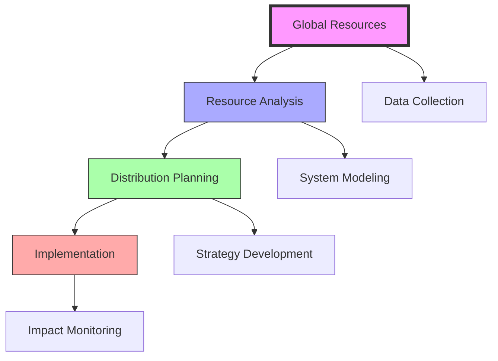
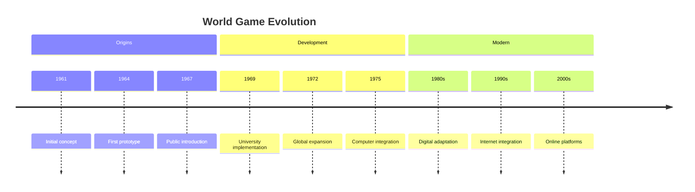
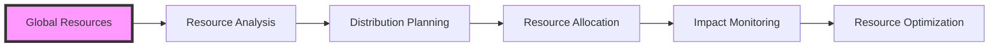

# World Game

> Fuller's innovative global simulation platform designed to solve humanity's greatest challenges through collaborative problem-solving and comprehensive [[Resource_Distribution]], developed as an alternative to military war games.

## Core Concept

### Foundational Elements

### Operational Framework

## Historical Development

## Implementation Methods

### Educational Applications
- [[Design_Science_Education]]
- [[Systems_Education]]
- [[Pattern_Learning]]
- Global collaboration

### Simulation Tools
- Resource mapping
- System modeling
- Strategy testing
- Impact assessment

## Core Components

### Resource Management

### System Integration
- [[Energy_Systems]]
- [[Resource_Distribution]]
- Transportation networks
- Communication systems

## Educational Framework

### Learning Objectives
- Systems thinking
- Global awareness
- Resource management
- Collaborative problem-solving

### Teaching Methods
- Interactive simulations
- Group exercises
- Real-world scenarios
- Data visualization

## Research Applications

### Areas of Study
- Global resources
- Distribution systems
- Energy networks
- Social systems

### Implementation Studies
- Case analyses
- Impact assessments
- System optimization
- Strategy development

## Global Impact

### Application Areas
- Resource management
- Energy distribution
- Transportation systems
- Communication networks

### Impact Assessment
- Efficiency metrics
- Distribution analysis
- System performance
- Global outcomes

## Modern Applications

### Digital Integration
- Online platforms
- Virtual simulations
- Data visualization
- Real-time modeling

### Contemporary Use
- Educational programs
- Research projects
- Policy planning
- Resource optimization

## Institutional Implementation

### Educational Institutions
- [[Southern_Illinois_University]]
- [[Black_Mountain_College]]
- [[Harvard_University]]
- Global universities

### Research Centers
- [[BFI_Headquarters]]
- [[Design_Science_Lab]]
- Research institutions
- Global centers

## Future Development

### Digital Evolution
- AI integration
- Virtual reality
- Real-time data
- Global networking

### Application Areas
- Sustainable development
- Resource planning
- Energy management
- Global education

## References

### Primary Sources
- Fuller, R. B. (1969). *Operating Manual for Spaceship Earth*.
- Fuller, R. B. (1981). *Critical Path*.
- World Game Workshop Documentation (1969-1983)

### Secondary Sources
- Edmondson, A. C. (2007). *A Fuller Explanation*.
- [[Medard_Gabel]]'s World Game Workshop Reports
- [[BFI_Archives]] Documentation

## See Also

- [[Design_Science]]
- [[System_Analysis]]
- [[Resource_Distribution]]
- [[Energy_Systems]]

## Notes

The World Game represents Fuller's vision for a collaborative platform to solve global challenges through comprehensive resource management and educational engagement, providing a framework for understanding and optimizing global systems for the benefit of all humanity. 