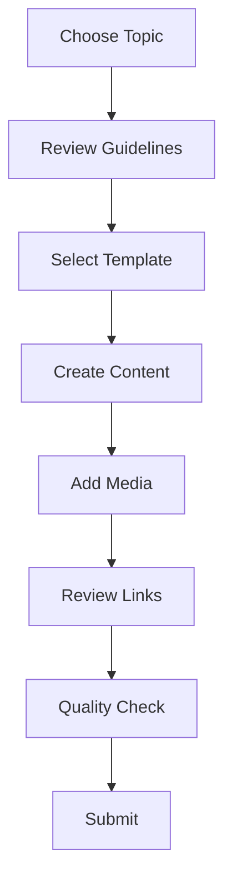

# Contribution Guide

Guidelines for contributing to the Fuller Knowledge Base.

## Overview



## Getting Started

### Prerequisites
1. Install [[Obsidian]]
2. Clone repository
3. Review [[Style_Guide]]
4. Understand [[Documentation_Map]]

### Setup Process
```bash
# Clone repository
git clone https://github.com/your-repo/fuller-knowledge-base
cd fuller-knowledge-base

# Open in Obsidian
obsidian ./
```

## Content Creation

### Choosing Topics
1. Check existing content
2. Identify gaps
3. Review priorities
4. Select focus area

### Document Types
- [[Person_Template]] - Individual profiles
- [[Concept_Template]] - Theoretical concepts
- [[Technical_Template]] - Technical documentation
- [[Tool_Template]] - Tool documentation
- [[System_Template]] - System documentation
- [[Workflow_Template]] - Process workflows

## Writing Guidelines

### Content Structure
```markdown
# Title

## Introduction
Brief overview

## Main Sections
Detailed content

## References
Sources and links
```

### Metadata
```yaml
---
title: Document Title
type: document_type
tags: [relevant, tags]
created: YYYY-MM-DD
updated: YYYY-MM-DD
status: draft
---
```

### Links and References
- Use `[[Internal Links]]`
- Include citations
- Cross-reference related content
- Maintain backlinks

## Media Guidelines

### Images
- Follow [[Media_Guidelines]]
- Use appropriate formats
- Optimize size
- Include alt text

### Documents
- Convert to PDF
- Include source files
- Maintain versions
- Add metadata

## Quality Standards

### Content Requirements
1. Accurate information
2. Clear writing
3. Proper formatting
4. Complete metadata

### Review Checklist
- [ ] Metadata complete
- [ ] Links working
- [ ] Images optimized
- [ ] Templates followed
- [ ] Citations included
- [ ] Tags added

## Submission Process

### Preparation
1. Review changes
2. Check links
3. Validate format
4. Test media

### Git Workflow
```bash
# Create branch
git checkout -b feature/topic-name

# Add changes
git add .
git commit -m "Add: detailed description"

# Push changes
git push origin feature/topic-name
```

### Pull Request
1. Create PR
2. Fill template
3. Request review
4. Address feedback

## Review Process

### Initial Review
- Content accuracy
- Format compliance
- Link validity
- Media quality

### Technical Review
- Template usage
- Metadata validity
- Integration checks
- Performance impact

### Final Approval
- Content review
- Technical review
- Integration test
- Merge approval

## Best Practices

### Content Creation
1. Research thoroughly
2. Write clearly
3. Link extensively
4. Review carefully

### Technical Aspects
1. Follow templates
2. Optimize media
3. Test links
4. Validate metadata

## Common Issues

### Content Problems
- Incomplete information
- Poor organization
- Missing links
- Unclear writing

### Technical Problems
- Broken links
- Invalid metadata
- Media issues
- Template errors

## Resources

### Documentation
- [[Style_Guide]]
- [[Media_Guidelines]]
- [[Template_Guide]]
- [[Markdown_Guide]]

### Tools
- [[Link_Checker]]
- [[Media_Optimizer]]
- [[Metadata_Validator]]
- [[Template_Helper]]

### Support
- [[FAQ]]
- [[Troubleshooting]]
- [[Contact]]
- [[Help]]

## Community

### Communication
- [[Discussion Forum]]
- [[Chat Channel]]
- [[Mailing List]]
- [[Issue Tracker]]

### Recognition
- [[Contributors]]
- [[Hall of Fame]]
- [[Achievements]]
- [[Rewards]]

## Tags
#contribution #guidelines #documentation #community 