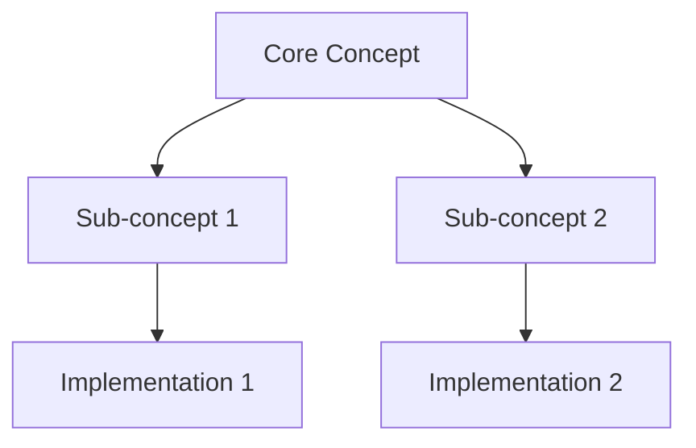
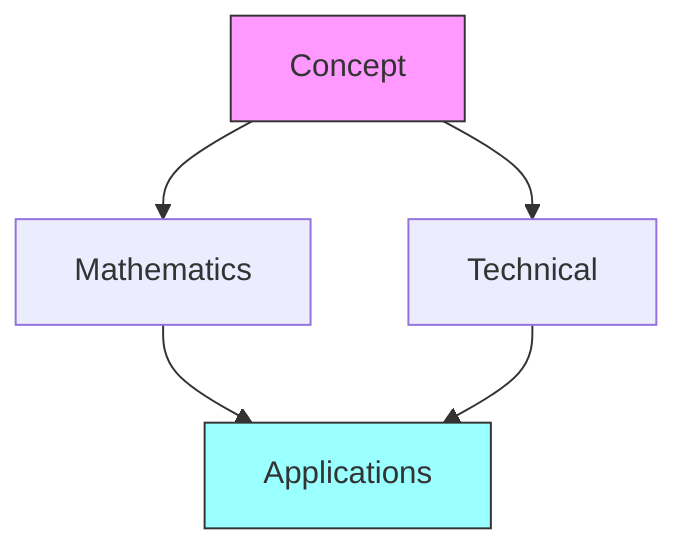

# Linking Guide

This document establishes standards for creating and maintaining links between documents in the Fuller Obsidian vault.

## Link Types

### Internal Links
1. Basic Links
   ```markdown
   [[Document_Name]]              # Basic link
   [[folder/Document_Name]]       # With path
   [[Document_Name|Display Text]] # With alias
   ```

2. Section Links
   ```markdown
   [[Document_Name#Section]]      # To section
   [[Document_Name#Subsection]]   # To subsection
   ```

3. Block Links
   ```markdown
   [[Document_Name#^block-id]]    # To specific block
   ```

## Link Structure

### Path Conventions
```yaml
link_structure:
  concepts: [[concepts/Concept_Name]]
  people: [[people/Lastname_Firstname]]
  books: [[books/Book_Title]]
  mathematics: [[mathematics/Math_Concept]]
  technical: [[technical/Technical_Name]]
  places: [[places/Place_Name]]
  tools: [[tools/Tool_Name]]
  formalisms: [[formalisms/Formalism_Name]]
```

### Cross-Domain Links

#### Concept to Implementation
```markdown
[[concepts/Tensegrity]] → [[technical/Tensegrity_Structure]]
[[concepts/Geodesic]] → [[mathematics/Geodesic_Mathematics]]
```

#### Person to Work
```markdown
[[people/Fuller_Buckminster]] → [[books/Operating_Manual_for_Spaceship_Earth]]
[[people/Fuller_Buckminster]] → [[concepts/Dymaxion]]
```

## Link Patterns

### Hierarchical Linking


### Network Linking


## Link Management

### Creation Guidelines
1. Always use relative paths
2. Include meaningful display text
3. Verify link targets exist
4. Use consistent naming

### Maintenance
1. Regular link validation
2. Update broken links
3. Review bidirectional links
4. Clean up orphaned links

### Quality Control
```yaml
link_checklist:
  creation:
    - Correct path
    - Proper format
    - Meaningful text
    - Valid target
  
  maintenance:
    - Regular checks
    - Update paths
    - Fix broken
    - Remove orphaned
  
  review:
    - Bidirectional
    - Relevance
    - Accuracy
    - Completeness
```

## Domain-Specific Linking

### Concepts
1. Link to:
   - Related concepts
   - Mathematical foundations
   - Technical implementations
   - Historical context

2. Example:
   ```markdown
   [[concepts/Synergetics]] links to:
   - [[mathematics/Vector_Equilibrium]]
   - [[technical/Geodesic_Dome]]
   - [[people/Fuller_Buckminster]]
   ```

### Mathematics
1. Link to:
   - Theoretical foundations
   - Applications
   - Proofs
   - Visualizations

2. Example:
   ```markdown
   [[mathematics/Geodesic_Mathematics]] links to:
   - [[concepts/Geodesic]]
   - [[technical/Dome_Construction]]
   - [[mathematics/Spherical_Geometry]]
   ```

### Technical
1. Link to:
   - Design principles
   - Mathematical foundations
   - Implementation examples
   - Tools and methods

2. Example:
   ```markdown
   [[technical/Tensegrity_Structure]] links to:
   - [[concepts/Tensegrity]]
   - [[mathematics/Force_Distribution]]
   - [[tools/Tensegrity_Analysis]]
   ```

## Implementation

### Creating Links
1. Identify connection type
2. Choose link format
3. Add bidirectional link
4. Verify connection

### Updating Links
1. Check link validity
2. Update as needed
3. Maintain consistency
4. Document changes

### Best Practices
- Use clear paths
- Include context
- Maintain structure
- Regular review

## References
1. [[documentation/guides/Style_Guide]]
2. [[documentation/guides/File_Types]]
3. [[documentation/guides/Folder_Structure]]

## Notes
- Follow conventions
- Check links regularly
- Update documentation
- Maintain quality

## Tags
#documentation #linking #organization #standards 