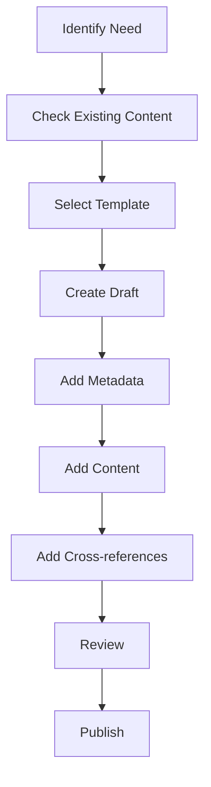

# Workflow Guide

This document establishes standard workflows for collaborative work in the Fuller Obsidian vault.

## Collaboration Model

### Roles and Responsibilities
1. Content Authors
   - Create new content
   - Update existing content
   - Maintain metadata
   - Ensure cross-references

2. Domain Experts
   - Review domain-specific content
   - Validate technical accuracy
   - Ensure conceptual integrity
   - Maintain domain relationships

3. Documentation Maintainers
   - Enforce standards
   - Update documentation
   - Manage templates
   - Monitor quality

### Domain Division
1. Core Domains:
   ```yaml
   domains:
     concepts:
       owner: concept_expert
       scope: [principles, theories, frameworks]
     
     mathematics:
       owner: math_expert
       scope: [geometry, proofs, calculations]
     
     technical:
       owner: technical_expert
       scope: [specifications, implementations]
     
     biographical:
       owner: historian
       scope: [people, places, timeline]
     
     documentation:
       owner: doc_maintainer
       scope: [guides, schemas, templates]
   ```

## Workflows

### 1. Content Creation


### 2. Content Update
1. Review Process
   - Check existing content
   - Verify cross-references
   - Update metadata
   - Maintain relationships

2. Update Steps
   - Mark as draft if major changes
   - Update content
   - Verify links
   - Update metadata
   - Request review

### 3. Cross-linking
1. Link Creation
   - Use relative paths
   - Follow naming conventions
   - Add bidirectional links
   - Verify link validity

2. Link Management
   - Regular link checks
   - Update broken links
   - Maintain consistency
   - Document relationships

### 4. Quality Control
1. Review Checklist
   ```yaml
   review_items:
     metadata:
       - Required fields present
       - Valid values used
       - Updated dates correct
     
     content:
       - Follows structure
       - Complete sections
       - Clear writing
       - Proper citations
     
     links:
       - Valid references
       - Bidirectional links
       - Proper formatting
       - Relevant connections
     
     formatting:
       - Correct syntax
       - Proper hierarchy
       - Consistent style
       - Clean layout
   ```

## Domain-Specific Guidelines

### 1. Concepts Domain
- Focus on theoretical foundations
- Maintain conceptual integrity
- Link to implementations
- Document relationships

### 2. Mathematics Domain
- Include formal proofs
- Provide visualizations
- Link to applications
- Show relationships

### 3. Technical Domain
- Detail specifications
- Include diagrams
- Document procedures
- Link to concepts

### 4. Biographical Domain
- Verify historical accuracy
- Document relationships
- Include timeline
- Link to works

### 5. Documentation Domain
- Maintain standards
- Update guidelines
- Create templates
- Monitor compliance

## Conflict Resolution

### 1. Content Conflicts
1. Identify conflict
2. Discuss with domain experts
3. Review documentation
4. Reach consensus
5. Update content

### 2. Structure Conflicts
1. Review standards
2. Consult documentation
3. Propose solution
4. Get agreement
5. Implement changes

## Implementation

### 1. Getting Started
1. Review documentation
2. Choose domain
3. Use templates
4. Follow workflows
5. Maintain standards

### 2. Ongoing Work
1. Regular reviews
2. Update content
3. Check links
4. Maintain quality
5. Document changes

### 3. Collaboration
1. Clear communication
2. Regular updates
3. Follow processes
4. Resolve conflicts
5. Maintain standards

## References
1. [[documentation/guides/Style_Guide]]
2. [[documentation/schemas/Metadata_Schema]]
3. [[documentation/guides/File_Types]]
4. [[documentation/guides/Folder_Structure]]

## Notes
- Follow workflows
- Maintain quality
- Collaborate effectively
- Document changes

## Tags
#documentation #workflow #collaboration #standards 