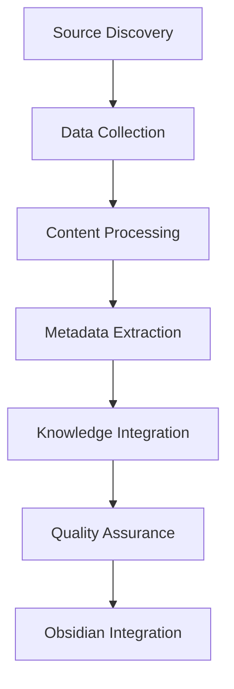

# Knowledge Ingestion System

A comprehensive system for automatically gathering, processing, and integrating Fuller-related content into the knowledge base.

## System Overview

### Architecture


## Components

### 1. Source Management
- [[Source_Registry]] - Catalog of content sources
- [[Source_Validators]] - Verification of source reliability
- [[Source_Prioritization]] - Content priority system

### 2. Data Collection
Located in `tools/scrapers/`:
- [[Blogspot_Scraper]] - For Fuller-related blogs
- [[Forum_Scraper]] - For discussion forums
- [[Github_Scraper]] - For code repositories
- [[Email_List_Parser]] - For mailing list archives

### 3. Content Processing
Located in `tools/parsers/`:
- [[Content_Classifier]] - Categorize content type
- [[Text_Extractor]] - Clean text extraction
- [[Media_Processor]] - Handle images and attachments
- [[Citation_Extractor]] - Extract references

### 4. Metadata Generation
Located in `tools/utils/`:
- [[Tag_Generator]] - Automatic tag suggestion
- [[Link_Discoverer]] - Find internal connections
- [[Category_Classifier]] - Content categorization
- [[Timeline_Generator]] - Temporal relationships

### 5. Knowledge Integration
Located in `tools/converters/`:
- [[Obsidian_Converter]] - Convert to Obsidian format
- [[Template_Matcher]] - Apply appropriate templates
- [[Link_Generator]] - Create wiki-style links
- [[Graph_Enhancer]] - Optimize graph connections

## Workflows

### 1. Source Addition
1. Register new source in [[Source_Registry]]
2. Validate source quality
3. Set update frequency
4. Configure source-specific scraper

### 2. Content Processing
1. Collect raw content
2. Extract clean text
3. Process media assets
4. Generate metadata
5. Create initial connections

### 3. Knowledge Integration
1. Convert to Obsidian format
2. Apply appropriate template
3. Generate wiki links
4. Place in correct folder
5. Update index files

## Configuration

### Source Configuration
```yaml
source:
  type: [blogspot|forum|github|email]
  url: "source_url"
  update_frequency: [daily|weekly|monthly]
  priority: [high|medium|low]
  credentials:
    api_key: "optional_api_key"
    auth_token: "optional_token"
```

### Processing Rules
```yaml
processing:
  content_types: [text, images, code]
  extract_citations: true
  generate_tags: true
  link_threshold: 0.7
  template_matching: true
```

## Quality Assurance

### Validation Checks
- Content relevance
- Source reliability
- Metadata completeness
- Link validity
- Template compliance

### Error Handling
- [[Error_Logger]] - Log processing errors
- [[Content_Validator]] - Validate output
- [[Link_Checker]] - Verify links
- [[Template_Validator]] - Check template compliance

## Backup and Version Control

### Backup System
- Daily snapshots
- Incremental backups
- Export to zip archives
- Version control integration

### Version Control
- Git integration
- Change tracking
- Conflict resolution
- Rollback capabilities

## Tools Directory Structure
```
tools/
├── scrapers/
│   ├── blogspot_scraper.py
│   ├── forum_scraper.py
│   ├── github_scraper.py
│   └── email_scraper.py
├── parsers/
│   ├── content_parser.py
│   ├── metadata_extractor.py
│   └── citation_parser.py
├── converters/
│   ├── obsidian_converter.py
│   ├── template_matcher.py
│   └── link_generator.py
└── utils/
    ├── tag_generator.py
    ├── link_discoverer.py
    └── quality_checker.py
```

## Implementation Guidelines

### Adding New Sources
1. Create source configuration
2. Implement source-specific scraper
3. Define processing rules
4. Test integration
5. Monitor quality

### Extending Functionality
1. Follow modular design
2. Maintain consistent interfaces
3. Update documentation
4. Add test coverage
5. Version control changes

## Monitoring and Maintenance

### System Health
- Source availability
- Processing success rates
- Integration quality
- Resource usage

### Maintenance Tasks
- Update source configurations
- Optimize processing rules
- Clean temporary files
- Update dependencies

## Tags
#system #tools #automation #ingestion #documentation 