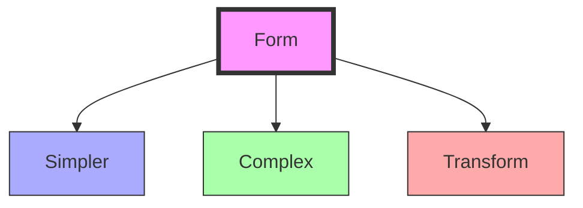

# Form Name

Brief description of the form and its significance, with key [[links]] in Obsidian format. 

## Geometric Properties

### Basic Characteristics
```yaml
properties:
  vertices: 
  edges: 
  faces: 
  symmetry_group: 
  dual_polyhedron: 
```

### Dimensional Relationships
1. Unit Edge Length
```yaml
measurements:
  radius_to_vertex: 
  edge_length: 
  volume: 
  surface_area: 
  height: 
```

2. Normalized Ratios
```yaml
ratios:
  edge_to_radius: 
  volume_to_sphere: 
  area_to_sphere: 
```

## Mathematical Structure

### Numerical Properties
```yaml
numbers:
  vertices: 
  edges: 
  faces: 
  euler_characteristic: 
  symmetries: 
```

### Coordinate Systems
1. Cartesian Coordinates
```yaml
vertices:
  # List vertex coordinates
```

2. [[concepts/Isotropic_Vector_Matrix|IVM]] Coordinates
```yaml
ivm_coordinates:
  # List IVM coordinates
```

## Synergetic Properties

### System Relationships
1. Form Hierarchy
   - Relationship to simpler forms
   - Relationship to more complex forms
   - Transformation capabilities
   - System integration

2. Energy Properties
   - Vector equilibrium
   - Force distribution
   - Structural stability
   - Energetic efficiency

### Transformation Framework


## Natural Occurrence

### Physical Systems
1. Natural Examples
   - Crystal structures
   - Molecular forms
   - Biological systems
   - Growth patterns

2. System Properties
   - Stability characteristics
   - Growth dynamics
   - Energy efficiency
   - Pattern formation

## Applications

### Structural Uses
1. Engineering Applications
   - Construction systems
   - Material design
   - Space frames
   - Tensegrity structures

2. Design Implementation
   - Architectural use
   - Product design
   - System organization
   - Pattern development

## References

### Primary Sources
1. Related research papers
2. Technical documentation
3. ....

### Related Concepts
- List related concepts with links

## Notes
- Key observations
- Special properties
- Important relationships
- Unique characteristics

## Tags
#geometry 