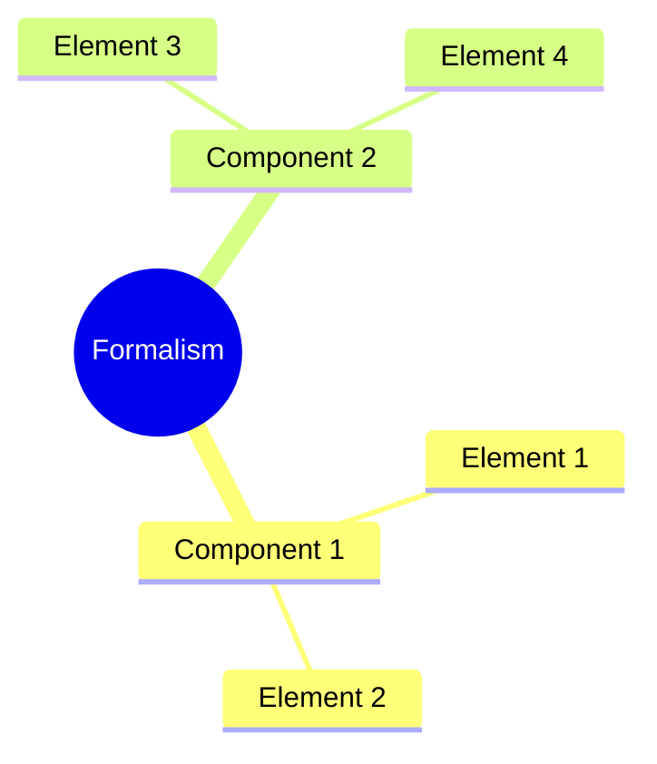
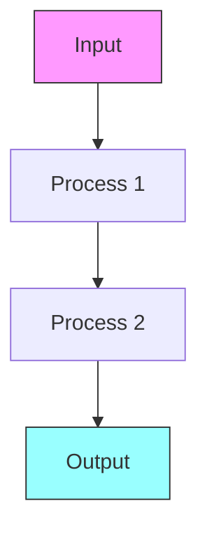
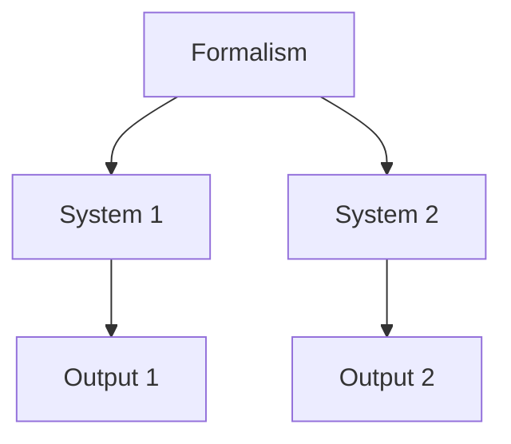

# {{title}}

Brief introduction to the formalism.

## Framework

### Core Principles
1. Principle 1
   - Definition
   - Rationale
   - Application

2. Principle 2
   - Definition
   - Rationale
   - Application

### Structure

## Methodology

### Approach
1. Step 1
   - Description
   - Methods
   - Validation

2. Step 2
   - Description
   - Methods
   - Validation

### Process Flow

## Applications

### Theoretical Applications
1. Application 1
   - Context
   - Implementation
   - Results

2. Application 2
   - Context
   - Implementation
   - Results

### Practical Applications
- Use Case 1
- Use Case 2
- Use Case 3

## Analysis

### Strengths
- Strength 1
- Strength 2
- Strength 3

### Limitations
- Limitation 1
- Limitation 2
- Limitation 3

## Integration

### Related Formalisms
1. Formalism 1
   - Connection
   - Comparison
   - Integration

2. Formalism 2
   - Connection
   - Comparison
   - Integration

### System Context

## References

### Theoretical Sources
1. Source 1
2. Source 2

### Applications
1. Application 1
2. Application 2

### Further Reading
1. Resource 1
2. Resource 2

## Notes
- Important note 1
- Important note 2

## Tags
#formalism 