# {{title}}

Brief description of this relationship map and its significance in the Fuller Knowledge Base.

## Overview

### Map Information
```yaml
map:
  type: [concept|person|project|influence]
  scope: [micro|macro|comprehensive]
  focus: [temporal|spatial|conceptual|social]
  period: [timeframe]
  status: [evolving|stable|historical]
```

### Quick Navigation
- **Central Node**: [[Main Entity]]
- **Key Connections**: [[Connection 1]], [[Connection 2]]
- **Major Clusters**: [[Cluster 1]], [[Cluster 2]]

## Network Structure

### Core Network
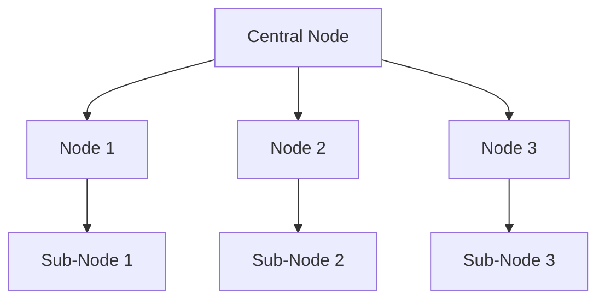

### Relationship Types
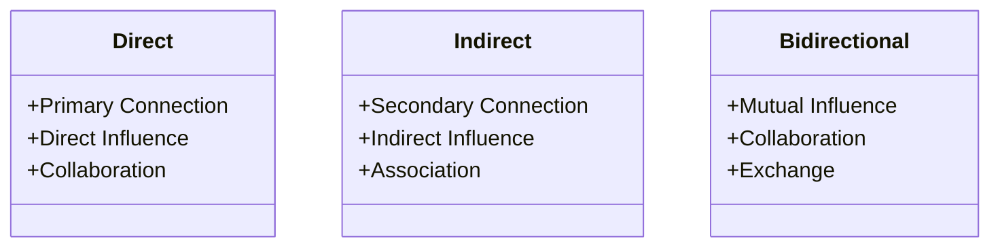

### Connection Strength
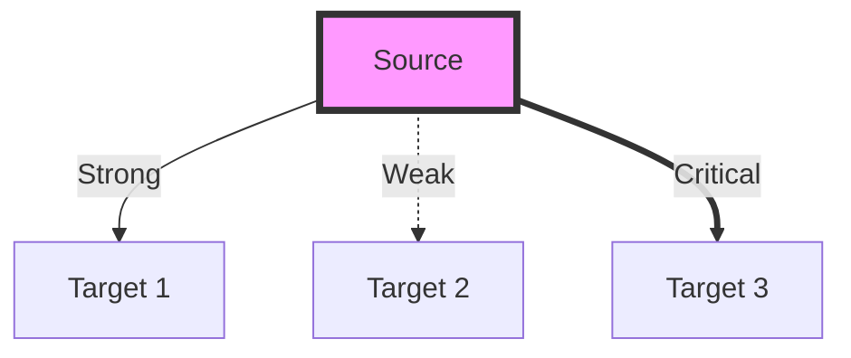

## Temporal Mapping

### Timeline View
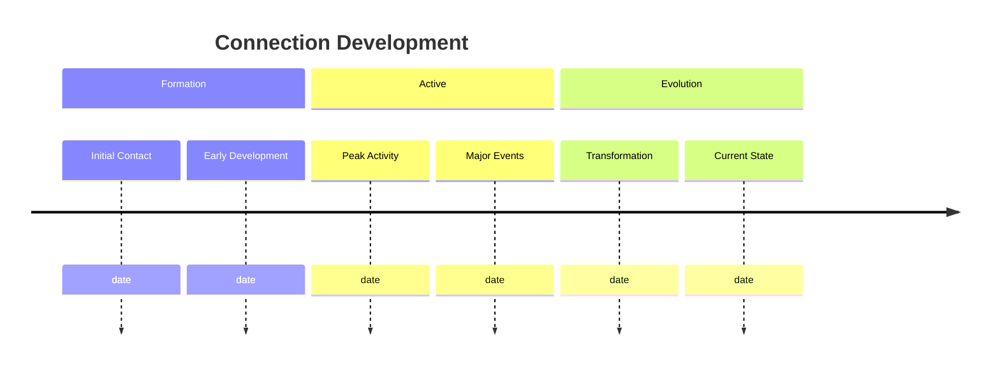

### Development Stages
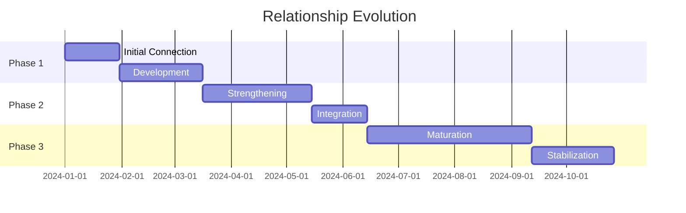

### Historical Context
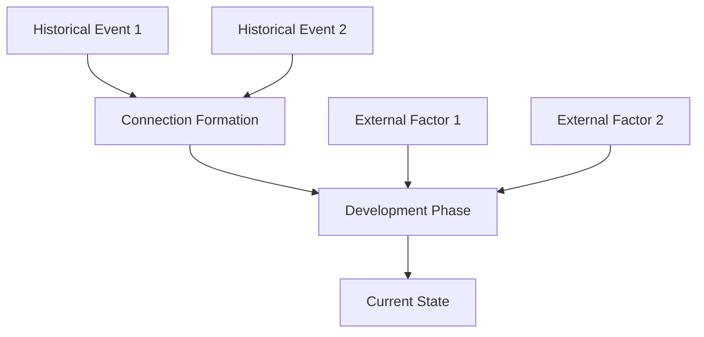

## Spatial Mapping

### Geographic Distribution
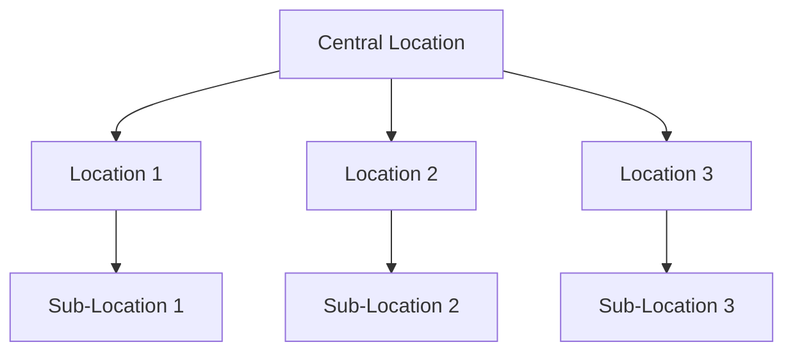

### Influence Zones
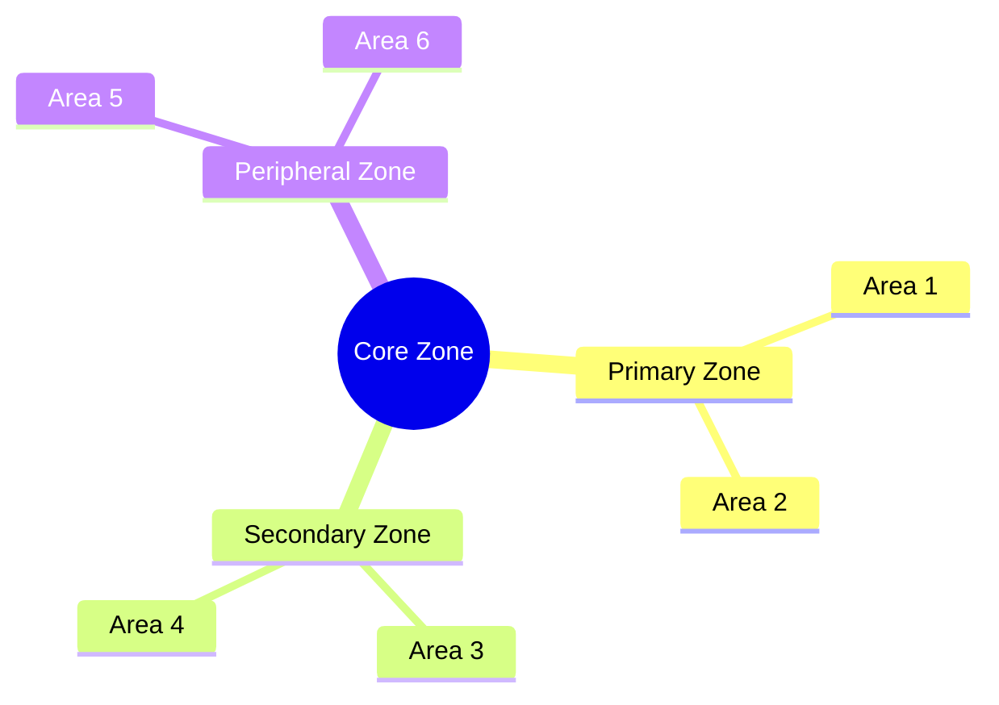

### Movement Patterns
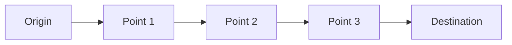

## Conceptual Mapping

### Idea Flow
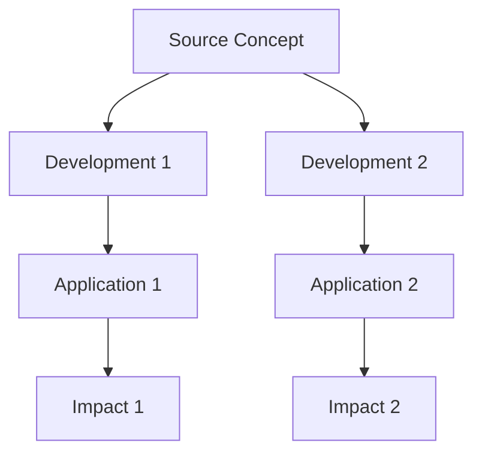

### Knowledge Transfer
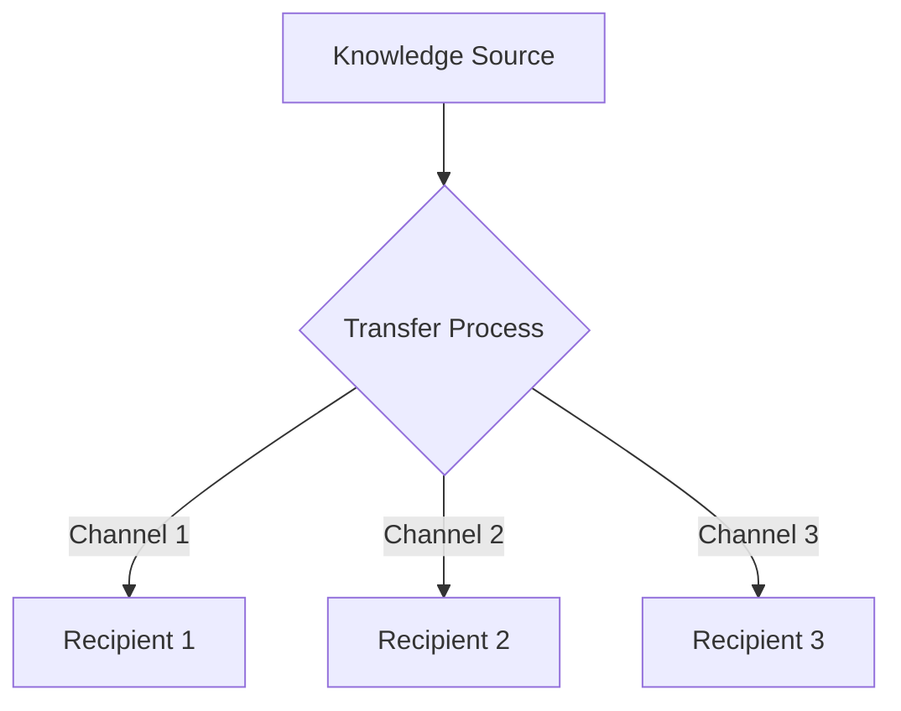

### Concept Evolution
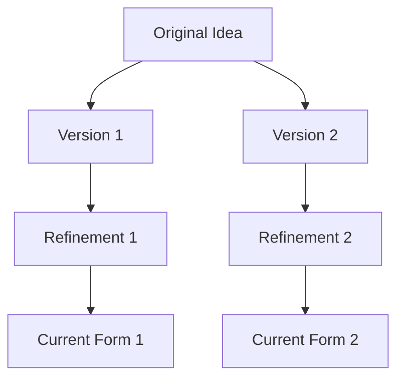

## Analysis

### Connection Patterns
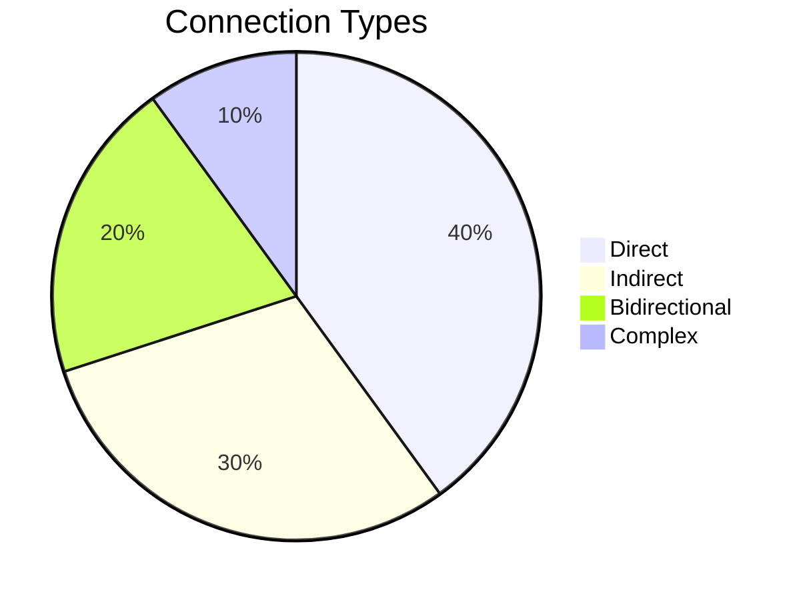

### Relationship Metrics
```yaml
metrics:
  strength:
    strong: count
    moderate: count
    weak: count
  frequency:
    high: count
    medium: count
    low: count
  impact:
    major: count
    minor: count
```

### Key Findings
1. Pattern 1
   - Evidence
   - Implications
   - Applications

2. Pattern 2
   - Evidence
   - Implications
   - Applications

## Integration

### System Connections
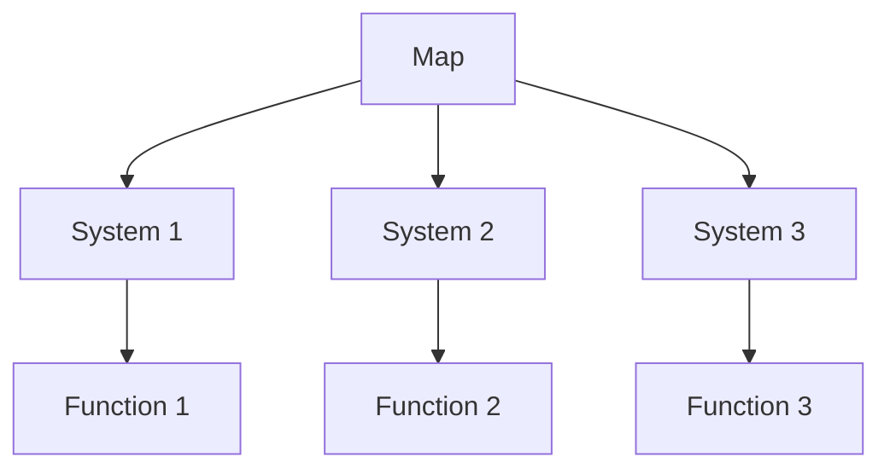

### Data Flow
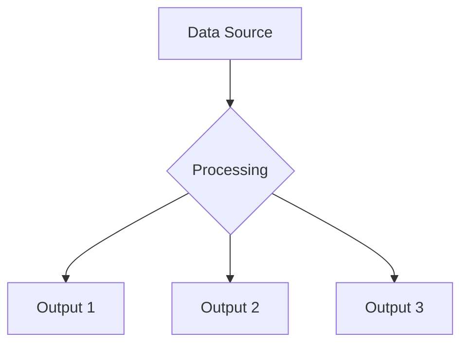

### Cross-References
```yaml
references:
  maps:
    - [[Related Map 1]]
    - [[Related Map 2]]
  systems:
    - [[System 1]]
    - [[System 2]]
  documents:
    - [[Document 1]]
    - [[Document 2]]
```

## Maintenance

### Update Process
1. Regular Review
   - Frequency
   - Scope
   - Methods

2. Version Control
   - Changes
   - Validation
   - Documentation

### Quality Control
```yaml
quality:
  accuracy:
    last_verified: date
    confidence: level
  completeness:
    coverage: percentage
    gaps: [identified areas]
  currency:
    last_updated: date
    update_frequency: period
```

## Resources

### Documentation
- [[Map Documentation]]
- [[Usage Guide]]
- [[Best Practices]]

### Tools
- [[Mapping Tool 1]]
- [[Analysis Tool 1]]
- [[Visualization Tool 1]]

### References
- [[Reference 1]]
- [[Reference 2]]
- [[Reference 3]]

## Tags
#map #relationships #connections #[specific-type] 