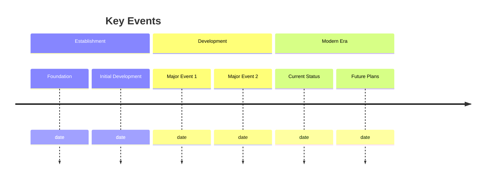

---
title:
  "{ title }": 
type: 
tags: 
created:
  "{ date }": 
updated:
  "{ date }": 
status: active
location: 
coordinates: 
period: 
related: 
aliases:
---

# Title

Brief description of the place and its significance.

## Description

### Physical Characteristics
- Location details
- Architecture
- Environment
- Notable features

### Historical Context
- Establishment
- Development
- Key periods
- Current status

## Significance

### Fuller Connection
- Relationship to Fuller
- Projects/work conducted
- Impact on Fuller's thinking
- Collaborative efforts

### Cultural Impact
- Historical importance
- Cultural significance
- Educational role
- Public perception

## History

### Timeline

### Key Events
1. Event 1
   - Date
   - Description
   - Significance

2. Event 2
   - Date
   - Description
   - Significance

## Current Status

### Present Condition
- Physical state
- Usage
- Management
- Accessibility

### Activities
- Current functions
- Programs
- Research
- Events

## References

### Primary Sources
1. Source 1
2. Source 2

### Secondary Sources
1. Source 1
2. Source 2

### Archives
- Archive 1
- Archive 2

## Notes
- Important note 1
- Important note 2

## Tags
#