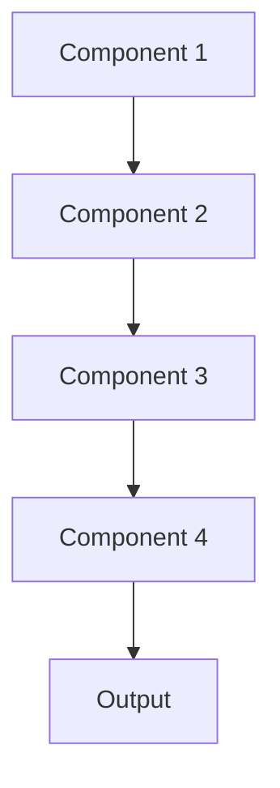

# {{title}}

Brief description of the system's purpose and scope.

## System Overview

### Architecture


### Key Components
1. [[Component 1]]
2. [[Component 2]]
3. [[Component 3]]
4. [[Component 4]]

## Technical Specifications

### Requirements
```yaml
system:
  hardware:
    cpu: "requirements"
    memory: "requirements"
    storage: "requirements"
  software:
    os: ["supported OS"]
    dependencies: ["dep1", "dep2"]
    runtime: "version"
```

### Configuration
```yaml
config:
  component1:
    setting1: value1
    setting2: value2
  component2:
    setting3: value3
    setting4: value4
```

## Implementation

### Components

#### Component 1
- Purpose
- Implementation
- Dependencies
- Configuration

#### Component 2
- Purpose
- Implementation
- Dependencies
- Configuration

### Interfaces

#### API
```python
class SystemAPI:
    def method1(self):
        """Method description"""
        pass
        
    def method2(self):
        """Method description"""
        pass
```

#### Events
```yaml
events:
  event1:
    type: "type"
    payload: "structure"
  event2:
    type: "type"
    payload: "structure"
```

## Data Flow

### Input Processing
1. Data reception
2. Validation
3. Transformation
4. Storage

### Output Generation
1. Data retrieval
2. Processing
3. Formatting
4. Delivery

## Integration

### Dependencies
- [[System 1]]
- [[System 2]]
- [[System 3]]

### APIs
- [[API 1]]
- [[API 2]]
- [[API 3]]

## Deployment

### Environment Setup
```bash
# Environment setup steps
step1
step2
step3
```

### Installation
```bash
# Installation steps
install step1
install step2
install step3
```

### Configuration
```yaml
# Configuration example
setting1: value1
setting2: value2
setting3: value3
```

## Operation

### Startup
1. Prerequisite checks
2. Service initialization
3. Connection establishment
4. Health verification

### Shutdown
1. Connection termination
2. State preservation
3. Resource cleanup
4. Service termination

## Monitoring

### Metrics
- Metric 1
- Metric 2
- Metric 3

### Logging
```python
import logging

logging.basicConfig(
    level=logging.INFO,
    format='%(asctime)s - %(name)s - %(levelname)s - %(message)s'
)
```

### Alerts
- Alert condition 1
- Alert condition 2
- Alert condition 3

## Maintenance

### Routine Tasks
- Task 1
- Task 2
- Task 3

### Updates
- Update procedure 1
- Update procedure 2
- Update procedure 3

## Security

### Authentication
- Method 1
- Method 2
- Method 3

### Authorization
- Level 1
- Level 2
- Level 3

### Data Protection
- Measure 1
- Measure 2
- Measure 3

## Disaster Recovery

### Backup Procedures
1. Backup step 1
2. Backup step 2
3. Backup step 3

### Recovery Procedures
1. Recovery step 1
2. Recovery step 2
3. Recovery step 3

## Testing

### Unit Tests
```bash
# Run unit tests
test command 1
```

### Integration Tests
```bash
# Run integration tests
test command 2
```

### Performance Tests
```bash
# Run performance tests
test command 3
```

## Documentation

### API Documentation
- [[API Reference]]
- [[Integration Guide]]
- [[Examples]]

### User Guides
- [[Installation Guide]]
- [[Configuration Guide]]
- [[Operation Guide]]

### Technical Docs
- [[Architecture Guide]]
- [[Development Guide]]
- [[Deployment Guide]]

## Support

### Troubleshooting
- Issue 1: Solution
- Issue 2: Solution
- Issue 3: Solution

### Contact
- [[Support Team]]
- [[Development Team]]
- [[Operations Team]]

## Version History

### Changelog
- v1.0.0: Initial release
- v1.1.0: Feature addition
- v1.2.0: Enhancement

### Roadmap
- Feature 1
- Feature 2
- Feature 3

## Tags
#system #documentation #technical #architecture 