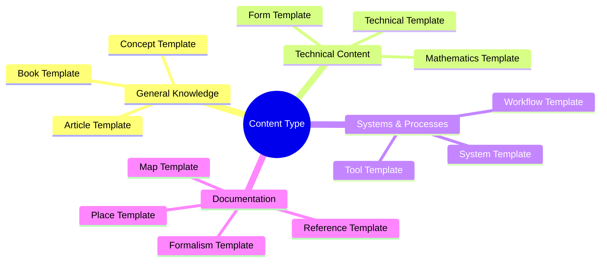
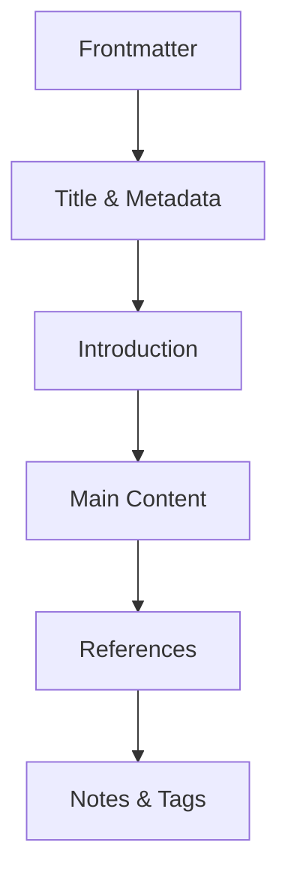

# Template Index

This document provides a comprehensive overview of available templates and guidelines for their usage in the Fuller Knowledge Base.

## Available Templates

### Core Content Templates

1. [[Article_Template|Article Template]]
   - For general articles and comprehensive topics
   - Used in: `/articles/`
   - Example: `Design_Science_Revolution.md`

2. [[Book_Template|Book Template]]
   - For documenting publications and written works
   - Used in: `/books/`
   - Example: `Operating_Manual_for_Spaceship_Earth.md`

3. [[Concept_Template|Concept Template]]
   - For documenting core ideas and theoretical frameworks
   - Used in: `/concepts/`
   - Example: `Synergetics.md`, `Dymaxion.md`

4. [[Person_Template|Person Template]]
   - For biographical information and contributions
   - Used in: `/people/`
   - Example: `Fuller_Buckminster.md`

### Technical Templates

5. [[Form_Template|Form Template]]
   - For geometric forms and structural patterns
   - Used in: `/forms/`
   - Example: `Geodesic_Sphere.md`

6. [[Mathematics_Template|Mathematics Template]]
   - For mathematical concepts and proofs
   - Used in: `/mathematics/`
   - Example: `Geodesic_Mathematics.md`

7. [[Technical_Template|Technical Template]]
   - For technical specifications and implementations
   - Used in: `/technical/`
   - Example: `Geodesic_Dome_Construction.md`

### System & Process Templates

8. [[System_Template|System Template]]
   - For documenting complex systems and architectures
   - Used in: `/systems/`
   - Example: `World_Game_System.md`

9. [[Workflow_Template|Workflow Template]]
   - For documenting processes and procedures
   - Used in: `/workflows/`
   - Example: `Design_Science_Planning.md`

10. [[Tool_Template|Tool Template]]
    - For tools, methods, and processes
    - Used in: `/tools/`
    - Example: `Dymaxion_Projection.md`

### Documentation Templates

11. [[Map_Template|Map Template]]
    - For relationship maps and connections
    - Used in: `/maps/`
    - Example: `Fuller_Influence_Network.md`

12. [[Reference_Template|Reference Template]]
    - For citations and reference materials
    - Used in: `/references/`
    - Example: `Critical_Path_References.md`

13. [[Place_Template|Place Template]]
    - For documenting significant locations
    - Used in: `/places/`
    - Example: `Black_Mountain_College.md`

14. [[Formalism_Template|Formalism Template]]
    - For formal systems and methodologies
    - Used in: `/formalisms/`
    - Example: `Design_Science.md`

## Template Usage

### Selection Guide

Choose templates based on content type:



### Required Structure

All templates follow a consistent structure:



#### Frontmatter Requirements
```yaml
frontmatter:
  required:
    - title
    - type
    - tags
    - created
    - updated
    - status
  optional:
    - related
    - aliases
    - version
```

### Template Customization

When modifying or creating templates:

1. Follow [[Style_Guide|Style Guide]]
2. Maintain consistent structure
3. Update [[Metadata_Schema|metadata schema]]
4. Test with sample content
5. Update this index

## Quality Control

### Document Validation
1. Verify frontmatter completeness
2. Check section requirements
3. Validate internal links
4. Test external references
5. Review formatting

### Maintenance Schedule
1. Weekly link checks
2. Monthly content reviews
3. Quarterly template updates
4. Annual comprehensive review

## Integration

### Related Documentation
- [[Style_Guide|Style Guide]] - Writing and formatting standards
- [[Metadata_Schema|Metadata Schema]] - Data structure specifications
- [[File_Types|File Types Guide]] - Supported file formats
- [[Folder_Structure|Folder Structure]] - Organization guidelines
- [[Naming_Conventions|Naming Conventions]] - File and folder naming rules
- [[Link_Guidelines|Link Guidelines]] - Internal and external linking

### Tools & Resources
- [[Template_Validator|Template Validator]] - Validation tool
- [[Markdown_Guide|Markdown Guide]] - Formatting reference
- [[YAML_Guide|YAML Guide]] - Frontmatter syntax
- [[Mermaid_Guide|Mermaid Guide]] - Diagram creation

## Notes
- Always use the latest template version
- Follow naming conventions strictly
- Maintain consistent metadata
- Test all links before committing
- Update related documentation when changing templates

## Tags
#documentation #templates #guide #organization #standards #metadata #structure 