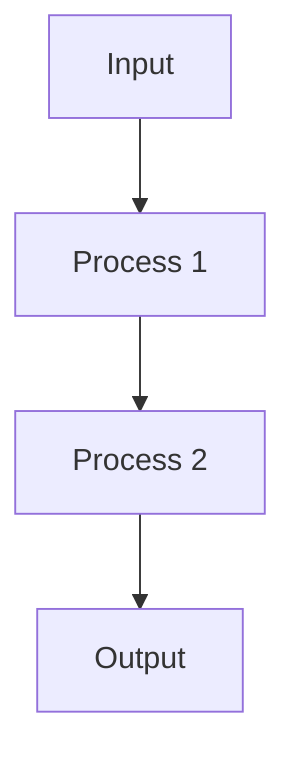

# {{title}}

Brief description of the tool and its purpose.

## Purpose

### Primary Function
Clear statement of the tool's main function.

### Applications
- Application 1
- Application 2
- Application 3

## Methodology

### Principles
1. Principle 1
   - Description
   - Application
   - Benefits

2. Principle 2
   - Description
   - Application
   - Benefits

### Process

## Usage

### Instructions
1. Step 1
   - Description
   - Methods
   - Verification

2. Step 2
   - Description
   - Methods
   - Verification

### Best Practices
- Practice 1
- Practice 2
- Practice 3

## Examples

### Case Studies
1. Example 1
   - Context
   - Implementation
   - Results

2. Example 2
   - Context
   - Implementation
   - Results

### Variations
- Variation 1
- Variation 2
- Variation 3

## Implementation

### Requirements
- Requirement 1
- Requirement 2
- Requirement 3

### Setup
1. Step 1
   - Description
   - Resources
   - Validation

2. Step 2
   - Description
   - Resources
   - Validation

## References

### Documentation
1. Document 1
2. Document 2

### Resources
1. Resource 1
2. Resource 2

### Related Tools
- Tool 1
- Tool 2

## Notes
- Important note 1
- Important note 2

## Tags
#tool 