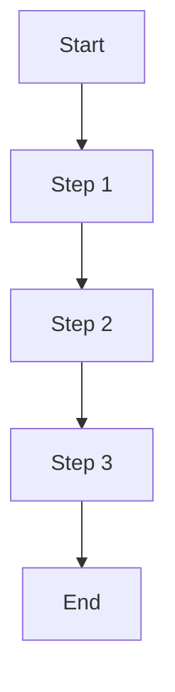
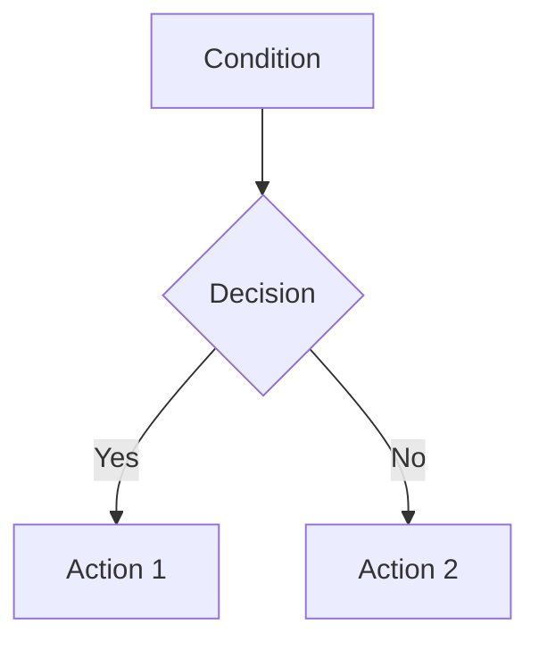
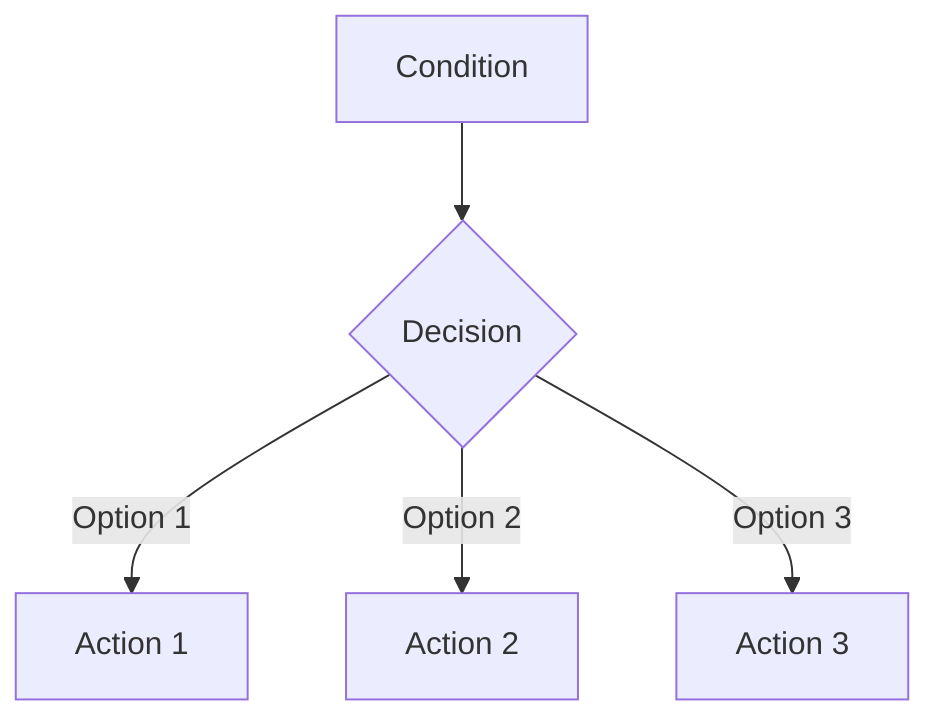

# {{title}}

Brief description of the workflow's purpose and scope.

## Overview

### Process Flow


### Key Information
- **Purpose**: Main objective
- **Scope**: Boundaries and limitations
- **Owner**: Responsible team/person
- **Stakeholders**: Involved parties
- **Frequency**: How often executed
- **Duration**: Expected time frame

## Prerequisites

### Requirements
```yaml
requirements:
  access:
    - system1
    - system2
  tools:
    - tool1
    - tool2
  knowledge:
    - skill1
    - skill2
```

### Preparation
1. Task 1
   - Details
   - Resources
   - Time

2. Task 2
   - Details
   - Resources
   - Time

## Process Steps

### 1. Step One
- **Input**: Required input
- **Action**: What to do
- **Output**: Expected output
- **Tools**: Required tools
- **Time**: Expected duration
- **Notes**: Important considerations

### 2. Step Two
- **Input**: Required input
- **Action**: What to do
- **Output**: Expected output
- **Tools**: Required tools
- **Time**: Expected duration
- **Notes**: Important considerations

## Decision Points

### Decision 1


### Decision 2


## Roles and Responsibilities

### Role Matrix
```yaml
roles:
  owner:
    - responsibility1
    - responsibility2
  executor:
    - responsibility3
    - responsibility4
  reviewer:
    - responsibility5
    - responsibility6
```

### Stakeholders
1. Stakeholder 1
   - Role
   - Responsibilities
   - Contact

2. Stakeholder 2
   - Role
   - Responsibilities
   - Contact

## Quality Control

### Checkpoints
1. Checkpoint 1
   - Criteria
   - Validation
   - Action

2. Checkpoint 2
   - Criteria
   - Validation
   - Action

### Quality Metrics
```yaml
metrics:
  accuracy:
    target: value
    tolerance: value
  time:
    target: value
    tolerance: value
```

## Exception Handling

### Common Issues
1. Issue 1
   - Symptoms
   - Causes
   - Resolution

2. Issue 2
   - Symptoms
   - Causes
   - Resolution

### Escalation Path
1. Level 1
   - Contact
   - Criteria
   - Response time

2. Level 2
   - Contact
   - Criteria
   - Response time

## Integration

### Systems
- [[System 1]]
- [[System 2]]
- [[System 3]]

### Dependencies
- [[Workflow 1]]
- [[Workflow 2]]
- [[Workflow 3]]

### Interfaces
1. Interface 1
   - Type
   - Protocol
   - Requirements

2. Interface 2
   - Type
   - Protocol
   - Requirements

## Documentation

### Related Procedures
- [[Procedure 1]]
- [[Procedure 2]]
- [[Procedure 3]]

### Templates
- [[Template 1]]
- [[Template 2]]
- [[Template 3]]

### References
- [[Reference 1]]
- [[Reference 2]]
- [[Reference 3]]

## Monitoring

### Metrics
1. Metric 1
   - Description
   - Collection
   - Analysis

2. Metric 2
   - Description
   - Collection
   - Analysis

### Reporting
```yaml
reports:
  daily:
    - metric1
    - metric2
  weekly:
    - metric3
    - metric4
```

### Alerts
1. Alert 1
   - Trigger
   - Action
   - Response

2. Alert 2
   - Trigger
   - Action
   - Response

## Maintenance

### Review Schedule
- Daily tasks
- Weekly tasks
- Monthly tasks
- Quarterly tasks

### Updates
1. Update 1
   - Changes
   - Reason
   - Impact

2. Update 2
   - Changes
   - Reason
   - Impact

### Archive
- Version history
- Change log
- Previous versions

## Training

### Materials
- [[Training Guide]]
- [[Quick Reference]]
- [[FAQ]]

### Requirements
1. Requirement 1
   - Skills
   - Knowledge
   - Experience

2. Requirement 2
   - Skills
   - Knowledge
   - Experience

## Support

### Help Resources
- [[Support Guide]]
- [[Troubleshooting]]
- [[Contact List]]

### Feedback
- Process
- Collection
- Implementation

## Tags
#workflow #process #[category] 