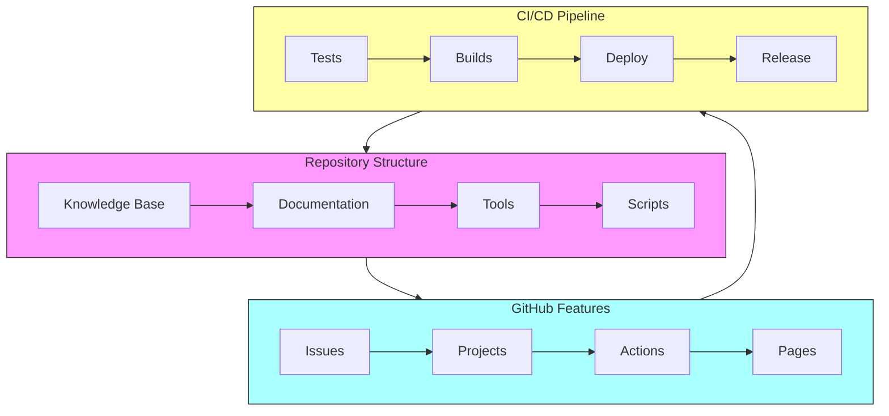
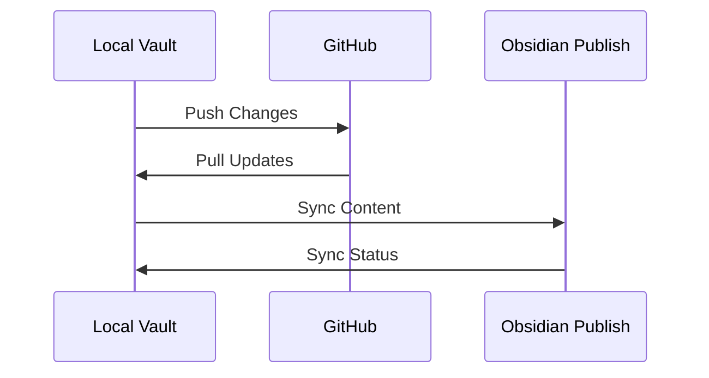
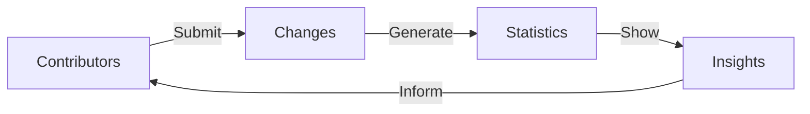
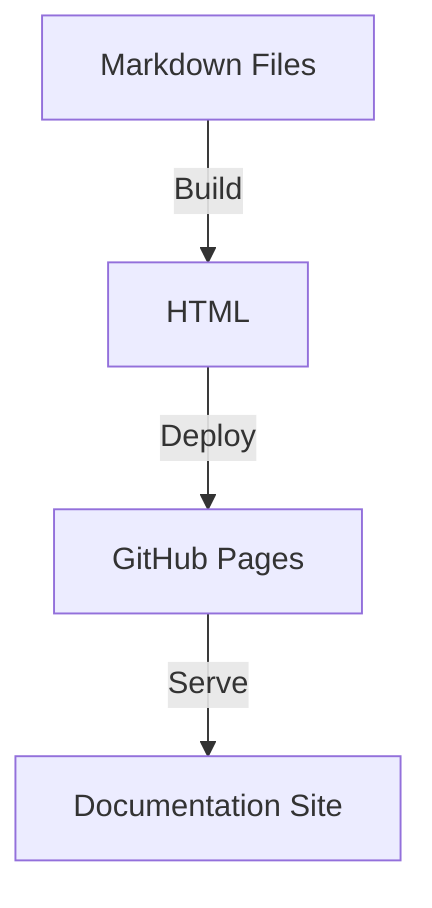
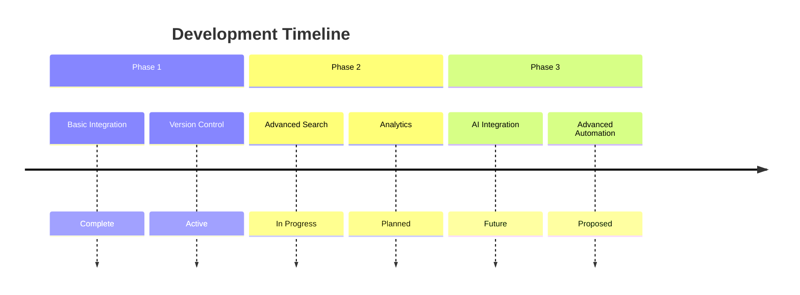

# 🛠️ GitHub Tools & Integration

## Overview
This document outlines the GitHub tools and integration features used in the Buckminster Fuller Knowledge Graph project, accessible at [School of Tomorrow](https://github.com/docxology/School_of_Tomorrow/).

## 🔄 Integration Architecture



## 🚀 Key Features

### 1. Version Control
- **Branch Management**
  - Main branch protection
  - Feature branch workflow
  - Pull request reviews
  
- **History Tracking**
  - Detailed commit logs
  - Change attribution
  - Revert capabilities

### 2. Collaboration Tools
- **Issue Tracking**
  - Bug reports
  - Feature requests
  - Discussion threads
  
- **Project Boards**
  - Task organization
  - Progress tracking
  - Milestone management

### 3. Automation
- **GitHub Actions**
  ```yaml
  name: Documentation Build
  on:
    push:
      branches: [main]
  jobs:
    build:
      runs-on: ubuntu-latest
      steps:
        - uses: actions/checkout@v2
        - name: Build Docs
          run: |
            npm install
            npm run build
  ```

## 🔗 Integration Points

### Obsidian Sync


### Development Workflow
1. **Fork Repository**
   ```bash
   # Clone the repository
   git clone https://github.com/docxology/School_of_Tomorrow.git
   cd School_of_Tomorrow
   ```

2. **Create Branch**
   ```bash
   git checkout -b feature/new-content
   ```

3. **Make Changes**
   ```bash
   # Edit files
   git add .
   git commit -m "Add new content"
   git push origin feature/new-content
   ```

4. **Create Pull Request**
   - Submit through GitHub interface
   - Add description
   - Request review

## 🔍 Search & Discovery

### GitHub Search Features
- Code search
- Issue search
- Wiki search
- Repository search

### Advanced Queries
```sql
-- Find specific file types
filename:*.md "Buckminster Fuller"

-- Search in commits
author:username after:2024-01-01

-- Complex queries
is:pr is:open label:documentation
```

## 📊 Analytics & Insights

### Repository Statistics


### Metrics Tracked
- Commit frequency
- Code additions/deletions
- Issue resolution time
- Pull request velocity

## 🔐 Security Features

### Branch Protection
- Required reviews
- Status checks
- Merge requirements

### Access Control
- Role-based access
- Environment secrets
- Deploy keys

## 📚 Documentation Integration

### Automated Builds


### Live Preview
- Pull request previews
- Documentation drafts
- Change visualization

## 🤝 Community Features

### Discussions
- Q&A format
- Feature requests
- Community polls

### Contributing Guidelines
1. Fork repository
2. Create feature branch
3. Make changes
4. Submit pull request

## 🔄 Sync Configuration

### GitHub Settings
```yaml
# .github/sync.yml
sync:
  - source: content/
    dest: docs/
    strategy: mirror
  - source: templates/
    dest: .templates/
    strategy: overlay
```

### Automation Rules
```yaml
# .github/workflows/sync.yml
name: Sync Content
on:
  push:
    branches: [main]
  schedule:
    - cron: '0 */6 * * *'
```

## 📈 Future Enhancements

### Planned Features
- Enhanced search integration
- Automated documentation updates
- Community contribution tools
- Advanced visualization features

### Integration Roadmap


## 🔗 Related Resources
- [[Contribution_Guide]]
- [[Development_Workflow]]
- [[CI_CD_Pipeline]]
- [[Security_Guidelines]] 