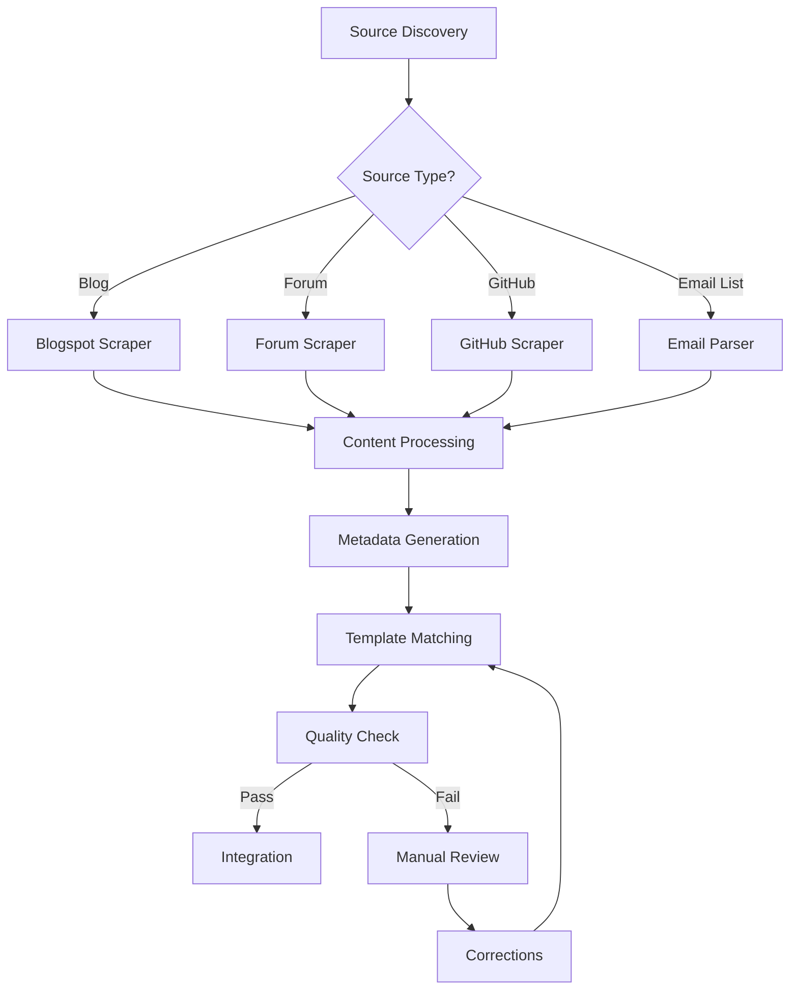

# Knowledge Ingestion Workflow

This document outlines the step-by-step process for ingesting new content into the Fuller Knowledge Base.

## Workflow Overview

## 1. Source Discovery

### Automated Discovery
- Monitor RSS feeds
- Track GitHub repositories
- Follow mailing lists
- Check known websites

### Manual Addition
1. Identify valuable source
2. Validate authenticity
3. Add to [[Source_Registry]]
4. Configure scraping rules

## 2. Content Collection

### Blogspot Processing
Using [[Blogspot_Scraper]]:
1. Extract post content
2. Capture comments
3. Download media
4. Store metadata

### Forum Processing
Using [[Forum_Scraper]]:
1. Extract threads
2. Capture responses
3. Identify key discussions
4. Map user interactions

### GitHub Processing
Using [[Github_Scraper]]:
1. Clone repositories
2. Extract documentation
3. Analyze code
4. Track issues/discussions

### Email List Processing
Using [[Email_List_Parser]]:
1. Download archives
2. Thread conversations
3. Extract attachments
4. Map discussions

## 3. Content Processing

### Text Processing
1. Clean HTML/markup
2. Extract plain text
3. Identify sections
4. Detect languages

### Media Processing
1. Download images
2. Convert formats
3. Optimize size
4. Generate thumbnails

### Citation Processing
1. Extract references
2. Validate sources
3. Create citations
4. Link to sources

## 4. Metadata Generation

### Automatic Tagging
Using [[Tag_Generator]]:
1. Analyze content
2. Extract keywords
3. Map to existing tags
4. Suggest new tags

### Link Discovery
Using [[Link_Discoverer]]:
1. Find related content
2. Identify connections
3. Generate wiki links
4. Create backlinks

### Categorization
Using [[Category_Classifier]]:
1. Analyze content type
2. Match to templates
3. Assign categories
4. Set metadata

## 5. Knowledge Integration

### Template Application
Using [[Template_Matcher]]:
1. Select template
2. Fill metadata
3. Structure content
4. Format sections

### Quality Checks
Using [[Content_Validator]]:
1. Verify metadata
2. Check links
3. Validate format
4. Test rendering

### Integration Steps
1. Place in correct folder
2. Update index files
3. Generate backlinks
4. Rebuild graph

## Error Handling

### Common Issues
1. Missing metadata
2. Broken links
3. Template mismatch
4. Media errors

### Resolution Process
1. Log error details
2. Classify issue type
3. Apply fixes
4. Revalidate

## Monitoring

### Quality Metrics
- Successful ingestions
- Error rates
- Processing time
- Link validity

### Health Checks
- Source availability
- System performance
- Storage usage
- Integration success

## Maintenance

### Regular Tasks
- Update sources
- Clean temporary files
- Optimize database
- Update templates

### Periodic Reviews
- Content quality
- Link integrity
- Tag consistency
- Template effectiveness

## Tools Reference

### Core Tools
- [[Blogspot_Scraper]]
- [[Forum_Scraper]]
- [[Github_Scraper]]
- [[Email_List_Parser]]

### Support Tools
- [[Tag_Generator]]
- [[Link_Discoverer]]
- [[Template_Matcher]]
- [[Content_Validator]]

## Tags
#workflow #ingestion #automation #process #documentation 