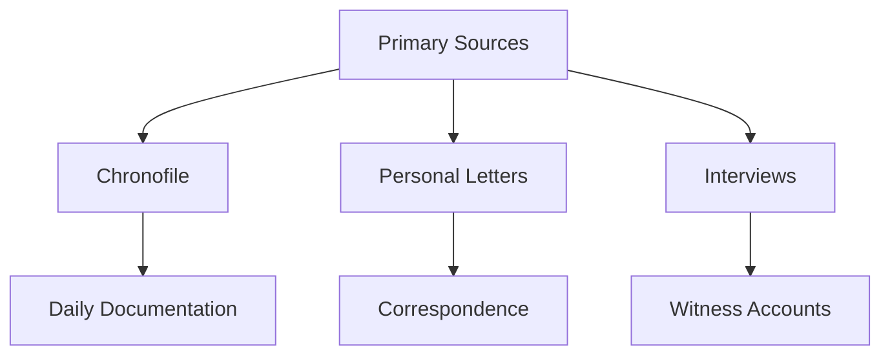
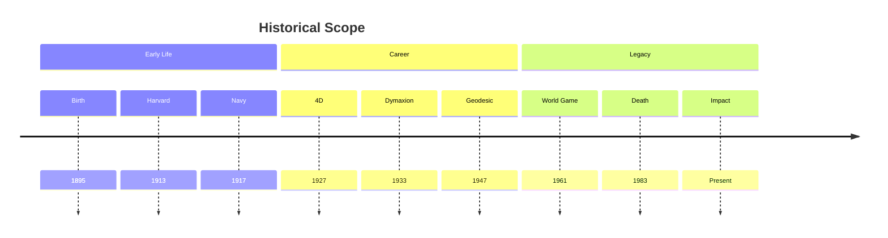
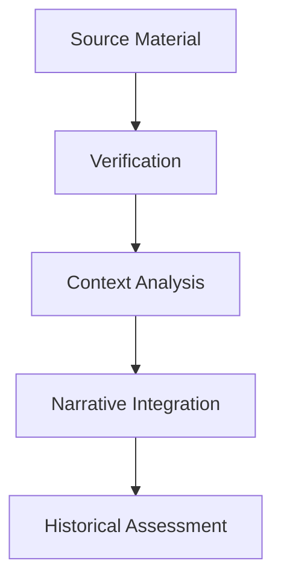
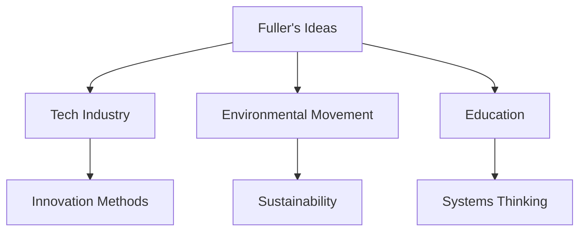

# Inventor of the Future: The Visionary Life of Buckminster Fuller

A comprehensive biography by [[Alec Nevala-Lee]] that examines the life, work, and legacy of [[Buckminster_Fuller]], drawing on extensive archival research and previously unpublished materials.

## Overview

### Key Information
```yaml
book:
  title: "Inventor of the Future: The Visionary Life of Buckminster Fuller"
  author: Alec Nevala-Lee
  publisher: HarperCollins
  publication_date: 2022
  pages: 672
  isbn: 9780062947239
  awards:
    - New York Times Book Review Editors' Choice
    - Esquire's 50 Best Biographies of All Time
```

### Scope
```mermaid
mindmap
    root((Biography))
        Early Life
            [[Family Background]]
            [[Education]]
            [[Personal Struggles]]
        Career
            [[Design Science]]
            [[Inventions]]
            [[Teaching]]
        Legacy
            [[Modern Impact]]
            [[Silicon Valley]]
            [[Environmental Movement]]
```

## Content Analysis

### Major Themes
1. Personal Development
   - Early failures and transformation
   - Spiritual awakening
   - Professional evolution

2. Professional Achievements
   - Architectural innovations
   - Design philosophy
   - Educational impact

3. Cultural Impact
   - Environmental consciousness
   - Technological influence
   - Educational legacy

### Research Sources


## Historical Context

### Timeline Coverage


### Cultural Framework
1. Historical Events
   - World Wars
   - Great Depression
   - Space Race
   - Environmental Movement

2. Intellectual Movements
   - Modernism
   - Systems Thinking
   - Environmental Consciousness
   - Technological Innovation

## Critical Reception

### Reviews
```yaml
reviews:
  new_york_times: "Masterful biography"
  wall_street_journal: "Definitive account"
  nature: "Comprehensive examination"
  esquire: "Essential biography"
```

### Academic Response
1. Scholarly Impact
   - Fuller scholarship advancement
   - Historical reassessment
   - Legacy interpretation

2. New Insights
   - Collaboration revelations
   - Project origins
   - Personal motivations

## Research Methodology

### Sources
1. Primary Materials
   - [[The Chronofile]]
   - Stanford Archives
   - Personal interviews
   - Family documents

2. Secondary Materials
   - Previous biographies
   - Academic studies
   - Media coverage
   - Contemporary accounts

### Analytical Approach


## Key Revelations

### New Findings
1. Project Origins
   - Geodesic dome development
   - Tensegrity attribution
   - Collaboration patterns

2. Personal Life
   - Family relationships
   - Professional struggles
   - Private motivations

### Legacy Assessment
```mermaid
mindmap
    root((Fuller Impact))
        Direct
            [[Architecture]]
            [[Design]]
            [[Education]]
        Indirect
            [[Silicon Valley]]
            [[Environmentalism]]
            [[Innovation]]
```

## Contemporary Relevance

### Modern Applications
1. Design Thinking
   - Sustainable design
   - Systems approach
   - Innovation methodology

2. Environmental Consciousness
   - Resource efficiency
   - Global perspective
   - Sustainability principles

### Current Influence


## Resources

### Additional Reading
- [[A Fuller Explanation]]
- [[Synergetics]]
- [[Operating Manual for Spaceship Earth]]

### Archives
- [[Stanford Special Collections]]
- [[Buckminster Fuller Institute]]
- [[Southern Illinois University]]

### Media Coverage
- Author interviews
- Book reviews
- Academic discussions
- Public lectures

## References
1. Book reviews
2. Academic papers
3. Author interviews
4. Historical documents
5. Archive materials

## Notes
- First comprehensive biography using full Chronofile access
- Reveals new aspects of Fuller's collaborations
- Reassesses key myths and legends
- Provides balanced historical perspective

## Tags
#book #biography #fuller-studies #design-science #history 