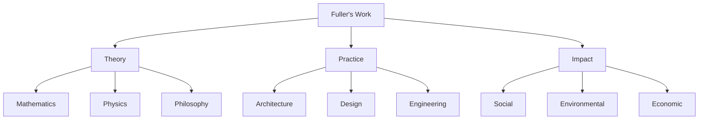

# 🌍 Buckminster Fuller Knowledge Graph
## Repository Overview

![[ascii_logo]]

> "You never change things by fighting the existing reality. To change something, build a new model that makes the existing model obsolete."

---

## 🎯 Vision & Purpose

- Living documentation of [[Buckminster_Fuller|Bucky Fuller]]'s work, life, times, and concepts. 
- Modern knowledge graph implementation
- Cross-disciplinary integration
- .....? 
---

## 🗺️ Repository Structure

```ascii
Knowledge Graph
    ├── 📂 concepts/
    ├── 📂 technical/
    ├── 📂 research/
    ├── 📂 people/
    ├── 📂 places/
    ├── 📂 fonds/
    └── 📂 documentation/
```

---

## 🧠 Core Components

1. **Knowledge Base**
   - Markdown-based documentation
   - Wiki-style linking
   - Bidirectional relationships

2. **Technical Framework**
   - Graph visualization
   - Semantic tagging
   - Version control

3. **Content Organization**
   - Modular structure
   - Cross-referencing
   - Metadata schemas

---

## 📚 Content Domains

### Mathematical Systems
- Vector Mathematics
- [[fonds/books/Synergetics|Synergetics]] and Geometry
- Geodesics and [[Great_Circles|Geodesic Lines]]

### Physical Systems
- [[Tensegrity]] Structures
- [[Geodesic_Dome]]
- [[Dymaxion]] designs
	- [[Dymaxion_Map]]
	- [[Dymaxion_Car]]

### Conceptual Systems
- Design Science
- World Game
- CADS (Comprehensive Anticipatory Design Science)

---

## 🛠️ Tools & Technologies

### Core Tools
- [[Obsidian]] for knowledge navigation
- [[GitHub_Tools]] for version control
- [[Obsidian]] Sync and publish (live at: https://publish.obsidian.md/synergetics/README )
- Python-based explorer

### Interactive Features
- Terminal-based navigation
- Markdown rendering
- File search & browsing
- Repository visualization

---

## 🚀 Getting Started

```bash
# Clone repository
git clone https://github.com/your-username/School_of_Tomorrow.git
cd School_of_Tomorrow

# Setup
./setup.sh

# Run explorer
./run
```

---

## 📂 Explorer Features

1. **Browse Repository**
   - Navigate directories
   - View files
   - Search content

2. **View Documentation**
   - Formatted markdown
   - Syntax highlighting
   - Tree visualization

3. **Interactive Interface**
   - Color-coded display
   - Intuitive navigation
   - Quick access to key files

---

## 🎯 Key Concepts

### Synergetics
- Systematic exploration of geometric principles
- Nature's coordinate system
- Fundamental patterns

### Tensegrity
- Structural integrity through tension
- Discontinuous compression
- Continuous tension

### Design Science
- Comprehensive problem-solving
- Anticipatory design
- Global solutions

---

## 🌐 Knowledge Integration



---

## 📊 Implementation Architecture

### Frontend Layer
- Markdown files
- Wiki-style links
- Graph visualization

### Backend Layer
- File system
- Version control
- Metadata management

### Integration Layer
- Templates
- Scripts
- Automation tools

---

## 🔍 Navigation Guide

1. Start with README.md
2. Explore concept directories
3. Follow wiki-style links
4. Use the interactive explorer
5. Leverage graph visualization
6. Dive into specific domains

---

## 🤝 Contributing

### Ways to Contribute
1. Content creation
2. Technical development
3. Documentation
4. Research integration
5. Testing & validation

### Workflow
Research → Document → Review → Integrate → Publish

---

## 🎓 Learning Path

1. **Foundation**
   - Basic concepts
   - Navigation tools
   - Repository structure

2. **Deep Dive**
   - Mathematical principles
   - Physical systems
   - Design methodology

3. **Application**
   - Practical implementations
   - Case studies
   - Modern relevance

---

## 🔗 Resources & Links

- [Buckminster Fuller Institute](https://www.bfi.org/)
- [Stanford Archives](https://archives.stanford.edu/)
- [Design Science Lab](https://designsciencelab.org/)

Documentation:
- [[Style_Guide]]
- [[Metadata_Schema]]
- [[Contribution_Guide]]

---

## 🌟 Future Development

1. **Content Expansion**
   - Additional domains
   - More case studies
   - Modern applications

2. **Technical Features**
   - Enhanced visualization
   - API integration
   - Advanced search

3. **Community Growth**
   - Collaborative tools
   - Educational resources
   - Workshop materials

---

## 🙏 Thank You

> "The best way to predict the future is to design it."
> — Buckminster Fuller

### Get Started
```bash
./run
```

[[README|Return to Main Documentation]] 