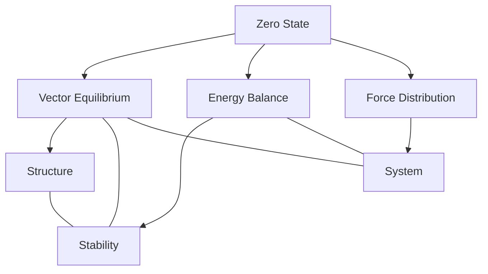
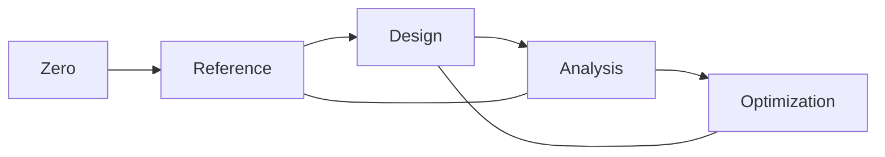
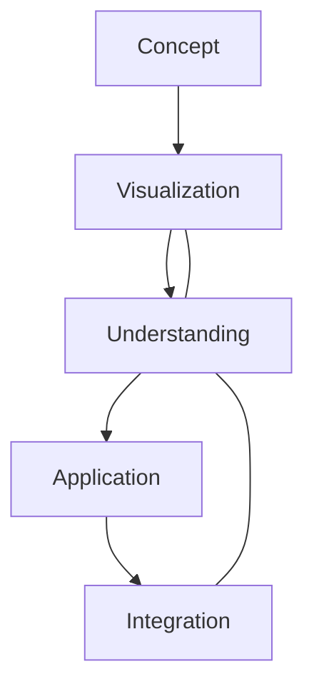

# Zero

In [[Buckminster_Fuller|Bucky Fuller]]'s work, [[0]] represents the state of perfect equilibrium, most notably embodied in the [[Vector_Equilibrium]], where all forces and vectors are in perfect balance.

## Overview

### Definition
```yaml
number:
  value: 0
  type: integer
  category: equilibrium state
  significance:
    - Perfect balance point
    - Vector Equilibrium state
    - Energy reference
    - System origin
  fuller_context:
    - Vector Equilibrium
    - Energy systems
    - Force balance
    - Reference state
```

### Key Properties
1. Mathematical Properties
   - Additive identity
   - Multiplicative absorber
   - Central reference
   - System origin

2. Synergetic Properties
   - Perfect equilibrium
   - Force balance
   - Energy reference
   - System neutrality

## Mathematical Framework

### Numerical Properties
```mermaid
mindmap
    root((Zero))
        Mathematics
            [[Identity]]
            [[Reference]]
            [[Balance]]
        Systems
            [[Equilibrium]]
            [[Origin]]
            [[Neutrality]]
        Applications
            [[Vector_Systems]]
            [[Energy_States]]
            [[Force_Balance]]
```

### Mathematical Relationships
1. System Reference
   - Origin point
   - Balance center
   - Neutral state
   - Reference frame

2. Energy States
   - Equilibrium condition
   - Force balance
   - Energy reference
   - System stability

## Synergetic Significance

### Vector Equilibrium
1. Structural Properties
   - [[Perfect_Balance]]
   - [[Force_Distribution]]
   - [[Vector_Relationships]]
   - [[System_Stability]]

2. Energy States
   - [[Zero_Energy]]
   - [[Perfect_Balance]]
   - [[Force_Neutrality]]
   - [[System_Reference]]

### System Framework


## Natural Occurrence

### Physical Systems
1. Energy States
   - [[Ground_State]]
   - [[Equilibrium]]
   - [[Balance_Point]]
   - [[Neutral_State]]

2. System Organization
   - [[Center_Points]]
   - [[Reference_Frames]]
   - [[Balance_Systems]]
   - [[Stability_States]]

### Natural Framework
```mermaid
mindmap
    root((Natural Zero))
        Energy
            [[Balance]]
            [[Equilibrium]]
            [[Stability]]
        Structure
            [[Center]]
            [[Reference]]
            [[Organization]]
```

## Applications

### Implementation Areas
1. Design Systems
   - [[Reference_Points]]
   - [[Balance_Systems]]
   - [[Center_Design]]
   - [[Stability_Planning]]

2. Analysis Methods
   - [[Equilibrium_Analysis]]
   - [[Force_Balance]]
   - [[System_Stability]]
   - [[Energy_Reference]]

### Application Framework


## Educational Value

### Teaching Methods
1. Conceptual Models
   - [[Vector_Equilibrium]]
   - Force balance
   - Energy states
   - System reference

2. Learning Tools
   - Physical models
   - Interactive displays
   - System demonstrations
   - Balance exercises

### Learning Framework


## Historical Context

### Cultural Significance
1. Historical Development
   - Mathematical discovery
   - System reference
   - Balance concept
   - Neutral state

2. Modern Understanding
   - [[Vector_Mathematics]]
   - [[Energy_Systems]]
   - System balance
   - Reference frames

### Historical Framework
```mermaid
mindmap
    root((Zero History))
        Traditional
            [[Mathematics]]
            [[Philosophy]]
            [[Systems]]
        Modern
            [[Vector_Mathematics]]
            [[Energy_Systems]]
            [[Balance_Theory]]
```

## Resources

### Documentation
- [[Technical_Papers]]
- [[Research_Studies]]
- [[System_Documentation]]
- [[Application_Notes]]

### Learning Materials
1. Educational Resources
   - [[Teaching_Guides]]
   - [[Model_Sets]]
   - [[Visual_Aids]]
   - [[Practice_Materials]]

2. Technical Resources
   - [[Analysis_Tools]]
   - [[Design_Software]]
   - [[Balance_Systems]]
   - [[Reference_Tools]]

## References
1. [[books/Synergetics|Fuller's Synergetics]]
2. [[Vector_Mathematics]]
3. [[System_Theory]]
4. [[Energy_Studies]]
5. [[Balance_Principles]]

## Notes
- Fundamental to [[Vector_Equilibrium]]
- Key reference state
- Perfect balance point
- System origin concept

## Tags
#number #mathematics #equilibrium #vector-equilibrium #synergetics
