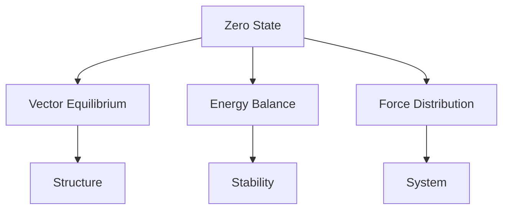
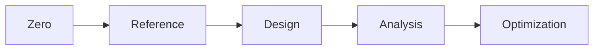
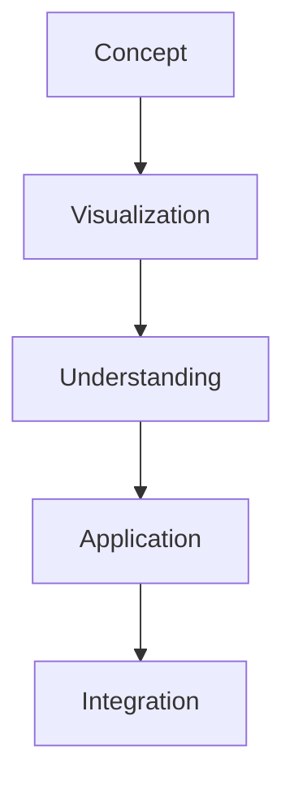

# Zero

In [[Buckminster_Fuller|Bucky Fuller]] work, [[0]] represents the state of perfect equilibrium, most notably embodied in the Vector Equilibrium, where all forces and vectors are in perfect balance.

## Overview

### Definition
```yaml
number:
  value: 0
  type: integer
  category: equilibrium state
  significance:
    - Perfect balance point
    - Vector Equilibrium state
    - Energy reference
    - System origin
  fuller_context:
    - Vector Equilibrium
    - Energy systems
    - Force balance
    - Reference state
```

### Key Properties
1. Mathematical Properties
   - Additive identity
   - Multiplicative absorber
   - Central reference
   - System origin

2. Synergetic Properties
   - Perfect equilibrium
   - Force balance
   - Energy reference
   - System neutrality

## Mathematical Framework

### Numerical Properties
```mermaid
mindmap
    root((Zero))
        Mathematics
            [[Identity]]
            [[Reference]]
            [[Balance]]
        Systems
            [[Equilibrium]]
            [[Origin]]
            [[Neutrality]]
        Applications
            [[Vector Systems]]
            [[Energy States]]
            [[Force Balance]]
```

### Mathematical Relationships
1. System Reference
   - Origin point
   - Balance center
   - Neutral state
   - Reference frame

2. Energy States
   - Equilibrium condition
   - Force balance
   - Energy reference
   - System stability

## Synergetic Significance

### Vector Equilibrium
1. Structural Properties
   - [[Perfect Balance]]
   - [[Force Distribution]]
   - [[Vector Relationships]]
   - [[System Stability]]

2. Energy States
   - [[Zero Energy]]
   - [[Perfect Balance]]
   - [[Force Neutrality]]
   - [[System Reference]]

### System Framework


## Natural Occurrence

### Physical Systems
1. Energy States
   - [[Ground State]]
   - [[Equilibrium]]
   - [[Balance Point]]
   - [[Neutral State]]

2. System Organization
   - [[Center Points]]
   - [[Reference Frames]]
   - [[Balance Systems]]
   - [[Stability States]]

### Natural Framework
```mermaid
mindmap
    root((Natural Zero))
        Energy
            [[Balance]]
            [[Equilibrium]]
            [[Stability]]
        Structure
            [[Center]]
            [[Reference]]
            [[Organization]]
```

## Applications

### Implementation Areas
1. Design Systems
   - [[Reference Points]]
   - [[Balance Systems]]
   - [[Center Design]]
   - [[Stability Planning]]

2. Analysis Methods
   - [[Equilibrium Analysis]]
   - [[Force Balance]]
   - [[System Stability]]
   - [[Energy Reference]]

### Application Framework


## Educational Value

### Teaching Methods
1. Conceptual Models
   - Vector Equilibrium
   - Force balance
   - Energy states
   - System reference

2. Learning Tools
   - Physical models
   - Interactive displays
   - System demonstrations
   - Balance exercises

### Learning Framework


## Historical Context

### Cultural Significance
1. Historical Development
   - Mathematical discovery
   - System reference
   - Balance concept
   - Neutral state

2. Modern Understanding
   - Vector systems
   - Energy states
   - System balance
   - Reference frames

### Historical Framework
```mermaid
mindmap
    root((Zero History))
        Traditional
            [[Mathematics]]
            [[Philosophy]]
            [[Systems]]
        Modern
            [[Vector Mathematics]]
            [[Energy Systems]]
            [[Balance Theory]]
```

## Resources

### Documentation
- [[Technical Papers]]
- [[Research Studies]]
- [[System Documentation]]
- [[Application Notes]]

### Learning Materials
1. Educational Resources
   - [[Teaching Guides]]
   - [[Model Sets]]
   - [[Visual Aids]]
   - [[Practice Materials]]

2. Technical Resources
   - [[Analysis Tools]]
   - [[Design Software]]
   - [[Balance Systems]]
   - [[Reference Tools]]

## References
1. Fuller's Synergetics
2. Vector mathematics
3. System theory
4. Energy studies
5. Balance principles

## Notes
- Fundamental to Vector Equilibrium
- Key reference state
- Perfect balance point
- System origin concept

## Tags
#number #mathematics #equilibrium #vector-equilibrium #synergetics
