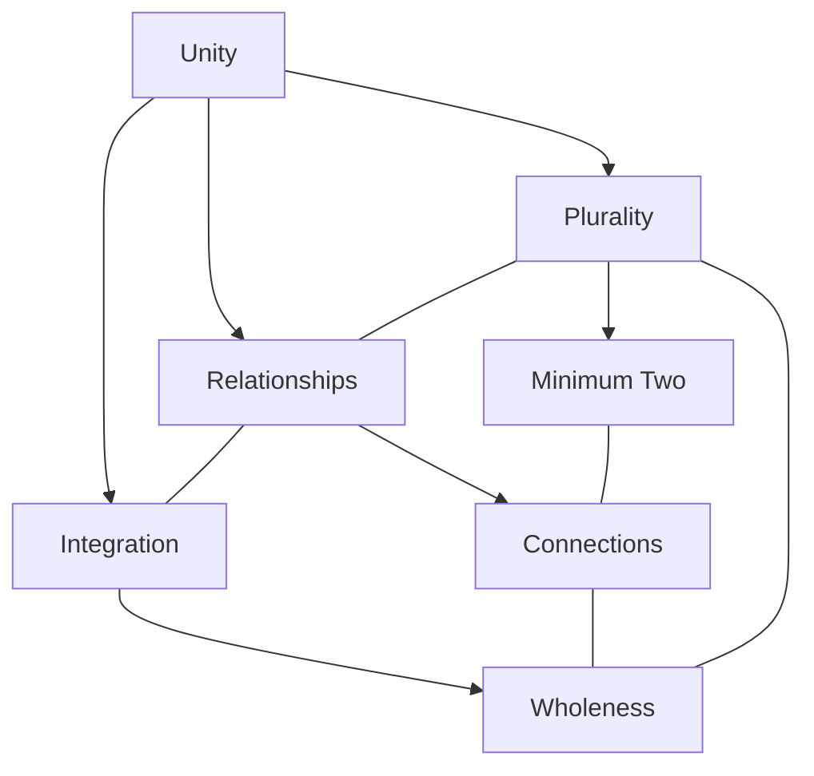
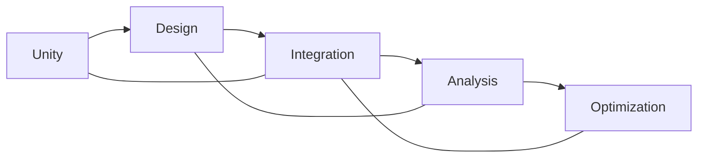
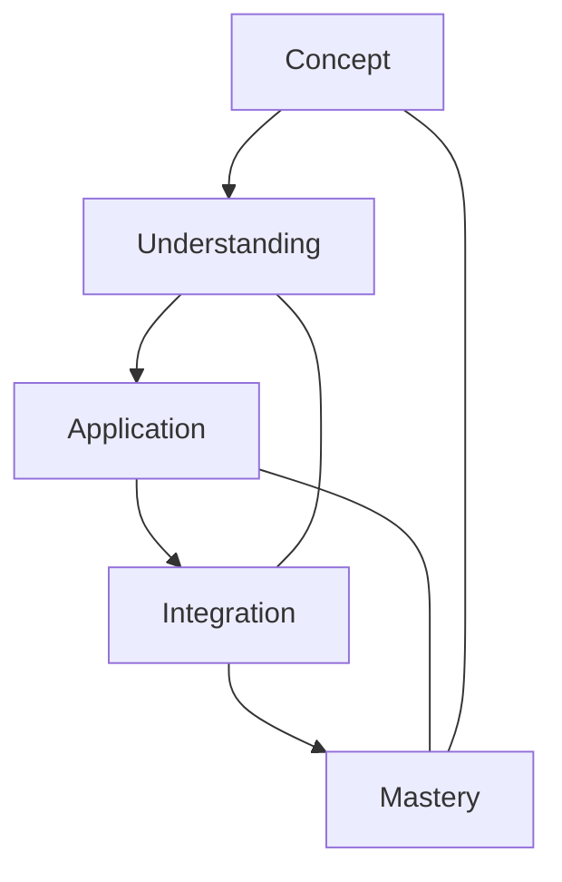

# One

In [[Buckminster_Fuller|R. Buckminster Fuller]]'s work, [[1|One]] represents unity and wholeness, but is understood as inherently plural, as expressed in his principle "Unity is plural and at minimum two."

## Overview

### Definition
```yaml
number:
  value: 1
  type: integer
  category: unity/wholeness
  significance:
    - System unity
    - Inherent plurality
    - Minimum relationship
    - Wholeness concept
  fuller_context:
    - Unity is plural
    - System relationships
    - Minimum two
    - Wholeness principle
```

### Key Properties
1. Mathematical Properties
   - Multiplicative identity
   - Unit measure
   - Prime number
   - System basis

2. Synergetic Properties
   - Inherent plurality
   - Relationship minimum
   - System unity
   - Wholeness concept

## Mathematical Framework

### Numerical Properties
```mermaid
mindmap
    root((One))
        Mathematics
            [[Identity]]
            [[Unity]]
            [[Prime_Number]]
        Systems
            [[Relationships]]
            [[Wholeness]]
            [[Integration]]
        Applications
            [[System_Design]]
            [[Unity_Principles]]
            [[Relationship_Models]]
```

### Mathematical Relationships
1. System Unity = [[System_Wholeness|Wholeness]]
   - Wholeness principle
   - Relationship basis
   - Integration concept
   - System foundation

2. Plurality Principle
   - "[[1|Unity]] is plural and at Minimum [[2|Two]]" ([[Buckminster_Fuller|Bucky Fuller]])
   - Relationship necessity
   - System dynamics
   - Unity concept

## Synergetic Significance

### Unity Principles
1. System Properties
   - [[System_Wholeness|Wholeness]]
   - [[Integration]]
   - [[Relationship]]
   - [[System_Unity]]

2. Relationship Dynamics
   - [[Minimum_Two]]
   - [[System_Connections]]
   - [[Unity_Patterns]]
   - [[Integration_Methods]]

### System Framework


## Natural Occurrence

### Physical Systems
1. Unity Patterns
   - [[System_Integration]]
   - [[Natural_Unity]]
   - [[Wholeness_Patterns]]
   - [[Relationship_Systems]]

2. System Organization
   - [[Unity_Structure]]
   - [[Integration_Methods]]
   - [[Relationship_Networks]]
   - [[System_Patterns]]

### Natural Framework
```mermaid
mindmap
    root((Natural Unity))
        Integration
            [[Wholeness]]
            [[Connection]]
            [[Pattern]]
        Systems
            [[Organization]]
            [[Structure]]
            [[Relationships]]
```

## Applications

### Implementation Areas
1. Design Systems
   - [[Unity_Design]]
   - [[System_Integration]]
   - [[Relationship_Planning]]
   - [[Wholeness_Methods]]

2. Analysis Methods
   - [[Unity_Analysis]]
   - [[System_Assessment]]
   - [[Relationship_Study]]
   - [[Integration_Evaluation]]

### Application Framework


## Educational Value

### Teaching Methods
1. Conceptual Models
   - Unity principles
   - Relationship concepts
   - Integration methods
   - System wholeness

2. Learning Tools
   - Unity demonstrations
   - Relationship models
   - Integration exercises
   - System examples

### Learning Framework


## Historical Context

### Cultural Significance
1. Historical Understanding
   - Unity concepts
   - Wholeness principles
   - Integration methods
   - Relationship patterns

2. Modern Interpretation
   - [[System_Integration]]
   - [[Relationship_Dynamics]]
   - Unity principles
   - Wholeness theory

### Historical Framework
```mermaid
mindmap
    root((Unity History))
        Traditional
            [[Philosophy]]
            [[Mathematics]]
            [[Systems]]
        Modern
            [[Integration]]
            [[Relationships]]
            [[Dynamics]]
```

## Resources

### Documentation
- [[Technical_Papers]]
- [[Research_Studies]]
- [[System_Documentation]]
- [[Application_Notes]]

### Learning Materials
1. Educational Resources
   - [[Teaching_Guides]]
   - [[Model_Sets]]
   - [[Visual_Aids]]
   - [[Practice_Materials]]

2. Technical Resources
   - [[Analysis_Tools]]
   - [[Design_Software]]
   - [[Integration_Systems]]
   - [[Relationship_Tools]]

## References
1. [[books/Synergetics|Fuller's Synergetics]]
2. [[Unity_Principles]]
3. [[System_Theory]]
4. [[Integration_Studies]]
5. [[Relationship_Dynamics]]

## Notes
- Unity is inherently plural
- Minimum [[2|two]] principle
- System integration basis
- Relationship foundation

## Tags
#number #mathematics #unity #wholeness #synergetics 