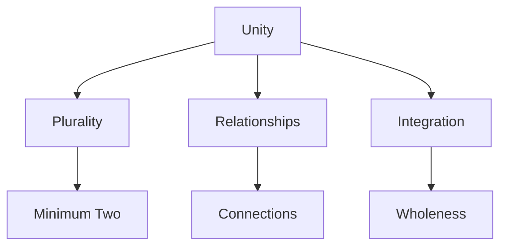
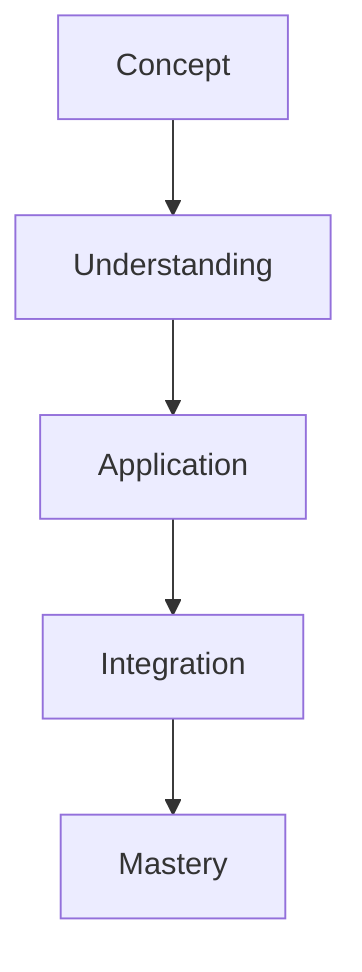

# One

In R. Buckminster Fuller's work, One represents unity and wholeness, but is understood as inherently plural, as expressed in his principle "Unity is plural and at minimum two."

## Overview

### Definition
```yaml
number:
  value: 1
  type: integer
  category: unity/wholeness
  significance:
    - System unity
    - Inherent plurality
    - Minimum relationship
    - Wholeness concept
  fuller_context:
    - Unity is plural
    - System relationships
    - Minimum two
    - Wholeness principle
```

### Key Properties
1. Mathematical Properties
   - Multiplicative identity
   - Unit measure
   - Prime number
   - System basis

2. Synergetic Properties
   - Inherent plurality
   - Relationship minimum
   - System unity
   - Wholeness concept

## Mathematical Framework

### Numerical Properties
```mermaid
mindmap
    root((One))
        Mathematics
            [[Identity]]
            [[Unity]]
            [[Prime]]
        Systems
            [[Relationships]]
            [[Wholeness]]
            [[Integration]]
        Applications
            [[System Design]]
            [[Unity Principles]]
            [[Relationship Models]]
```

### Mathematical Relationships
1. System Unity = [[System_Wholeness|Wholeness]]
   - Wholeness principle
   - Relationship basis
   - Integration concept
   - System foundation

2. Plurality Principle
   -  "[[1|Unity]] is plural and at Minimum [[2]]" ([[Buckminster_Fuller|Bucky Fuller]])
   - Relationship necessity
   - System dynamics
   - Unity concept

## Synergetic Significance

### Unity Principles
1. System Properties
   - [[System_Wholeness|Wholeness]]
   - [[Integration]]
   - [[Relationship]]
   - [[System Unity]]

2. Relationship Dynamics
   - [[Minimum Two]]
   - [[System Connections]]
   - [[Unity Patterns]]
   - [[Integration Methods]]

### System Framework


## Natural Occurrence

### Physical Systems
1. Unity Patterns
   - [[System Integration]]
   - [[Natural Unity]]
   - [[Wholeness Patterns]]
   - [[Relationship Systems]]

2. System Organization
   - [[Unity Structure]]
   - [[Integration Methods]]
   - [[Relationship Networks]]
   - [[System Patterns]]

### Natural Framework
```mermaid
mindmap
    root((Natural Unity))
        Integration
            [[Wholeness]]
            [[Connection]]
            [[Pattern]]
        Systems
            [[Organization]]
            [[Structure]]
            [[Relationships]]
```

## Applications

### Implementation Areas
1. Design Systems
   - [[Unity Design]]
   - [[System Integration]]
   - [[Relationship Planning]]
   - [[Wholeness Methods]]

2. Analysis Methods
   - [[Unity Analysis]]
   - [[System Assessment]]
   - [[Relationship Study]]
   - [[Integration Evaluation]]

### Application Framework


## Educational Value

### Teaching Methods
1. Conceptual Models
   - Unity principles
   - Relationship concepts
   - Integration methods
   - System wholeness

2. Learning Tools
   - Unity demonstrations
   - Relationship models
   - Integration exercises
   - System examples

### Learning Framework


## Historical Context

### Cultural Significance
1. Historical Understanding
   - Unity concepts
   - Wholeness principles
   - Integration methods
   - Relationship patterns

2. Modern Interpretation
   - System integration
   - Relationship dynamics
   - Unity principles
   - Wholeness theory

### Historical Framework
```mermaid
mindmap
    root((Unity History))
        Traditional
            [[Philosophy]]
            [[Mathematics]]
            [[Systems]]
        Modern
            [[Integration]]
            [[Relationships]]
            [[Dynamics]]
```

## Resources

### Documentation
- [[Technical Papers]]
- [[Research Studies]]
- [[System Documentation]]
- [[Application Notes]]

### Learning Materials
1. Educational Resources
   - [[Teaching Guides]]
   - [[Model Sets]]
   - [[Visual Aids]]
   - [[Practice Materials]]

2. Technical Resources
   - [[Analysis Tools]]
   - [[Design Software]]
   - [[Integration Systems]]
   - [[Relationship Tools]]

## References
1. Fuller's Synergetics
2. Unity principles
3. System theory
4. Integration studies
5. Relationship dynamics

## Notes
- Unity is inherently plural
- Minimum two principle
- System integration basis
- Relationship foundation

## Tags
#number #mathematics #unity #wholeness #synergetics 