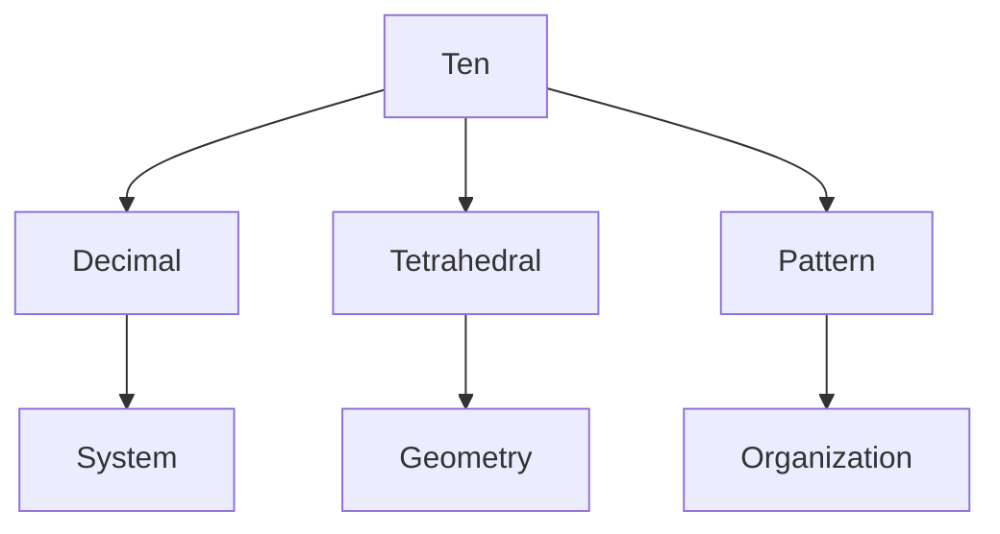
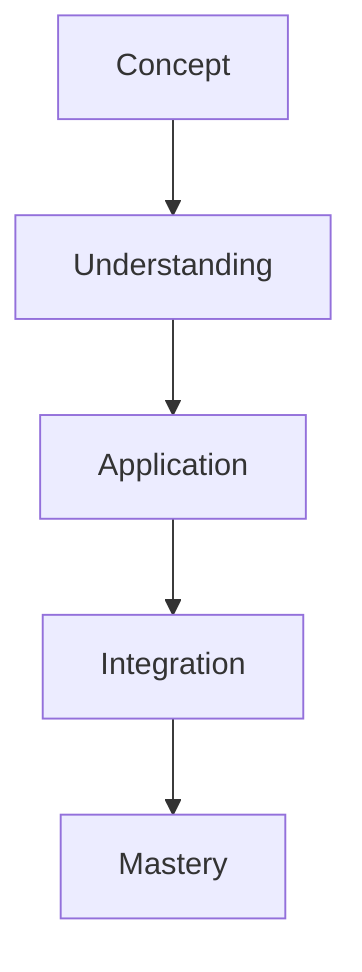

# Ten

In R. Buckminster Fuller's work, Ten represents the basis of the decimal system and appears in significant tetrahedral number patterns, bridging conventional mathematics with synergetic geometry.

## Overview

### Definition
```yaml
number:
  value: 10
  type: integer
  category: system/structure
  significance:
    - Decimal base
    - Tetrahedral number
    - System organization
    - Pattern formation
  fuller_context:
    - Number systems
    - Tetrahedral patterns
    - System structure
    - Pattern organization
```

### Key Properties
1. Mathematical Properties
   - Decimal base
   - Triangular number
   - Tetrahedral sequence
   - System foundation

2. Synergetic Properties
   - Pattern organization
   - System structure
   - Geometric relationships
   - Number sequences

## Mathematical Framework

### Numerical Properties
```mermaid
mindmap
    root((Ten))
        Mathematics
            [[Decimal]]
            [[Triangular]]
            [[Tetrahedral]]
        Systems
            [[Organization]]
            [[Structure]]
            [[Pattern]]
        Applications
            [[Number Systems]]
            [[Geometry]]
            [[Design]]
```

### Mathematical Relationships
1. System Properties
   - Decimal organization
   - Tetrahedral patterns
   - Number relationships
   - System structure

2. Pattern Properties
   - Geometric formation
   - Number sequences
   - System organization
   - Pattern development

## Synergetic Significance

### System Properties
1. Structural Principles
   - [[Decimal_System]]
   - [[Tetrahedral_Pattern]]
   - [[Number_Organization]]
   - [[System_Structure]]

2. Pattern Applications
   - [[System_Design]]
   - [[Pattern_Formation]]
   - [[Number_Sequence]]
   - [[Geometric_Organization]]

### System Framework


## Natural Occurrence

### Physical Systems
1. Natural Patterns
   - [[Number Systems]]
   - [[Geometric Forms]]
   - [[Growth Patterns]]
   - [[Natural Structure]]

2. System Organization
   - [[Pattern Formation]]
   - [[System Development]]
   - [[Number Relationships]]
   - [[Natural Design]]

### Natural Framework
```mermaid
mindmap
    root((Natural Ten))
        Pattern
            [[Decimal]]
            [[Tetrahedral]]
            [[Geometric]]
        Systems
            [[Organization]]
            [[Development]]
            [[Structure]]
```

## Applications

### Implementation Areas
1. Design Systems
   - [[Number Organization]]
   - [[Pattern Design]]
   - [[System Structure]]
   - [[Geometric Planning]]

2. Analysis Methods
   - [[Pattern Analysis]]
   - [[System Study]]
   - [[Number Evaluation]]
   - [[Structure Assessment]]

### Application Framework


## Educational Value

### Teaching Methods
1. Conceptual Models
   - Decimal systems
   - Tetrahedral patterns
   - Number relationships
   - System organization

2. Learning Tools
   - Number models
   - Pattern demonstrations
   - System exercises
   - Geometric studies

### Learning Framework


## Historical Context

### Cultural Significance
1. Historical Understanding
   - Number systems
   - Decimal development
   - Pattern recognition
   - System organization

2. Modern Interpretation
   - System design
   - Pattern analysis
   - Number relationships
   - Geometric structure

### Historical Framework
```mermaid
mindmap
    root((Ten History))
        Traditional
            [[Decimal]]
            [[Number]]
            [[Pattern]]
        Modern
            [[Systems]]
            [[Design]]
            [[Organization]]
```

## Resources

### Documentation
- [[Technical Papers]]
- [[Research Studies]]
- [[Design Guides]]
- [[Application Notes]]

### Learning Materials
1. Educational Resources
   - [[Teaching Guides]]
   - [[Model Sets]]
   - [[Visual Aids]]
   - [[Practice Materials]]

2. Technical Resources
   - [[Analysis Tools]]
   - [[Design Software]]
   - [[Pattern Systems]]
   - [[Number Tools]]

## References
1. Fuller's Synergetics
2. Number systems
3. Pattern studies
4. Geometric analysis
5. System organization

## Notes
- Fundamental to decimal system
- Tetrahedral number significance
- Pattern organization basis
- System structure principle

## Tags
#number #mathematics #decimal #tetrahedral #synergetics 