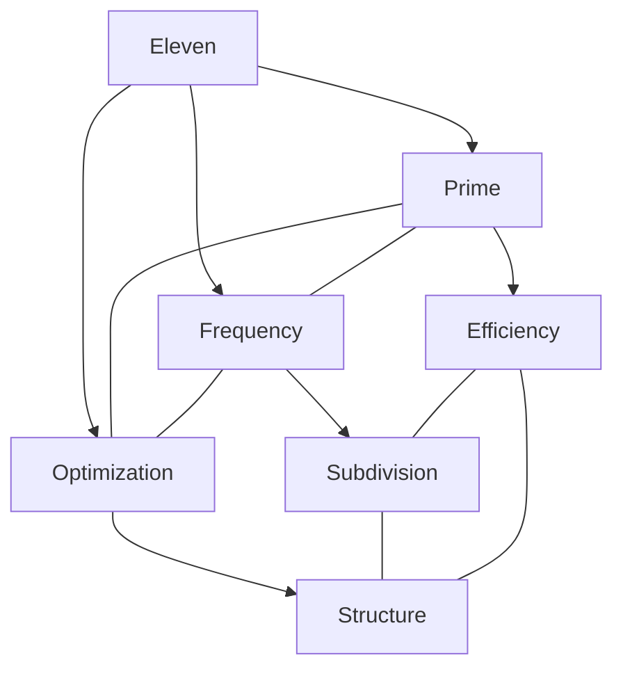
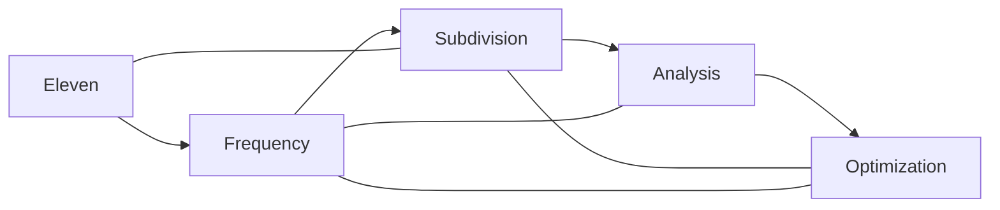
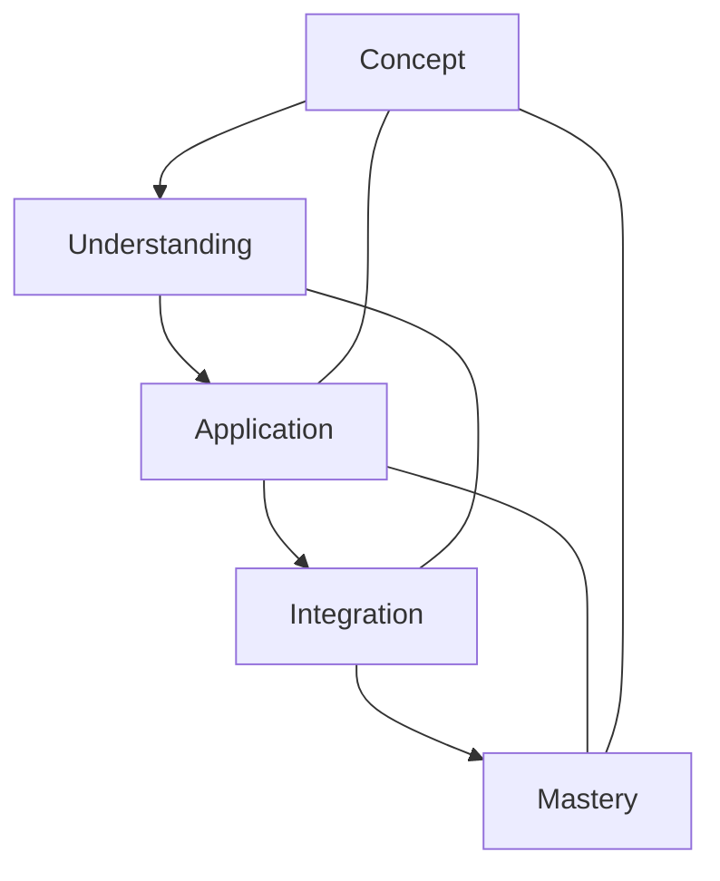

# Eleven

In [[Buckminster_Fuller|R. Buckminster Fuller]]'s work, [[11|Eleven]] represents a significant frequency number in geodesic systems and breakdown patterns, with particular importance in certain geodesic dome subdivision and structural efficiency calculations.

## Overview

### Definition
```yaml
number:
  value: 11
  type: integer
  category: frequency/structural
  significance:
    - Geodesic frequency
    - Prime efficiency
    - Subdivision patterns
    - Structural optimization
  fuller_context:
    - Geodesic systems
    - Frequency breakdown
    - Prime structures
    - Optimization patterns
```

### Key Properties
1. Mathematical Properties
   - Prime number
   - Geodesic frequency
   - Subdivision factor
   - Optimization parameter

2. Synergetic Properties
   - Frequency system
   - Structural efficiency
   - Subdivision pattern
   - Optimization factor

## Mathematical Framework

### Numerical Properties
```mermaid
mindmap
    root((Eleven))
        Mathematics
            [[Prime_Number]]
            [[Frequency]]
            [[Subdivision]]
        Systems
            [[Geodesic]]
            [[Structure]]
            [[Optimization]]
        Applications
            [[Frequency_Systems]]
            [[Geodesic_Structures]]
            [[Optimal_Design]]
```

### Mathematical Relationships
1. Frequency Properties
   - Geodesic breakdown
   - Subdivision patterns
   - Optimization factors
   - Structural efficiency

2. Structural Properties
   - Geodesic systems
   - Prime efficiency
   - Optimization parameters
   - Structural patterns

## Synergetic Significance

### Frequency Principles
1. System Properties
   - [[Geodesic_Frequency]]
   - [[Prime_Efficiency]]
   - [[Subdivision_Pattern]]
   - [[System_Optimization]]

2. Structural Properties
   - [[Frequency_Systems]]
   - [[Geodesic_Breakdown]]
   - [[Optimal_Structure]]
   - [[Efficiency_Parameters]]

### System Framework


## Natural Occurrence

### Physical Systems
1. Natural Patterns
   - [[Frequency_Patterns]]
   - [[Prime_Structures]]
   - [[Optimization_Systems]]
   - [[Natural_Efficiency]]

2. System Organization
   - [[Frequency_Organization]]
   - [[Subdivision_Systems]]
   - [[Efficiency_Patterns]]
   - [[Optimal_Growth]]

### Natural Framework
```mermaid
mindmap
    root((Natural Eleven))
        Frequency
            [[Prime]]
            [[Subdivision]]
            [[Optimization]]
        Systems
            [[Geodesic]]
            [[Efficiency]]
            [[Structure]]
```

## Applications

### Implementation Areas
1. Design Systems
   - [[Geodesic_Design]]
   - [[Frequency_Planning]]
   - [[Optimization_Systems]]
   - [[Efficient_Structures]]

2. Analysis Methods
   - [[Frequency_Analysis]]
   - [[Prime_Efficiency_Study]]
   - [[Subdivision_Evaluation]]
   - [[Structural_Optimization]]

### Application Framework


## Educational Value

### Teaching Methods
1. Conceptual Models
   - Frequency principles
   - Geodesic systems
   - Optimization methods
   - Structural efficiency

2. Learning Tools
   - Geodesic models
   - Frequency demonstrations
   - Optimization exercises
   - Efficiency examples

### Learning Framework


## Historical Context

### Cultural Significance
1. Historical Understanding
   - Prime significance
   - Structure systems
   - Efficiency principles
   - Optimization patterns

2. Modern Interpretation
   - [[Geodesic_Mathematics]]
   - [[Frequency_Analysis]]
   - [[Optimization_Systems]]
   - [[Efficiency_Structures]]

### Historical Framework
```mermaid
mindmap
    root((Eleven History))
        Traditional
            [[Prime]]
            [[Numerical]]
            [[Mathematical]]
        Modern
            [[Geodesic]]
            [[Frequency]]
            [[Optimization]]
```

## Resources

### Documentation
- [[Technical_Papers]]
- [[Research_Studies]]
- [[Geodesic_Documentation]]
- [[Application_Notes]]

### Learning Materials
1. Educational Resources
   - [[Teaching_Guides]]
   - [[Model_Sets]]
   - [[Visual_Aids]]
   - [[Practice_Materials]]

2. Technical Resources
   - [[Analysis_Tools]]
   - [[Geodesic_Software]]
   - [[Frequency_Systems]]
   - [[Optimization_Tools]]

## References
1. [[books/Synergetics|Fuller's Synergetics]]
2. [[Geodesic_Mathematics]]
3. [[Frequency_Systems]]
4. [[Optimization_Studies]]
5. [[Efficiency_Analysis]]

## Notes
- Significant in certain geodesic frequency calculations
- Prime number with optimization properties in structural systems
- Important in specific classes of geodesic dome subdivision
- Appears in frequency-based calculations for structural efficiency
- Related to the balance between structural efficiency and material usage
- Prime number that often appears in optimal geodesic breakdowns
- Connected to [[10|Ten]] and [[12|Twelve]] in certain frequency-based transformations

## Tags
#number #mathematics #prime #frequency #synergetics 