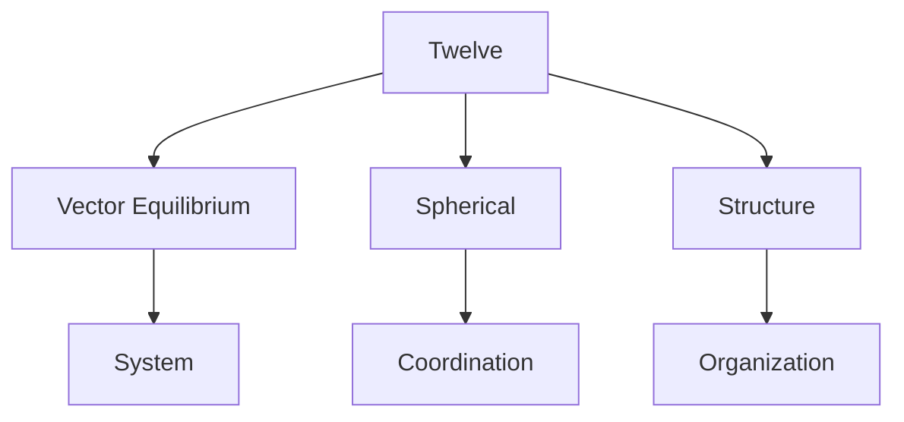
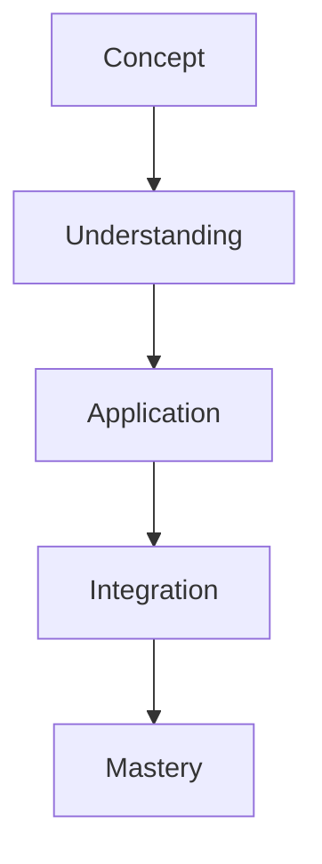

# Twelve

In R. Buckminster Fuller's work, Twelve represents the fundamental number of vertices in the Vector Equilibrium (cuboctahedron) and is key to understanding spherical systems and closest packing arrangements.

## Overview

### Definition
```yaml
number:
  value: 12
  type: integer
  category: structural/system
  significance:
    - Vector Equilibrium vertices
    - Spherical coordination
    - System completeness
    - Structural stability
  fuller_context:
    - Vector Equilibrium
    - Closest packing
    - Spherical systems
    - System coordination
```

### Key Properties
1. Mathematical Properties
   - Highly composite number
   - Spherical coordination
   - Cuboctahedral vertices
   - System completeness

2. Synergetic Properties
   - Vector equilibrium
   - System stability
   - Spatial organization
   - Pattern coordination

## Mathematical Framework

### Numerical Properties
```mermaid
mindmap
    root((Twelve))
        Mathematics
            [[Composite]]
            [[Spherical]]
            [[Coordination]]
        Systems
            [[Vector Equilibrium]]
            [[Structure]]
            [[Pattern]]
        Applications
            [[Organization]]
            [[Stability]]
            [[Design]]
```

### Mathematical Relationships
1. Geometric Properties
   - Vector equilibrium
   - Spherical coordination
   - System organization
   - Pattern formation

2. Structural Properties
   - Stability principles
   - System coordination
   - Space organization
   - Pattern development

## Synergetic Significance

### System Properties
1. Structural Principles
   - [[Vector_Equilibrium]]
   - [[Spherical_Coordination]]
   - [[System_Organization]]
   - [[Spatial_Stability]]

2. Pattern Applications
   - [[System_Design]]
   - [[Structural_Planning]]
   - [[Pattern_Formation]]
   - [[Space_Organization]]

### System Framework


## Natural Occurrence

### Physical Systems
1. Natural Patterns
   - [[Crystal Systems]]
   - [[Molecular Structure]]
   - [[Atomic Organization]]
   - [[Natural Forms]]

2. System Organization
   - [[Spatial Structure]]
   - [[Pattern Formation]]
   - [[System Development]]
   - [[Natural Design]]

### Natural Framework
```mermaid
mindmap
    root((Natural Twelve))
        Structure
            [[Vector Equilibrium]]
            [[Spherical]]
            [[Pattern]]
        Systems
            [[Organization]]
            [[Coordination]]
            [[Development]]
```

## Applications

### Implementation Areas
1. Design Systems
   - [[Structural Design]]
   - [[System Organization]]
   - [[Space Planning]]
   - [[Pattern Development]]

2. Analysis Methods
   - [[Structure Analysis]]
   - [[System Evaluation]]
   - [[Pattern Study]]
   - [[Space Assessment]]

### Application Framework


## Educational Value

### Teaching Methods
1. Conceptual Models
   - Vector equilibrium
   - Spherical systems
   - Structural principles
   - Pattern organization

2. Learning Tools
   - Physical models
   - System demonstrations
   - Pattern exercises
   - Space studies

### Learning Framework


## Historical Context

### Cultural Significance
1. Historical Understanding
   - System organization
   - Structural principles
   - Pattern formation
   - Space coordination

2. Modern Interpretation
   - Vector systems
   - Structural design
   - Pattern analysis
   - Space organization

### Historical Framework
```mermaid
mindmap
    root((Twelve History))
        Traditional
            [[Systems]]
            [[Structure]]
            [[Pattern]]
        Modern
            [[Vector Equilibrium]]
            [[Organization]]
            [[Design]]
```

## Resources

### Documentation
- [[Technical Papers]]
- [[Research Studies]]
- [[Design Guides]]
- [[Application Notes]]

### Learning Materials
1. Educational Resources
   - [[Teaching Guides]]
   - [[Model Sets]]
   - [[Visual Aids]]
   - [[Practice Materials]]

2. Technical Resources
   - [[Analysis Tools]]
   - [[Design Software]]
   - [[Pattern Systems]]
   - [[Space Tools]]

## References
1. Fuller's Synergetics
2. Vector Equilibrium studies
3. System principles
4. Pattern analysis
5. Space organization

## Notes
- Fundamental to Vector Equilibrium
- Key to spherical systems
- Pattern organization basis
- System coordination principle

## Tags
#number #mathematics #vector-equilibrium #spherical-systems #synergetics 