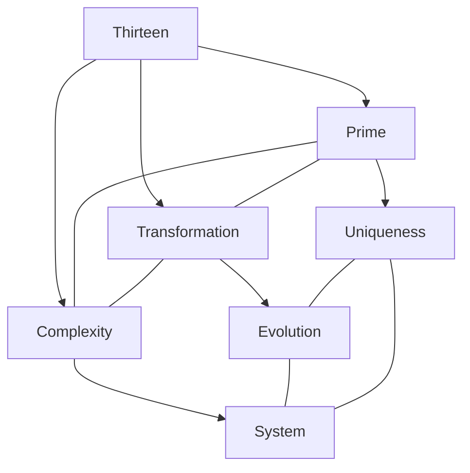
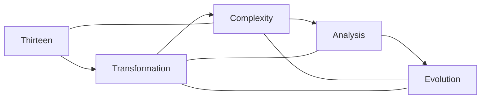
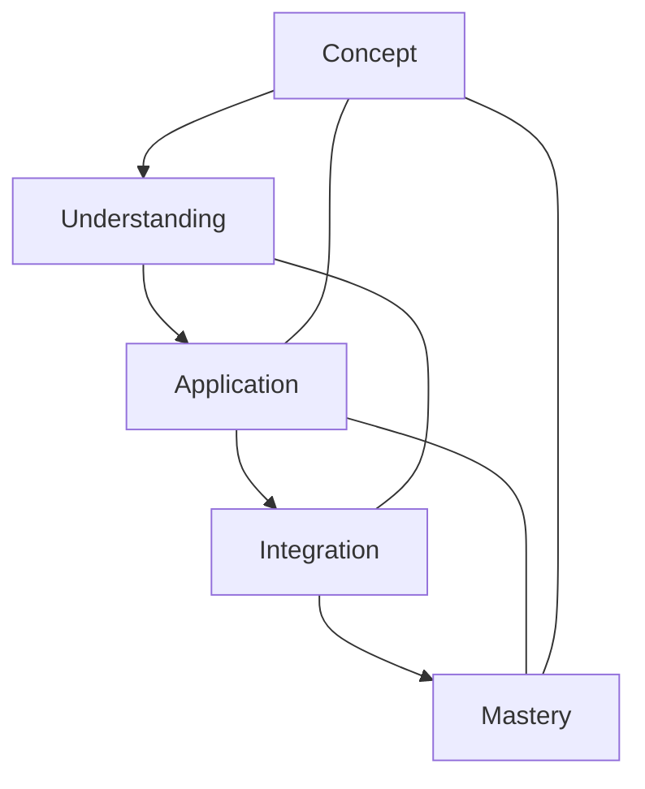

# Thirteen

In [[Buckminster_Fuller|R. Buckminster Fuller]]'s work, [[13|Thirteen]] represents significant transformation points in complex systems, appearing in specific geometric configurations and transition states between stable structural arrangements.

## Overview

### Definition
```yaml
number:
  value: 13
  type: integer
  category: transformational/structural
  significance:
    - System transition
    - Transformation phase
    - Prime complexity
    - Structural shift
  fuller_context:
    - System transformation
    - Complex organization
    - Transitional states
    - Structural evolution
```

### Key Properties
1. Mathematical Properties
   - Prime number
   - Transformation marker
   - Transition state
   - Complexity indicator

2. Synergetic Properties
   - System evolution
   - Structural transformation
   - Complexity development
   - Phase transition

## Mathematical Framework

### Numerical Properties
```mermaid
mindmap
    root((Thirteen))
        Mathematics
            [[Prime_Number]]
            [[Transformation]]
            [[Complexity]]
        Systems
            [[Evolution]]
            [[Transition]]
            [[Development]]
        Applications
            [[Transformation_Systems]]
            [[Complex_Structures]]
            [[Evolution_Design]]
```

### Mathematical Relationships
1. Transformation Properties
   - System evolution
   - Transition phases
   - Complexity development
   - Structural transformation

2. Structural Properties
   - Complex systems
   - Transformation patterns
   - Evolutionary stages
   - Phase transitions

## Synergetic Significance

### Transformation Principles
1. System Properties
   - [[System_Transformation]]
   - [[Complex_Evolution]]
   - [[Transition_States]]
   - [[Structural_Development]]

2. Evolutionary Properties
   - [[Phase_Transitions]]
   - [[System_Complexity]]
   - [[Transformation_Patterns]]
   - [[Evolutionary_Development]]

### System Framework


## Natural Occurrence

### Physical Systems
1. Natural Patterns
   - [[Transitional_Structures]]
   - [[Complex_Organizations]]
   - [[Evolutionary_Systems]]
   - [[Transformation_Phases]]

2. System Organization
   - [[Phase_Development]]
   - [[Transition_Patterns]]
   - [[Complex_Evolution]]
   - [[System_Transformation]]

### Natural Framework
```mermaid
mindmap
    root((Natural Thirteen))
        Transformation
            [[Phase]]
            [[Evolution]]
            [[Transition]]
        Systems
            [[Complexity]]
            [[Development]]
            [[Organization]]
```

## Applications

### Implementation Areas
1. Design Systems
   - [[Transformation_Design]]
   - [[Complex_Systems]]
   - [[Evolution_Planning]]
   - [[Transition_Structures]]

2. Analysis Methods
   - [[Transformation_Analysis]]
   - [[Complex_Study]]
   - [[Evolution_Evaluation]]
   - [[Transition_Assessment]]

### Application Framework


## Educational Value

### Teaching Methods
1. Conceptual Models
   - Transformation principles
   - Complexity concepts
   - Evolutionary models
   - Transition understanding

2. Learning Tools
   - Transformation models
   - Complexity demonstrations
   - Evolution exercises
   - Transition examples

### Learning Framework


## Historical Context

### Cultural Significance
1. Historical Understanding
   - Transformation concepts
   - Complexity principles
   - Evolutionary patterns
   - Transition states

2. Modern Interpretation
   - [[System_Transformations]]
   - [[Complex_Analysis]]
   - [[Evolutionary_Models]]
   - [[Transition_Systems]]

### Historical Framework
```mermaid
mindmap
    root((Thirteen History))
        Traditional
            [[Prime]]
            [[Mystical]]
            [[Symbolic]]
        Modern
            [[Transformation]]
            [[Complexity]]
            [[Evolution]]
```

## Resources

### Documentation
- [[Technical_Papers]]
- [[Research_Studies]]
- [[Transformation_Documentation]]
- [[Application_Notes]]

### Learning Materials
1. Educational Resources
   - [[Teaching_Guides]]
   - [[Model_Sets]]
   - [[Visual_Aids]]
   - [[Practice_Materials]]

2. Technical Resources
   - [[Analysis_Tools]]
   - [[Transformation_Software]]
   - [[Complexity_Systems]]
   - [[Evolution_Tools]]

## References
1. [[books/Synergetics|Fuller's Synergetics]]
2. [[Transformation_Principles]]
3. [[Complexity_Studies]]
4. [[Evolution_Theory]]
5. [[Transition_Analysis]]

## Notes
- Prime number significant in transformation phases
- Appears at critical junctures in complex system evolution
- Marks specific transition states in structural development
- Important in certain [[Jitterbug_Transformation|jitterbug transformation]] phases
- Connected to both [[12|Twelve]] ([[Vector_Equilibrium]]) and [[14|Fourteen]] in transformational sequences
- Often indicates a transformation threshold in geodesic subdivision systems
- Appears in complex ratio relationships in certain frequency systems

## Tags
#number #mathematics #prime #transformation #synergetics 