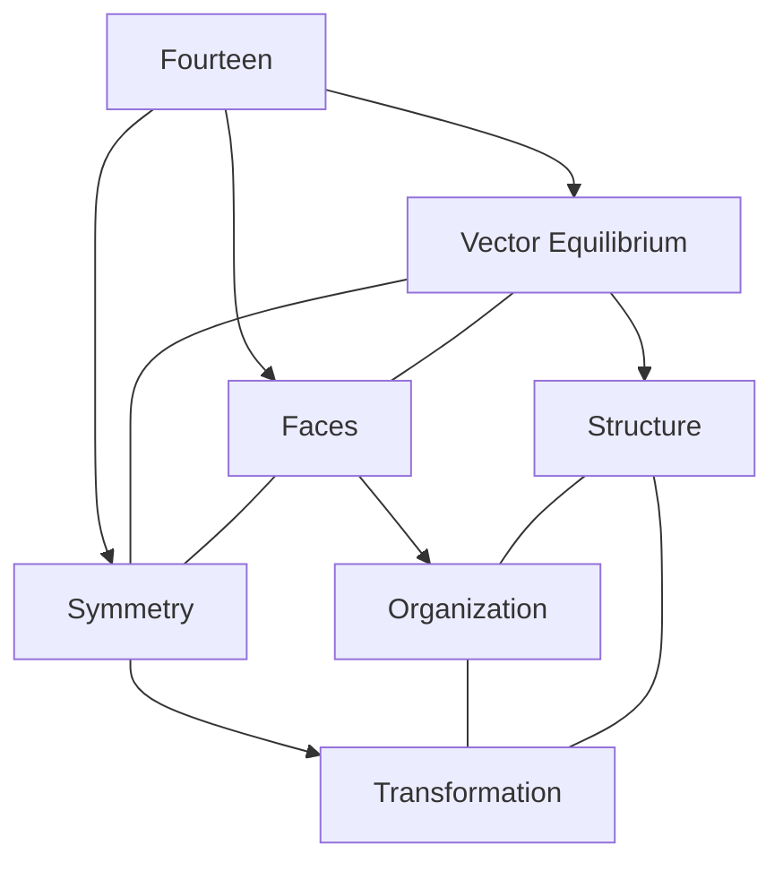
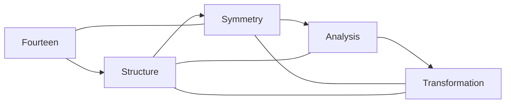
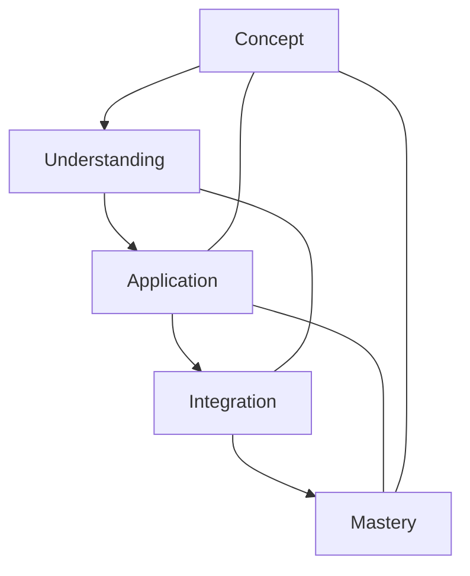

# Fourteen

In [[Buckminster_Fuller|R. Buckminster Fuller]]'s work, [[14|Fourteen]] represents the total number of faces in the [[Vector_Equilibrium]] (cuboctahedron), comprising 8 triangular faces and 6 square faces, making it fundamental to understanding the symmetry and transformational properties of this key geometric form.

## Overview

### Definition
```yaml
number:
  value: 14
  type: integer
  category: structural/symmetry
  significance:
    - Vector Equilibrium faces
    - 8 triangular + 6 square faces
    - Symmetry system
    - Transformational structure
  fuller_context:
    - Vector Equilibrium
    - Jitterbug transformation
    - Symmetry systems
    - Structural transformation
```

### Key Properties
1. Mathematical Properties
   - Sum of 8 (triangular faces) and 6 (square faces)
   - Cuboctahedral faces
   - Symmetry parameter
   - Structural component

2. Synergetic Properties
   - Vector equilibrium
   - Jitterbug phases
   - Symmetry system
   - Transformation stages

## Mathematical Framework

### Numerical Properties
```mermaid
mindmap
    root((Fourteen))
        Mathematics
            [[Composite_Number]]
            [[Vector_Equilibrium]]
            [[Symmetry]]
        Systems
            [[Structure]]
            [[Transformation]]
            [[Organization]]
        Applications
            [[Jitterbug_Transformation]]
            [[Structural_Systems]]
            [[Symmetry_Design]]
```

### Mathematical Relationships
1. Structural Properties
   - Vector equilibrium faces
   - Cuboctahedral symmetry
   - System organization
   - Transformation parameters

2. Symmetry Properties
   - 8 triangular + 6 square faces
   - Balanced distribution
   - Transformation system
   - Structural organization

## Synergetic Significance

### Vector Equilibrium
1. Structural Properties
   - [[Triangular_Faces]]
   - [[Square_Faces]]
   - [[Polyhedral_Symmetry]]
   - [[Structural_Organization]]

2. Transformational Properties
   - [[Jitterbug_Phases]]
   - [[Symmetry_Transformation]]
   - [[Structural_Development]]
   - [[System_Evolution]]

### System Framework


## Natural Occurrence

### Physical Systems
1. Natural Patterns
   - [[Vector_Structures]]
   - [[Symmetry_Systems]]
   - [[Transformation_Patterns]]
   - [[Natural_Organization]]

2. System Organization
   - [[Structural_Symmetry]]
   - [[Face_Distribution]]
   - [[Transformation_Phases]]
   - [[System_Balance]]

### Natural Framework
```mermaid
mindmap
    root((Natural Fourteen))
        Structure
            [[Vector_Equilibrium]]
            [[Faces]]
            [[Symmetry]]
        Systems
            [[Organization]]
            [[Transformation]]
            [[Balance]]
```

## Applications

### Implementation Areas
1. Design Systems
   - [[Vector_Design]]
   - [[Structural_Planning]]
   - [[Symmetry_Systems]]
   - [[Transformation_Structures]]

2. Analysis Methods
   - [[Face_Analysis]]
   - [[Symmetry_Study]]
   - [[Transformation_Evaluation]]
   - [[Structural_Assessment]]

### Application Framework


## Educational Value

### Teaching Methods
1. Conceptual Models
   - Vector equilibrium
   - Facial structure
   - Symmetry principles
   - Transformation processes

2. Learning Tools
   - Physical models
   - Symmetry demonstrations
   - Transformation exercises
   - Structural examples

### Learning Framework


## Historical Context

### Cultural Significance
1. Historical Understanding
   - Structural principles
   - Symmetry concepts
   - Transformation processes
   - Balance systems

2. Modern Interpretation
   - [[Vector_Equilibrium]]
   - [[Jitterbug_Transformation]]
   - [[Symmetry_Systems]]
   - [[Structural_Design]]

### Historical Framework
```mermaid
mindmap
    root((Fourteen History))
        Traditional
            [[Structure]]
            [[Symmetry]]
            [[Balance]]
        Modern
            [[Vector_Equilibrium]]
            [[Transformation]]
            [[Systems]]
```

## Resources

### Documentation
- [[Technical_Papers]]
- [[Research_Studies]]
- [[Structure_Documentation]]
- [[Application_Notes]]

### Learning Materials
1. Educational Resources
   - [[Teaching_Guides]]
   - [[Model_Sets]]
   - [[Visual_Aids]]
   - [[Practice_Materials]]

2. Technical Resources
   - [[Analysis_Tools]]
   - [[Vector_Software]]
   - [[Symmetry_Systems]]
   - [[Transformation_Tools]]

## References
1. [[books/Synergetics|Fuller's Synergetics]]
2. [[Vector_Equilibrium_Principles]]
3. [[Symmetry_Studies]]
4. [[Transformation_Theory]]
5. [[Structural_Analysis]]

## Notes
- Represents the total number of faces in the [[Vector_Equilibrium]] (cuboctahedron)
- Composed of 8 triangular faces + 6 square faces
- Critical to understanding the [[Jitterbug_Transformation]] as faces transform
- Connected to [[12|Twelve]] (vertices) and [[24|Twenty-Four]] (edges) in the Vector Equilibrium
- Essential to the symmetry properties of the Vector Equilibrium
- Key parameter in the transformation from Vector Equilibrium to [[8|Octahedron]] and [[4|Tetrahedron]]
- Related to balance between triangular (8) and square (6) faces in stable equilibrium

## Tags
#number #mathematics #vector-equilibrium #faces #synergetics 