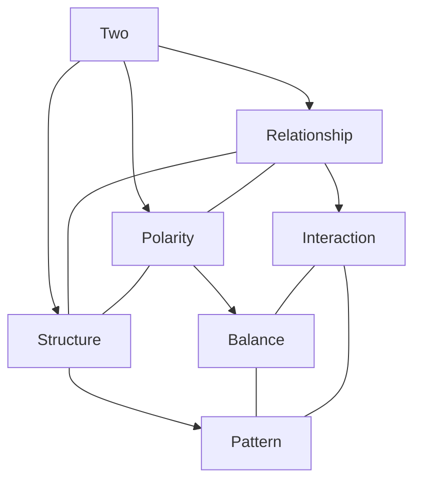
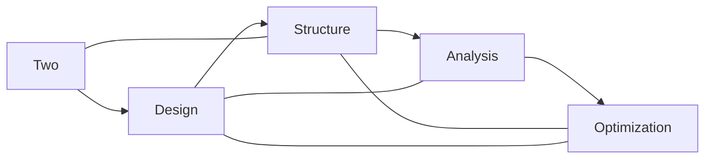
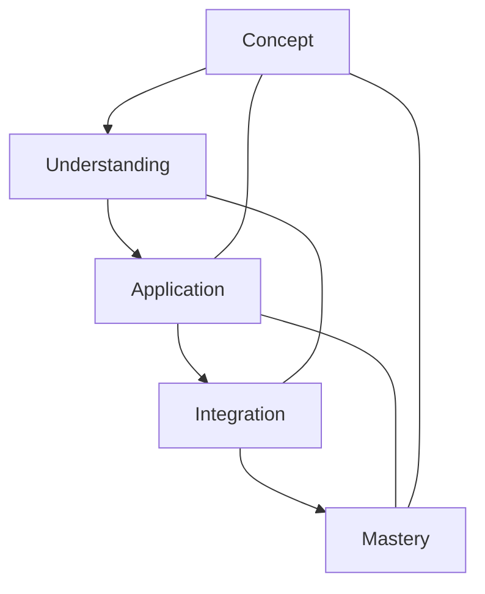

# Two

In [[Buckminster_Fuller|R. Buckminster Fuller]]'s work, [[2|Two]] represents the minimum condition for relationship and system existence, fundamental to his principle that "[[1|Unity]] is plural and at minimum [[2|two]]."

## Overview

### Definition
```yaml
number:
  value: 2
  type: integer
  category: relationship/duality
  significance:
    - Minimum relationship
    - System foundation
    - Basic polarity
    - Unity requirement
  fuller_context:
    - Minimum system
    - Basic relationship
    - Fundamental duality
    - Unity plurality
```

### Key Properties
1. Mathematical Properties
   - First prime number
   - Only even prime
   - Binary basis
   - Duality principle

2. Synergetic Properties
   - Minimum relationship
   - System foundation
   - Basic polarity
   - Unity requirement

## Mathematical Framework

### Numerical Properties
```mermaid
mindmap
    root((Two))
        Mathematics
            [[Prime_Number]]
            [[Even_Number]]
            [[Binary]]
        Systems
            [[Relationship]]
            [[Polarity]]
            [[Duality]]
        Applications
            [[System_Design]]
            [[Pattern_Formation]]
            [[Structure]]
```

### Mathematical Relationships
1. System Basis
   - Minimum relationship
   - Basic polarity
   - Fundamental duality
   - Pattern foundation

2. Structural Properties
   - Binary relationships
   - System pairs
   - Basic patterns
   - Structural units

## Synergetic Significance

### Relationship Principles
1. System Properties
   - [[Minimum_System]]
   - [[Basic_Relationship]]
   - [[Polarity_Pattern]]
   - [[Duality_Structure]]

2. Dynamic Properties
   - [[System_Interaction]]
   - [[Force_Relationship]]
   - [[Energy_Exchange]]
   - [[Pattern_Formation]]

### System Framework


## Natural Occurrence

### Physical Systems
1. Natural Patterns
   - [[Binary_Systems]]
   - [[Polar_Structures]]
   - [[Dual_Patterns]]
   - [[Basic_Units]]

2. System Organization
   - [[Pair_Formation]]
   - [[Basic_Structure]]
   - [[Pattern_Development]]
   - [[System_Growth]]

### Natural Framework
```mermaid
mindmap
    root((Natural Two))
        Patterns
            [[Binary]]
            [[Polarity]]
            [[Duality]]
        Systems
            [[Pairs]]
            [[Relationships]]
            [[Structures]]
```

## Applications

### Implementation Areas
1. Design Systems
   - [[Basic_Structure]]
   - [[Pattern_Design]]
   - [[System_Relationship]]
   - [[Polarity_Balance]]

2. Analysis Methods
   - [[Pair_Analysis]]
   - [[Relationship_Study]]
   - [[Pattern_Evaluation]]
   - [[System_Assessment]]

### Application Framework


## Educational Value

### Teaching Methods
1. Conceptual Models
   - Basic relationships
   - System polarity
   - Pattern formation
   - Structure design

2. Learning Tools
   - Relationship models
   - Polarity demonstrations
   - Pattern exercises
   - System examples

### Learning Framework


## Historical Context

### Cultural Significance
1. Historical Understanding
   - Duality concepts
   - Binary systems
   - Polarity principles
   - Relationship patterns

2. Modern Interpretation
   - [[System_Relationships]]
   - [[Pattern_Formation]]
   - [[Structure_Design]]
   - [[Dynamic_Balance]]

### Historical Framework
```mermaid
mindmap
    root((Two History))
        Traditional
            [[Duality]]
            [[Binary]]
            [[Polarity]]
        Modern
            [[Systems]]
            [[Relationships]]
            [[Patterns]]
```

## Resources

### Documentation
- [[Technical_Papers]]
- [[Research_Studies]]
- [[System_Documentation]]
- [[Application_Notes]]

### Learning Materials
1. Educational Resources
   - [[Teaching_Guides]]
   - [[Model_Sets]]
   - [[Visual_Aids]]
   - [[Practice_Materials]]

2. Technical Resources
   - [[Analysis_Tools]]
   - [[Design_Software]]
   - [[Pattern_Systems]]
   - [[Relationship_Tools]]

## References
1. [[books/Synergetics|Fuller's Synergetics]]
2. [[Relationship_Principles]]
3. [[System_Theory]]
4. [[Pattern_Studies]]
5. [[Structure_Analysis]]

## Notes
- Minimum system requirement
- Basic relationship unit 
- Connected to [[1|Unity]] through the principle "Unity is plural and at minimum two"
- Foundation for [[3|triangulation]] and stability
- Pattern formation basis

## Tags
#number #mathematics #duality #relationship #synergetics 