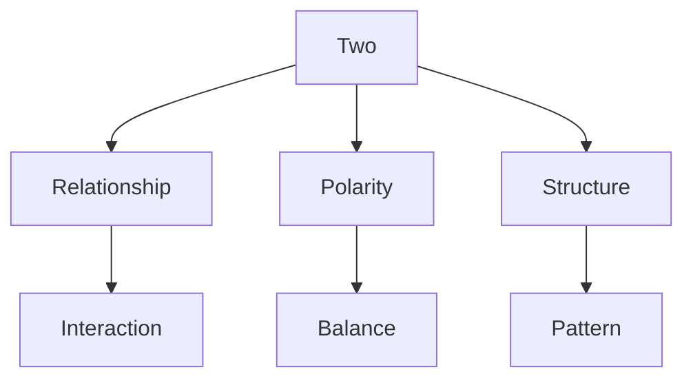
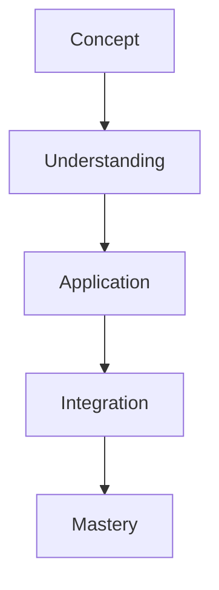

# Two

In R. Buckminster Fuller's work, Two represents the minimum condition for relationship and system existence, fundamental to his principle that "Unity is plural and at minimum two."

## Overview

### Definition
```yaml
number:
  value: 2
  type: integer
  category: relationship/duality
  significance:
    - Minimum relationship
    - System foundation
    - Basic polarity
    - Unity requirement
  fuller_context:
    - Minimum system
    - Basic relationship
    - Fundamental duality
    - Unity plurality
```

### Key Properties
1. Mathematical Properties
   - First prime number
   - Only even prime
   - Binary basis
   - Duality principle

2. Synergetic Properties
   - Minimum relationship
   - System foundation
   - Basic polarity
   - Unity requirement

## Mathematical Framework

### Numerical Properties
```mermaid
mindmap
    root((Two))
        Mathematics
            [[Prime]]
            [[Even]]
            [[Binary]]
        Systems
            [[Relationship]]
            [[Polarity]]
            [[Duality]]
        Applications
            [[System Design]]
            [[Pattern Formation]]
            [[Structure]]
```

### Mathematical Relationships
1. System Basis
   - Minimum relationship
   - Basic polarity
   - Fundamental duality
   - Pattern foundation

2. Structural Properties
   - Binary relationships
   - System pairs
   - Basic patterns
   - Structural units

## Synergetic Significance

### Relationship Principles
1. System Properties
   - [[Minimum System]]
   - [[Basic Relationship]]
   - [[Polarity Pattern]]
   - [[Duality Structure]]

2. Dynamic Properties
   - [[System Interaction]]
   - [[Force Relationship]]
   - [[Energy Exchange]]
   - [[Pattern Formation]]

### System Framework


## Natural Occurrence

### Physical Systems
1. Natural Patterns
   - [[Binary Systems]]
   - [[Polar Structures]]
   - [[Dual Patterns]]
   - [[Basic Units]]

2. System Organization
   - [[Pair Formation]]
   - [[Basic Structure]]
   - [[Pattern Development]]
   - [[System Growth]]

### Natural Framework
```mermaid
mindmap
    root((Natural Two))
        Patterns
            [[Binary]]
            [[Polarity]]
            [[Duality]]
        Systems
            [[Pairs]]
            [[Relationships]]
            [[Structures]]
```

## Applications

### Implementation Areas
1. Design Systems
   - [[Basic Structure]]
   - [[Pattern Design]]
   - [[System Relationship]]
   - [[Polarity Balance]]

2. Analysis Methods
   - [[Pair Analysis]]
   - [[Relationship Study]]
   - [[Pattern Evaluation]]
   - [[System Assessment]]

### Application Framework


## Educational Value

### Teaching Methods
1. Conceptual Models
   - Basic relationships
   - System polarity
   - Pattern formation
   - Structure design

2. Learning Tools
   - Relationship models
   - Polarity demonstrations
   - Pattern exercises
   - System examples

### Learning Framework


## Historical Context

### Cultural Significance
1. Historical Understanding
   - Duality concepts
   - Binary systems
   - Polarity principles
   - Relationship patterns

2. Modern Interpretation
   - System relationships
   - Pattern formation
   - Structure design
   - Dynamic balance

### Historical Framework
```mermaid
mindmap
    root((Two History))
        Traditional
            [[Duality]]
            [[Binary]]
            [[Polarity]]
        Modern
            [[Systems]]
            [[Relationships]]
            [[Patterns]]
```

## Resources

### Documentation
- [[Technical Papers]]
- [[Research Studies]]
- [[System Documentation]]
- [[Application Notes]]

### Learning Materials
1. Educational Resources
   - [[Teaching Guides]]
   - [[Model Sets]]
   - [[Visual Aids]]
   - [[Practice Materials]]

2. Technical Resources
   - [[Analysis Tools]]
   - [[Design Software]]
   - [[Pattern Systems]]
   - [[Relationship Tools]]

## References
1. Fuller's Synergetics
2. Relationship principles
3. System theory
4. Pattern studies
5. Structure analysis

## Notes
- Minimum system requirement
- Basic relationship unit
- Pattern formation basis
- Structure foundation

## Tags
#number #mathematics #duality #relationship #synergetics 