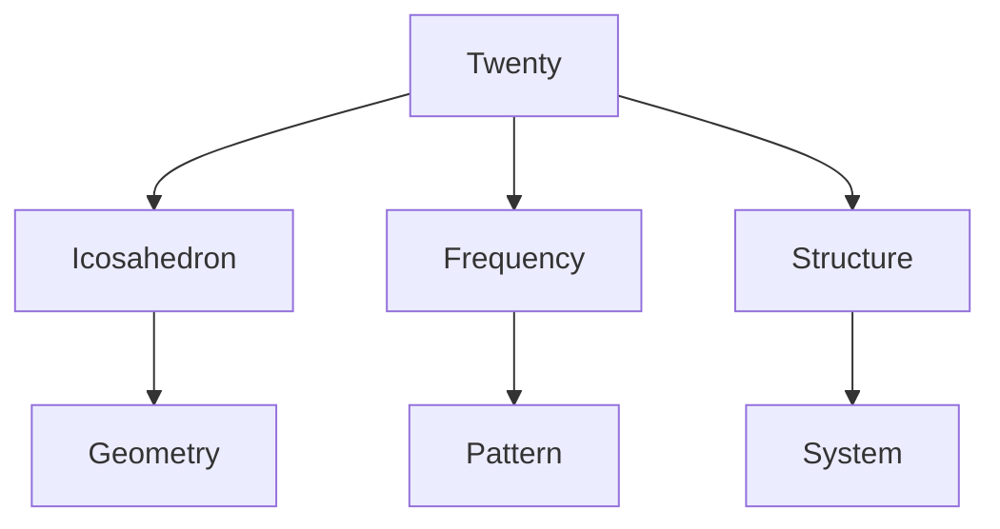
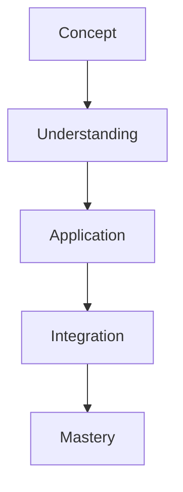

# Twenty

In R. Buckminster Fuller's work, Twenty represents the number of triangular faces in an icosahedron and is fundamental to frequency patterns in geodesic structures.

## Overview

### Definition
```yaml
number:
  value: 20
  type: integer
  category: structural/frequency
  significance:
    - Icosahedral faces
    - Frequency patterns
    - Structural systems
    - Geodesic mathematics
  fuller_context:
    - Icosahedral geometry
    - Geodesic structures
    - Frequency systems
    - Pattern organization
```

### Key Properties
1. Mathematical Properties
   - Icosahedral faces
   - Frequency number
   - Structural pattern
   - System organization

2. Synergetic Properties
   - Geodesic frequency
   - Pattern formation
   - System structure
   - Spatial organization

## Mathematical Framework

### Numerical Properties
```mermaid
mindmap
    root((Twenty))
        Mathematics
            [[Icosahedral]]
            [[Frequency]]
            [[Pattern]]
        Systems
            [[Structure]]
            [[Organization]]
            [[Development]]
        Applications
            [[Geodesic]]
            [[Architecture]]
            [[Design]]
```

### Mathematical Relationships
1. Geometric Properties
   - Icosahedral structure
   - Frequency patterns
   - System organization
   - Spatial relationships

2. Structural Properties
   - Geodesic systems
   - Pattern formation
   - System development
   - Organization principles

## Synergetic Significance

### System Properties
1. Structural Principles
   - [[Icosahedral_System]]
   - [[Frequency_Pattern]]
   - [[Geodesic_Structure]]
   - [[System_Organization]]

2. Pattern Applications
   - [[Structural_Design]]
   - [[Pattern_Formation]]
   - [[System_Development]]
   - [[Spatial_Organization]]

### System Framework


## Natural Occurrence

### Physical Systems
1. Natural Patterns
   - [[Crystal Systems]]
   - [[Molecular Structure]]
   - [[Growth Patterns]]
   - [[Natural Forms]]

2. System Organization
   - [[Structural Systems]]
   - [[Pattern Formation]]
   - [[System Development]]
   - [[Natural Design]]

### Natural Framework
```mermaid
mindmap
    root((Natural Twenty))
        Structure
            [[Icosahedral]]
            [[Frequency]]
            [[Pattern]]
        Systems
            [[Organization]]
            [[Development]]
            [[Growth]]
```

## Applications

### Implementation Areas
1. Design Systems
   - [[Geodesic Design]]
   - [[Structural Planning]]
   - [[System Organization]]
   - [[Pattern Development]]

2. Analysis Methods
   - [[Structure Analysis]]
   - [[Pattern Study]]
   - [[System Evaluation]]
   - [[Frequency Assessment]]

### Application Framework


## Educational Value

### Teaching Methods
1. Conceptual Models
   - Icosahedral systems
   - Frequency patterns
   - Structural principles
   - System organization

2. Learning Tools
   - Physical models
   - Pattern demonstrations
   - System exercises
   - Structure studies

### Learning Framework


## Historical Context

### Cultural Significance
1. Historical Understanding
   - Geometric systems
   - Structural patterns
   - System organization
   - Design principles

2. Modern Interpretation
   - Geodesic structures
   - Pattern analysis
   - System design
   - Frequency applications

### Historical Framework
```mermaid
mindmap
    root((Twenty History))
        Traditional
            [[Geometry]]
            [[Structure]]
            [[Pattern]]
        Modern
            [[Geodesic]]
            [[Design]]
            [[Systems]]
```

## Resources

### Documentation
- [[Technical Papers]]
- [[Research Studies]]
- [[Design Guides]]
- [[Application Notes]]

### Learning Materials
1. Educational Resources
   - [[Teaching Guides]]
   - [[Model Sets]]
   - [[Visual Aids]]
   - [[Practice Materials]]

2. Technical Resources
   - [[Analysis Tools]]
   - [[Design Software]]
   - [[Pattern Systems]]
   - [[Structure Tools]]

## References
1. Fuller's Synergetics
2. Geodesic mathematics
3. Structural principles
4. Pattern analysis
5. System organization

## Notes
- Key to icosahedral systems
- Fundamental frequency number
- Pattern organization basis
- System structure principle

## Tags
#number #mathematics #icosahedral #frequency #synergetics 
 