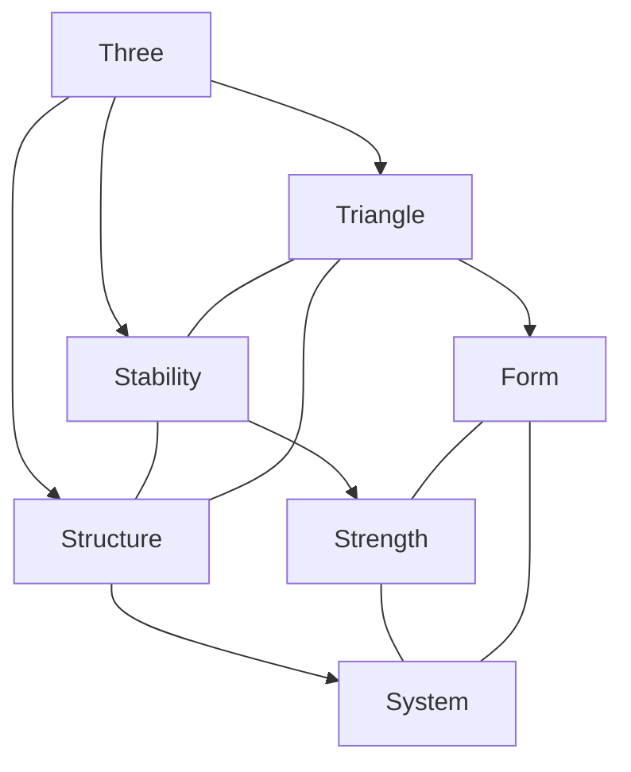
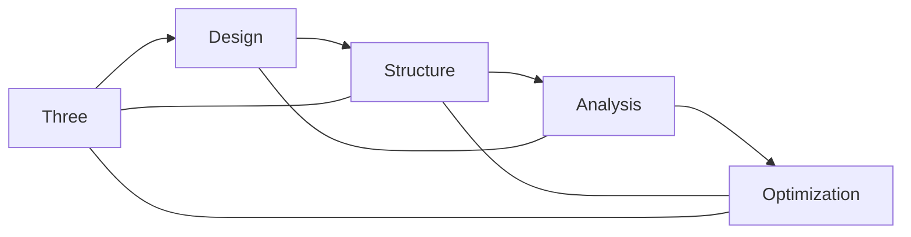
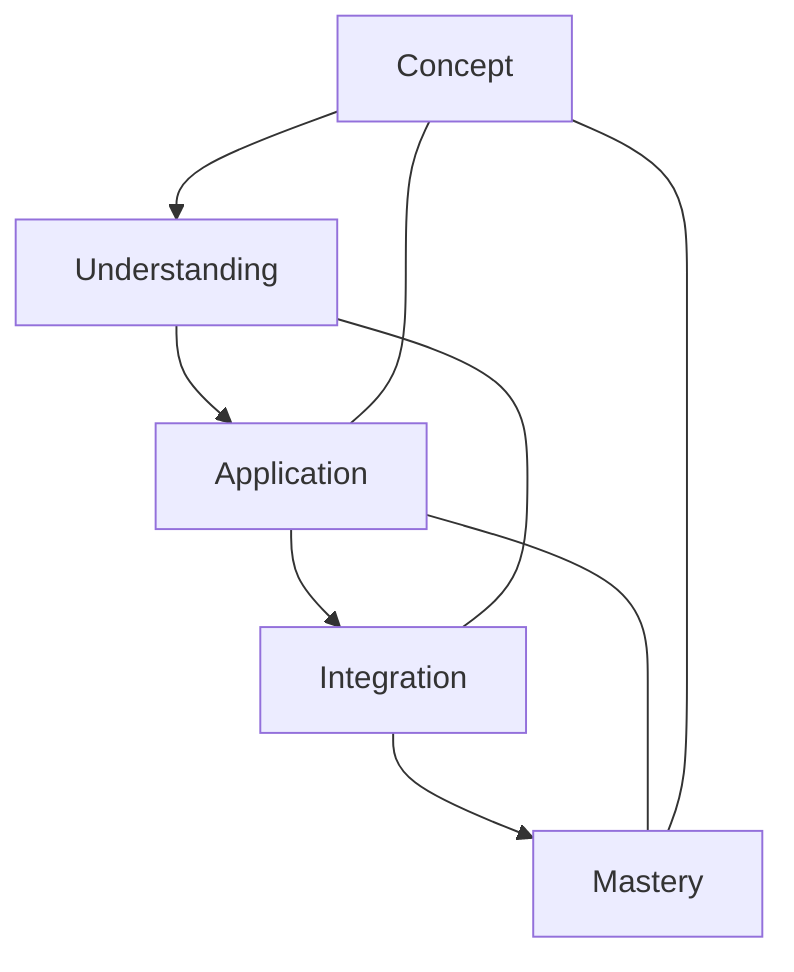

# Three

In [[Buckminster_Fuller|R. Buckminster Fuller]]'s work, [[3|Three]] represents the principle of structural stability through triangulation, fundamental to his geometric and architectural systems.

## Overview

### Definition
```yaml
number:
  value: 3
  type: integer
  category: structural/stability
  significance:
    - Structural stability
    - Triangulation principle
    - Minimum polygon
    - System stability
  fuller_context:
    - Triangulated structures
    - Geodesic systems
    - Structural efficiency
    - Stability principle
```

### Key Properties
1. Mathematical Properties
   - Prime number
   - Triangular basis
   - Minimum polygon
   - Structural minimum

2. Synergetic Properties
   - Stability principle
   - Structural efficiency
   - System foundation
   - Pattern formation

## Mathematical Framework

### Numerical Properties
```mermaid
mindmap
    root((Three))
        Mathematics
            [[Prime_Number]]
            [[Triangle]]
            [[Polygon]]
        Systems
            [[Stability]]
            [[Structure]]
            [[Pattern]]
        Applications
            [[Architecture]]
            [[Engineering]]
            [[Design]]
```

### Mathematical Relationships
1. Geometric Properties
   - Triangular form
   - Structural stability
   - Pattern basis
   - System foundation

2. Structural Properties
   - Stability principle
   - Force distribution
   - Load bearing
   - System integrity

## Synergetic Significance

### Structural Principles
1. System Properties
   - [[Triangulation]]
   - [[Structural_Stability]]
   - [[Force_Distribution]]
   - [[System_Integrity]]

2. Design Applications
   - [[Geodesic_Systems]]
   - [[Structural_Design]]
   - [[Pattern_Formation]]
   - [[System_Organization]]

### System Framework


## Natural Occurrence

### Physical Systems
1. Natural Patterns
   - [[Crystal_Structure]]
   - [[Molecular_Geometry]]
   - [[Natural_Forms]]
   - [[Growth_Patterns]]

2. System Organization
   - [[Structural_Systems]]
   - [[Pattern_Formation]]
   - [[Stability_Principles]]
   - [[Natural_Design]]

### Natural Framework
```mermaid
mindmap
    root((Natural Three))
        Structure
            [[Form]]
            [[Pattern]]
            [[System]]
        Properties
            [[Stability]]
            [[Strength]]
            [[Organization]]
```

## Applications

### Implementation Areas
1. Design Systems
   - [[Structural_Design]]
   - [[Architecture]]
   - [[Engineering]]
   - [[System_Design]]

2. Analysis Methods
   - [[Stability_Analysis]]
   - [[Force_Distribution]]
   - [[Pattern_Study]]
   - [[System_Evaluation]]

### Application Framework


## Educational Value

### Teaching Methods
1. Conceptual Models
   - Triangular structures
   - Stability principles
   - Force distribution
   - System design

2. Learning Tools
   - Physical models
   - Structure demonstrations
   - Pattern exercises
   - System examples

### Learning Framework


## Historical Context

### Cultural Significance
1. Historical Understanding
   - Structural principles
   - Geometric foundations
   - System stability
   - Pattern formation

2. Modern Interpretation
   - [[Engineering_Applications]]
   - [[Architectural_Design]]
   - [[System_Development]]
   - [[Pattern_Analysis]]

### Historical Framework
```mermaid
mindmap
    root((Three History))
        Traditional
            [[Geometry]]
            [[Structure]]
            [[Pattern]]
        Modern
            [[Engineering]]
            [[Design]]
            [[Systems]]
```

## Resources

### Documentation
- [[Technical_Papers]]
- [[Research_Studies]]
- [[Design_Guides]]
- [[Application_Notes]]

### Learning Materials
1. Educational Resources
   - [[Teaching_Guides]]
   - [[Model_Sets]]
   - [[Visual_Aids]]
   - [[Practice_Materials]]

2. Technical Resources
   - [[Analysis_Tools]]
   - [[Design_Software]]
   - [[Structural_Systems]]
   - [[Pattern_Tools]]

## References
1. [[books/Synergetics|Fuller's Synergetics]]
2. [[Structural_Principles]]
3. [[Engineering_Studies]]
4. [[Design_Science]]
5. [[Pattern_Analysis]]

## Notes
- Fundamental to stability
- Builds upon [[2|minimum relationship]] to create stability
- Basic structural unit for [[4|tetrahedral systems]]
- Pattern formation basis
- System organization principle

## Tags
#number #mathematics #triangulation #stability #synergetics 